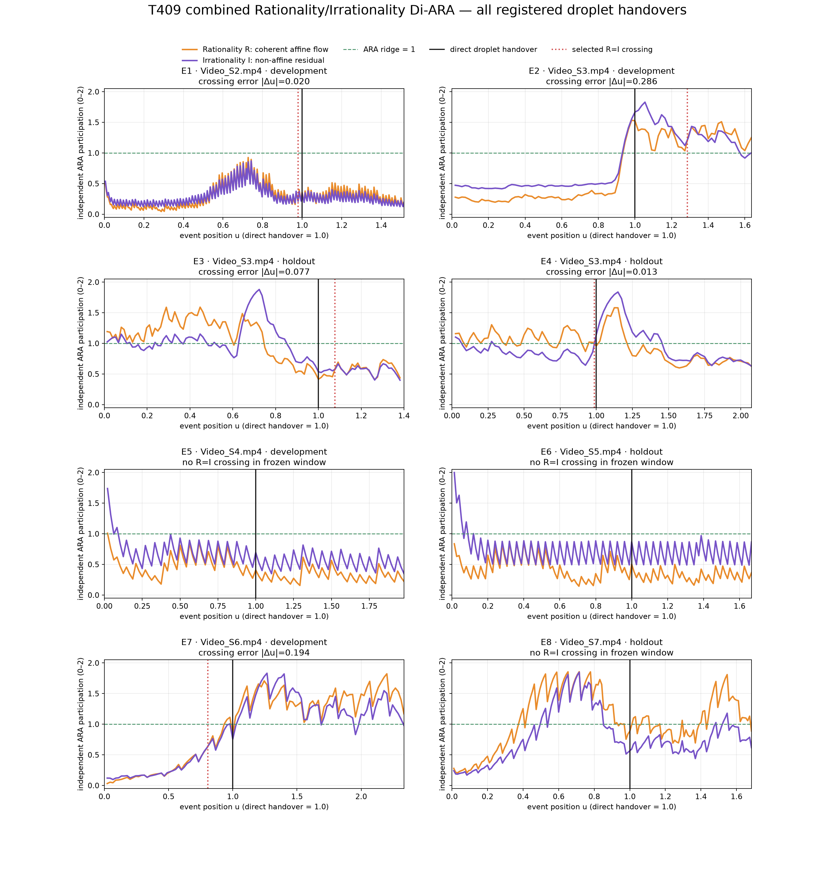
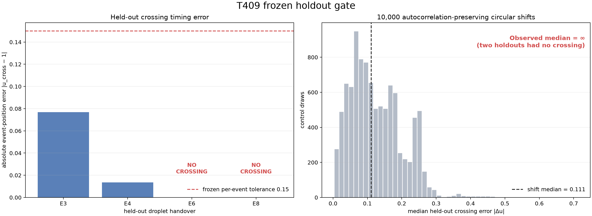
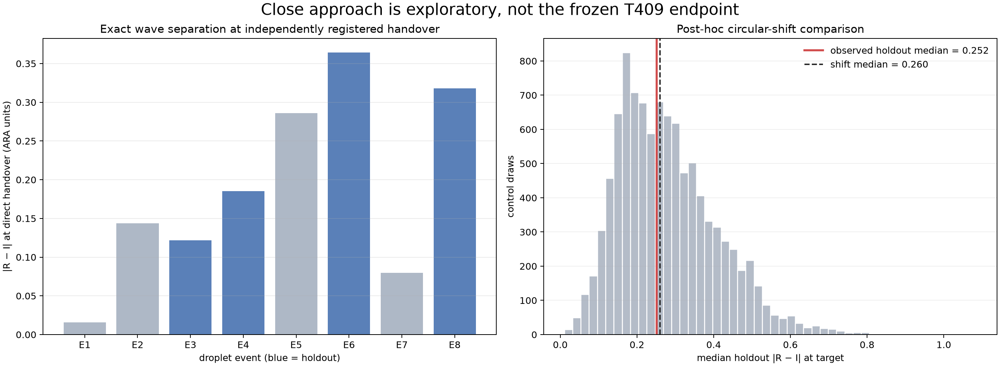
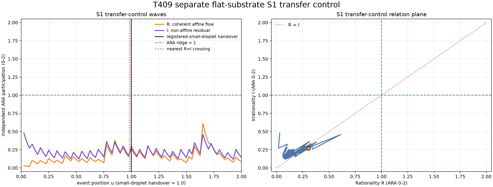
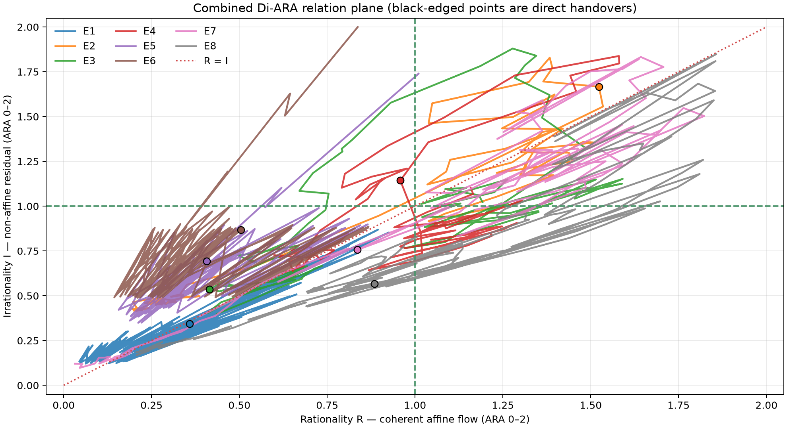

# T409 — Combined Rationality/Irrationality Di-ARA at droplet handover

**Outcome:** the frozen universal equality-crossing rule was **not supported**.
Two of four held-out fibre handovers contained an `R = I` crossing within the
predeclared timing tolerance; two contained no equality crossing at all. A
post-hoc close-approach test also failed against autocorrelation-preserving
controls. A separate flat-substrate small-droplet transfer did cross very near
its independently registered handover, showing that equality can be a real
local landmark without being a universal one.

## Relational address

- **Who:** eight registered water-droplet identity handovers on pre-wetted
  fibres, plus one separately analysed small-droplet transfer on a flat
  substrate.
- **What:** `R(t)`, coherent affine movement, and `I(t)`, the non-affine
  residual movement left after the same robust affine fit.
- **When:** encoded video frames from the established pre-handover state through
  persistent lobe loss and post-handover reclosure.
- **Where:** local droplet-pair ROIs. This is a droplet-scale cut, not a
  molecular bridge measurement.
- **Why:** test whether the combined Rationality/Irrationality Di-ARA supplies a
  reproducible equality or ridge-neighbourhood landmark at physical handover.
- **How:** dense optical flow, RANSAC affine decomposition, independent frozen
  `0–2` ARA scaling, causal smoothing, frozen holdout scoring and circular-shift
  controls.

## Target status

| Target | Status |
|---|---|
| Persistent droplet lobe loss | **Direct** |
| Coherent affine flow `R` | **Inferred from observed pixels** |
| Non-affine residual flow `I` | **Inferred from observed pixels** |
| Molecular bridge formation in fibre clips | **Absent** — the fibre was already wetted |
| Flat-substrate small-droplet transfer | **Direct, separate cross-medium control** |

The target was refined before wave scoring because the public fibre clips begin
with a thin liquid connection. The registered event is therefore the transfer
from two visible droplet lobes to one persistent lobe, not first molecular
contact.

## Frozen result

Protocol hash:
`A3899462E5DFF426A0CA10A5418A7AAB4194093301BE3C66162C9B06B77E7A65`.

The frozen gate required at least three of four holdouts within
`|u_cross − 1| ≤ 0.15`, at least 25% improvement over 10,000 circular shifts,
and empirical `p < 0.05`.

| Holdout | Nearest `R=I` crossing | Error from direct handover | Frozen per-event result |
|---|---:|---:|---|
| E3 | 1.0769 | 0.0769 | pass |
| E4 | 0.9865 | 0.0135 | pass |
| E6 | absent | undefined | fail |
| E8 | absent | undefined | fail |

Only `2/4` holdouts passed. The finite-only median error was `0.0452`, but it is
not a valid overall median because two events had no crossing. The strict
missing-crossing-aware empirical probability was `p = 1.0`. The frozen gate
therefore **failed**.

## Post-hoc close-approach diagnostic

After the frozen crossing rule failed, a labelled exploratory analysis asked
whether `R` and `I` at least became unusually close at the direct handover.

- observed held-out median `|R − I|`: `0.2517` ARA units;
- circular-shift median: `0.2604`;
- relative reduction: `3.37%`;
- empirical probability: `p = 0.4713`.

That is not distinguishable from ordinary timing variation. This post-hoc
analysis does not rescue the frozen claim.

## Separate S1 transfer control

Video S1 uses a different substrate and identity geometry. A small central
droplet visibly disappears into the larger left droplet by registered encoded
frame 40 while the two large droplets remain separate. The S1 target was fixed
from visual QA before extracting its `R/I` waves, and the frozen fibre scaling
was transferred without refitting.

| Quantity | Result |
|---|---:|
| `R` at handover | 0.3041 |
| `I` at handover | 0.2676 |
| `|R−I|` at handover | 0.0365 |
| nearest `R=I` crossing | `u = 0.9827` |
| crossing timing error | 0.0173 |

This is a strong local correspondence, but it is one separate cross-medium
control and cannot alter the failed fibre holdout gate.

## Data-quality audit

The negative result is not explained by obvious numerical collapse:

- every handover frame retained `892–3,289` valid flow vectors;
- target-frame RANSAC inlier fractions ranged from `0.622` to `1.000`;
- neither ARA channel was clipped to `0` or `2` in any analysed event;
- the eight fibre events had within-event Spearman `R/I` correlations from
  `0.555` to `0.966`.

The last result is the key instrument diagnosis. The trajectories largely run
along the relation-plane diagonal:

`R` and `I` are mathematically distinct and were independently scaled, but both
usually increase when total droplet movement increases. They therefore measure
two **participations in a shared movement budget**, not an established
phase/anti-phase pair. Equality is permitted, but the construction does not
make equality a necessary handover condition.

## ARA interpretation

### Supported

1. The video can be decomposed reproducibly into coherent and non-affine
   movement components without complement forcing.
2. Those two components trace structured, identity-specific paths through a
   two-dimensional ARA relation plane.
3. Equality crossing can mark a physical handover in some identities: E1, E3,
   E4 and the separate S1 transfer all crossed close to their registered event.
4. The handover coordinate is identity-conditioned: some valid events remain
   `I`-dominant, while another remains `R`-dominant.

### Not supported

1. `R = I` as a universal liquid-droplet handover rule.
2. Unusually small `|R−I|` as a universal substitute for equality.
3. The claim that the current non-negative affine/residual magnitudes are the
   complete Rationality/Irrationality phase pair.

### Unresolved

The Di-ARA may require separating shared movement **amount** from relational
**balance/direction**. A natural next instrument is

\[
A(t)=\frac{R(t)+I(t)}{2},
\qquad
B(t)=\frac{R(t)-I(t)}{R(t)+I(t)+\varepsilon},
\qquad
x_B(t)=1+B(t)\in[0,2].
\]

`A` would record the common movement budget; `x_B` would record which mode
leads, without declaring either original channel to be `2 −` the other. The
signed affine convergence/expansion and rotation terms can then supply genuine
direction. This must be frozen as a new test; it is not retroactively part of
T409.

## Interpretation boundary

This experiment rejects one measurement rule, not the ARA framework. It also
does not establish a new physical law. The supported conclusion is that the
current affine/residual cut is a useful two-component movement decomposition,
but a universal Di-ARA handover requires either an identity-conditioned rule or
a more faithful opposing-direction coordinate.

## Public source and reproducibility

- Primary study: [Short-time asymmetric droplet coalescence dynamics](https://pubs.aip.org/aip/apl/article-abstract/125/6/061601/3306700/Short-time-asymmetric-droplet-coalescence-dynamics?redirectedFrom=fulltext), *Applied Physics Letters* 125, 061601.
- Supplementary media entry: [Figshare Video S1](https://figshare.com/articles/media/Video_S1/26128957). The seven media records are distributed under CC BY-NC 4.0.
- Published videos are encoded at `29.970 fps`; the study reports high-speed
  acquisition at `20,000 fps`. Results therefore use encoded frames and
  dimensionless event position rather than inferred microseconds.
- Source hashes: [`results/T409_SOURCE_HASHES.csv`](results/T409_SOURCE_HASHES.csv).
- Frozen protocol: [`T409_FROZEN_PROTOCOL.md`](T409_FROZEN_PROTOCOL.md).
- Primary script: [`t409_combined_handover_test.py`](t409_combined_handover_test.py).
- Post-hoc script: [`t409_posthoc_close_approach.py`](t409_posthoc_close_approach.py).
- Separate transfer-control script: [`t409_s1_transfer_control.py`](t409_s1_transfer_control.py).

