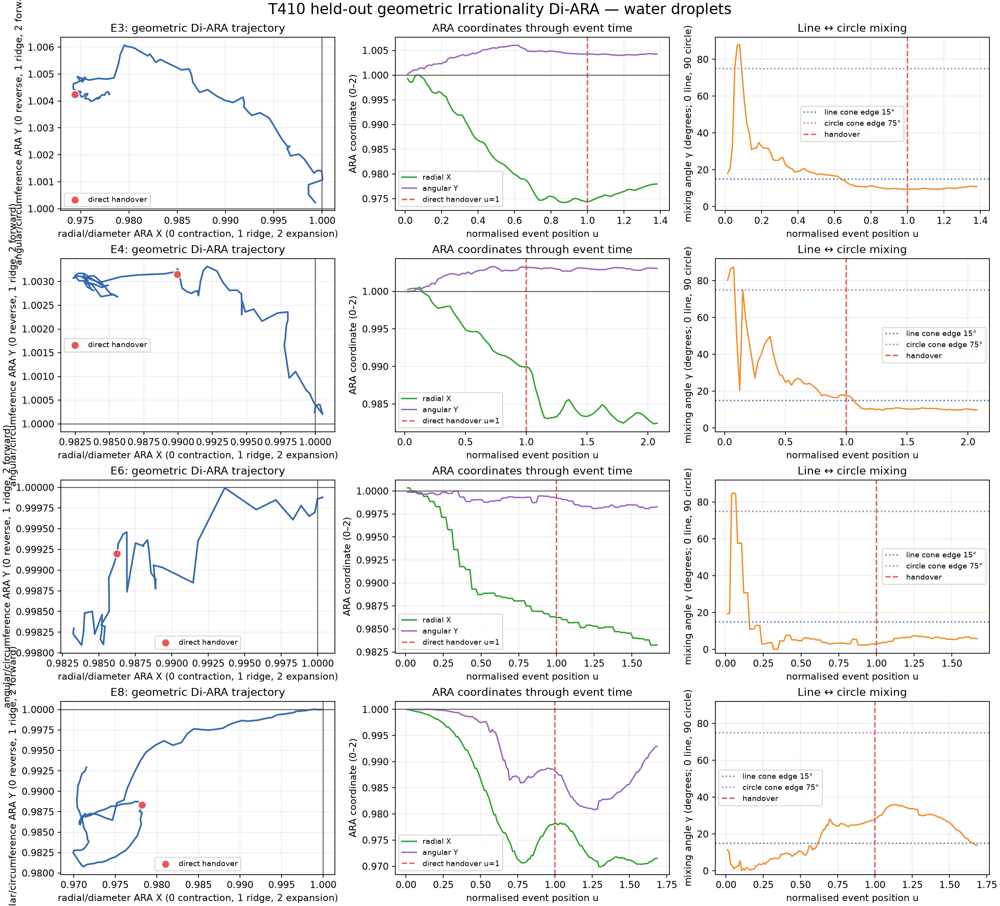
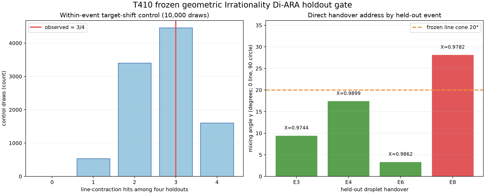

# T410 — Geometric Irrationality Di-ARA in water-droplet handover

**Frozen holdout verdict:** **structural transfer, event-specific gate failed**  
**Protocol SHA-256:**
`E9C820A2684680A80C4615FB97EAED626C116E7327F73A7DD7FEC07B054133D0`

## Answer first

The geometric Irrationality Di-ARA is visibly present in these droplet
trajectories. At the direct handover, all eight development-plus-holdout events
sit on the radial-contraction side, and seven of eight sit within the frozen
20-degree line cone. In the untouched holdout alone, three of four direct
handovers satisfy that line-contraction address and the median mixing angle is
`13.4017°`.

That address is **not specific enough to locate the handover**. The same
line-contraction state occupies broad stretches of the trajectories. Randomly
shifting the target within each event produced at least the observed three hits
with probability `p = 0.6060`. Only two of four holdouts became more line-like
across the handover. The frozen joint gate therefore failed.

The strongest faithful conclusion is:

> These fibre-guided droplet handovers usually occur inside a
> line-dominant contraction branch of the geometric Irrationality Di-ARA, but
> that branch describes the surrounding coalescence regime rather than a
> unique release/locking instant.

## Relational address

- **Who:** eight registered liquid-water droplet handovers on pre-wetted
  fibres.
- **What:** radial/diameter scale change crossed with
  angular/circumference rotation—the geometric/state Irrationality Di-ARA.
- **When:** adjacent encoded frames from an established two-lobe state through
  persistent lobe loss and early reclosure.
- **Where:** the same local pair ROIs used by T409, at the droplet/fibre scale.
- **Why:** determine whether handover has a reproducible geometric address
  after T409's `R=I` amplitude rule failed.
- **How:** robust affine optical flow, polar decomposition, cumulative exact
  ARA mapping, development-registered holdout gate and within-event target
  shifts.

## Measurement

For each adjacent-frame affine map, polar decomposition gives scale `s_t` and
rotation `dtheta_t`. Their cumulative relation to the registered event start is

\[
S_t=\prod s_t,
\qquad
\Theta_t=\sum\Delta\theta_t.
\]

The exact ARA cuts are

\[
X_t=\frac{2S_t}{1+S_t},
\qquad
Y_t=1+\frac{\operatorname{wrap}(\Theta_t)}{\pi},
\]

and the line-to-circle mixing angle is

\[
\gamma_t=\operatorname{atan2}(|Y_t-1|,|X_t-1|).
\]

Thus `X<1` is radial contraction, `X>1` radial expansion, `gamma=0°` the
pure line/diameter limit and `gamma=90°` the pure circle/circumference limit.
No Phi, `e`, reciprocal-Phi or fitted endpoint enters this test.

## Frozen holdout result

| Event | X at direct handover | Y at direct handover | gamma | 20° line-contraction hit | Pre gamma | Post gamma | Became more line-like |
|---|---:|---:|---:|---|---:|---:|---|
| E3 | 0.974421 | 1.004239 | 9.4101° | yes | 10.3007° | 9.6970° | yes |
| E4 | 0.989940 | 1.003151 | 17.3933° | yes | 17.9357° | 10.4941° | yes |
| E6 | 0.986240 | 0.999199 | 3.3331° | yes | 3.0889° | 6.1812° | no |
| E8 | 0.978182 | 0.988348 | 28.1050° | no | 25.3505° | 33.9275° | no |

Frozen gate:

| Requirement | Result | Status |
|---|---:|---|
| At least 3/4 direct targets are 20° line-contraction hits | 3/4 | pass |
| Median target gamma <= 20° | 13.4017° | pass |
| Alignment beats 10,000 target shifts, p < 0.05 | p = 0.6060 | **fail** |
| All frozen requirements | — | **not supported** |

Cone sensitivity is consistent with a gradient rather than a sharp universal
boundary: `2/4` holdouts pass at 15°, `3/4` at 20° and `3/4` at 25°.





## What the figures show

The trajectories are not literal circles. They are paths in the two-axis
geometric relation plane. E3, E4 and E6 arrive near the diameter axis from the
contraction side. E8 remains a more mixed radial/angular identity at handover.
All four still occupy valid Di-ARA gradients.

The shift-control failure is important rather than contradictory. It says the
line-contraction state is a **regime**: it can be present before, during and
after lobe loss. It cannot by itself tell us which frame is the physical
handover. A separate accumulation/release or child-scale coordinate is needed
for timing.

## Supported

1. A reproducible radial/angular Di-ARA coordinate can be extracted from the
   observed droplet motion without complement forcing.
2. All eight direct handovers are radially contracting relative to their
   registered start state.
3. Seven of eight development-plus-holdout handovers are line-dominant under
   the transferred 20-degree cone.
4. Angular sign can be forward or reverse, so the stable feature is the
   line/contraction branch, not one top/bottom quadrant.

## Not supported

1. The line-contraction address as a precise handover detector.
2. A universal transition toward the line axis at lobe loss; only `2/4`
   holdouts moved in that direction across the fixed window.
3. Any exact Phi/e landmark or universal irrational constant.

## Unresolved

The fibre itself strongly privileges one spatial direction. The result may
therefore be a faithful identity-conditioned geometric address of fibre-guided
coalescence rather than a universal droplet rule. A separate flat-substrate
transfer would change the coupling geometry and must be registered as a new
cross-medium test rather than pooled silently.

The next ARA cut, if pursued, should keep this geometric state as the parent
regime and ask which independently measured child accumulation/release
coordinate supplies the event timing inside it.

## QA and reproducibility

- Direct-target valid flow vectors: `892–3,289`, above the frozen minimum.
- Direct-target RANSAC inlier fractions: `0.667–0.908`.
- Direct-target affine anisotropy remained small (`0.00014–0.00202` log-ratio),
  so the polar scale/rotation reading was not dominated by extreme shear.
- Independent validation reproduced the protocol hash, four event addresses,
  median gamma, circular-shift probability and verdict.

Reproduce:

```powershell
$python = 'C:\Users\Dylan\.cache\codex-runtimes\codex-primary-runtime\dependencies\python\python.exe'
$env:PYTHONPATH = 'F:\SystemFormulaFolder\GIT\ARA-GIT\analysis\irrationality_di_ara\T409_combined_handover_droplets\.deps'
& $python analysis\irrationality_di_ara\T410_geometric_irrationality_droplets\t410_geometric_irrationality_droplets.py --mode development
& $python analysis\irrationality_di_ara\T410_geometric_irrationality_droplets\t410_geometric_irrationality_droplets.py --mode holdout
& $python analysis\irrationality_di_ara\T410_geometric_irrationality_droplets\validate_t410_geometric_irrationality_droplets.py
```

Public source and source hashes remain those frozen for T409:
`../T409_combined_handover_droplets/results/T409_SOURCE_HASHES.csv`.
