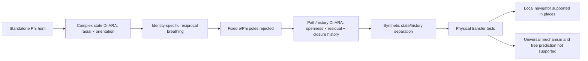

# Irrationality Di-ARA — status update

**Date:** 12 August 2026  
**Status:** research programme paused after T366  
**Scope:** tests directly concerning Irrationality Di-ARA, its precursor Phi/complex-quadrant work, its state/history separation, and its physical transfers  
**Evidence rule:** frozen failures remain failures; post-result diagnostics are labelled and do not repair them

## Technical summary

The Irrationality programme has produced a useful and increasingly precise ARA instrument, but it has **not** established a universal irrationality law, universal `e/Phi` poles, or a complete physical predictor.

The central result is a separation that was initially blurred:

1. **State Di-ARA** records what an identity is doing locally:

   \[
   D_{\rm state}=(x_L,x_C),
   \]

   where the two cuts describe contraction/expansion and reverse/forward orientation.

2. **Path/history Irrationality Di-ARA** records how the identity has travelled:

   \[
   D_{\rm history}=\bigl(x_P,x_R,C(H)\bigr),
   \]

   where `x_P` measures reused/finite addresses versus opening/resolving addresses, `x_R` measures relation-determined movement versus unresolved/stochastic residual, and `C(H)` retains the uncompressed closure history.

The synthetic known-referee tests strongly support those as separable instruments. Physical tests show that the state cut often transfers, that the history cut can preserve real chronology and lineage, and that it can record local next movement very accurately. They do **not** yet show that this history object is a universal physical parent, an autonomous whole-wave generator, or a reliable long-range event predictor.

The strongest current plain-language description is:

> Irrationality Di-ARA is presently best treated as a relational path navigator and recorder. It distinguishes a finitely reused route from an opening route, and a rule-determined route from unresolved or stochastic movement. It can show where a connection could close and how the route approached that closure. It cannot, from geometry alone, prove that a physical connection actually formed, identify one universal irrational constant, or freely reconstruct a long hidden future without renewed observations.

## Key findings at a glance

| Finding | Current status | Why |
|---|---|---|
| Two perpendicular ARA cuts form a useful four-region coordinate | **Supported as an instrument** | Recovered in synthetic referees and several recorded physical domains |
| Reciprocal contraction/expansion around a local ridge occurs | **Supported in selected identities** | Strong in qutrit, bubbles and river, but with different amplitudes |
| One universal reciprocal amplitude exists | **Not supported** | Qutrit, bubble and river amplitudes differ materially |
| Universal `1/e ↔ e` and golden circumferential poles | **Not supported** | T340 and T341 failed cross-domain fixed-constant gates |
| All identities follow one quadrant order or cadence | **Rejected as a framework requirement** | T342 tested that auxiliary rule; identity-specific traversal is the corrected interpretation |
| The intact two-axis parent always beats its children | **Not supported universally** | Strong in controlled laboratory flow; inconsistent across the multimedium battery and numerical representation |
| State and path/history are different cuts | **Strong synthetic support** | T349 passed 7/7 interface gates without cross-contamination |
| The final closing tick creates all stored history | **Rejected** | T350 showed parent memory is distributed across the path; the local tick mainly locates closure |
| Candidate seam geometry proves a physical connection formed | **Rejected** | T351 showed identical geometry can occur with and without an independently measured connection response |
| A visible finite “dusk” is an intrinsic transition width | **Not supported** | T352–T353 reduced it largely to measurement-window smear |
| A parent ridge can be found from one absolute averaged stream | **Not supported** | T354 failed 5/6 gates |
| A parent ridge can be triangulated from two paired child ridges | **Supported synthetically** | T355 passed 6/6, including wrong-pair controls |
| Irrationality Di-ARA autonomously records an entire hidden physical wave | **Not supported** | T361 succeeded only in the coherent middle band |
| Irrationality Di-ARA records local next movement | **Strong result in one oscillator archive** | T361B achieved `0.0183–0.0416` ARA-unit median next-position error and `0.927–0.975` direction agreement across all nine records |
| Fault-tension child closure aligns with release | **Strong retrospective physical result** | T364 found the local child ridge at `+2 ms`; all 15 replication events crossed within `-9` to `+10` source rows |
| The tested fault scale ladder is a general predictor | **Not supported** | Dense event passed, but exact order repeated in only `2/15`; frozen alarm in `3/15` |
| Acoustic children provide a unique granite-failure warning | **Not supported** | Event-associated warning existed, but 31 earlier bouts and poor pseudo-marker specificity defeated the frozen claim |

## The conceptual development

### 1. Standalone Phi was demoted

The earlier search treated Phi as a possible universal Time/non-closing carrier. Plant, orbital, quantum, bubble and river tests produced useful geometry and several conditional Phi appearances, but they did not support one universal Phi step or circle train.

Important precursor boundaries were:

- plant phyllotaxis is a useful known-Phi calibration, not an independent discovery;
- local plant structure often preferred `3/8`, while a larger ordered Fibonacci carrier could prefer Phi;
- the Phi circle-train did not transfer as a universal local operator;
- the orbital Phi ruler was non-identifying, and the `7.5°/15°` orbital result depended on a simplified frame;
- exact Phi remained one possible efficient structured-nonclosure landmark, but no longer the general irrationality identity.

This was productive failure. It changed the question from “Where is Phi?” to “What distinguishes finite closure, structured nonclosure and randomness?”

### 2. The first Irrationality Di-ARA was the complex state cut

The first clean two-axis construction used a complex local relation:

\[
q_n=\frac{z_{n+1}}{z_n}=s_ne^{i\Delta\theta_n}.
\]

The two ARA children were:

- radial contraction versus expansion;
- reverse versus forward orientation.

Crossing their signs formed the four mixed regions `Ab`, `aB`, `bA`, `Ba`.

This coordinate repeatedly appeared, but simply occupying four quadrants is not a discovery by itself. The empirical work had to ask whether order, lineage, coupling and prediction survived controls.

### 3. Reciprocal breathing survived; universal constants did not

The most informative early transfers were:

- **T307 muon/Fusion model:** all four quadrants were recovered and carried order, but a generic continuous AR(2) model was better; the declared `1/e ↔ Phi` pair was not unique.
- **T333 recorded qutrit:** an extremely stable reciprocal breath was recovered at approximately `0.5533 ↔ 1.8069`, not `1/Phi ↔ Phi`. Real order beat all 500 time-order nulls.
- **T334 bubbles:** four quadrants and octave-relative reciprocal breathing transferred, around an identity-specific amplitude near `1.2`. Correct lineage mattered; strict chronological advantage failed on holdout.
- **T335 river/thalweg:** the strongest frozen physical result in this phase. All registered gates passed: four sectors, reciprocal closure, calibration-to-holdout amplitude transfer, true downstream order over 1,000 permutations, intact elevation lineage, and thalweg specificity. The fitted amplitude was about `1.10`, not Phi.

These results support a **shared coordinate form with identity-specific amplitude**.

### 4. T340–T341 directly rejected the universal `e/Phi` placement

T340 asked whether radial/diameter motion universally uses `1/e ↔ e` while angular/circumferential motion uses a golden step. None of the three primary real-data holdouts selected both; the overall verdict was not supported.

T341 then treated line and circle as pure limits of one mixed Di-ARA gradient. A qutrit line-cone result sat unusually close to the `e` limit, but exact `e` lost narrowly to a calibration-fitted value; the circular side preferred `1/e` over the golden target. Bubble and river did not reproduce the constants. The proposed one-budget interpolation also failed.

The correct retained boundary is:

> Line/radial and circle/angular are useful perpendicular cuts. Their local landmarks are not presently universal `e/Phi` constants.

## Full test ledger

### A. Complex state and cross-domain coupling

| Test | What it asked | Result that survives |
|---|---|---|
| **T307** muon/Fusion complex quadrant | Does the four-state compression retain real order and uniquely express the proposed irrational pair? | Quadrant informative; not uniquely `1/e/Phi`; generic continuous model better |
| **T333** recorded qutrit | Does reciprocal golden breathing transfer to real quantum records? | Stable reciprocal breathing and four quadrants; universal Phi endpoints failed |
| **T334** bubbles | Does the coordinate survive an octave-relative physical lineage? | Geometry and reciprocal breathing supported; identity-specific amplitude; holdout chronology failed |
| **T335** river/thalweg | Does downstream order and intact lineage support the coordinate? | Frozen protocol supported; thalweg particularly clean; no fixed constant tested |
| **T340** diameter/circumference | Are `e` and Phi universal pure-axis placements? | Not supported in `0/3` primary real holdouts |
| **T341** pure-axis gradient | Do the constants emerge at pure limits and trade through one budget? | Universal package failed; qutrit `e`-line remains an identity-specific lead |
| **T342** multimedium | Do seven domains share one quadrant gait? | All `7/7` populated four regions; the universal gait failed and was later identified as the wrong framework claim |
| **T343** intact versus broken parent | Does the joint parent beat either child and broken pairing? | Frozen `1/6`, not supported. A past-only post-result sensitivity gave `3/6`, requiring new replication |
| **T344** controlled weir | Does intact radial×turn coupling predict held-out flow conditions and implement the proposed irrationality mechanism? | Laboratory coupling and interaction supported; numerical transfer partial; registered irrationality sandwich failed |
| **T345** line/circle two-ledger | Can coherent curvature be separated from straight and crooked paths, and does it preserve/release information as predicted? | Geometric distinction replicated strongly; delayed information story failed. Coherent curves were already relation-concentrated and their successors lost concentration |
| **T346** storage/handover | Does a connection-concentration peak store and release in proportion to the next opening? | Primary mechanism failed; coherent recurrence and crooked curvature have different, rung-dependent connection profiles |
| **T347** cross-rung return and Phase-B ablation | Does a smoother parent direction span the handover and survive graded removal of the child contribution? | All frozen gates failed in the numerical weir representation |

### B. The cleaner path/history instrument

| Test | What it asked | Result that survives |
|---|---|---|
| **T348** known-referee paths | Can finite periodic, irrational rotation, deterministic chaos, finite stochastic and continuous stochastic histories be separated without using labels in scoring? | Synthetic instrument supported: `95.65%` broad-sector accuracy and `90.00%` macro-family accuracy; deterministic chaos remains the hard boundary |
| **T349** state/history interface | Are current radial/orientation state and accumulated path history genuinely different cuts? | Supported `7/7`; changing one cut did not spuriously change the other. No universal fixed amplitude passed |
| **T350** tick versus parent memory | Does the final closure tick create the parent history? | Parent memory supported; pure closure-front origin rejected. The local tick locates closure while history is distributed across the path |
| **T351** progressive zipper | Does candidate seam geometry prove connection construction? | No. Geometry can locate where a connection could form, but an independent physical response channel is required to show that it did form |
| **T352** dusk band | Is a visible finite transition band intrinsic? | Only measurement dusk supported; `4/6` gates |
| **T353** dusk deconvolution | Can varying the observer window recover the true intrinsic width? | No; window-smear-only verdict, `2/6` |
| **T354** absolute parent ridge | Can one averaged stream localize an invariant parent centre? | Ridge not resolved, `1/6` |
| **T355** relational parent ridge | Can two independently measured directional child ridges triangulate the common seam? | Synthetic instrument supported, `6/6`; paired estimate beat either child and wrong pairs |

### C. Physical transfers of the path/history idea

| Test | What it asked | Result that survives |
|---|---|---|
| **T357** single/double pendulum | Is the second arm an ordered repeatedly missing child path? | Instrument transferred and `5/6` grouped gates passed, but the actual double records were phase-locked or too incoherent; complete irrationality transfer failed |
| **T358** detuned electrochemical oscillators | Does a raw derivative phase plane recover coherent nonclosure? | Frozen result failed; the chosen clock was physically invalid, so the physical question remained inconclusive |
| **T359** event-clock correction | Does a raw event clock rescue coupling-specific coherent nonclosure? | It found closing/nonclosing records but converted recurrent traces into near-sawteeth, erasing coupling identity; not supported |
| **T360** magnetic Plinko | Do nearby connection gates steer the path and immediately produce a denser parent lock? | `21/25` turns went toward a real nearest magnet; the aggregate-density zipper and full frozen benchmark failed |
| **T361/T361B** oscillator wave recorder | Can the relation restore a hidden child wave? | Complete free-running recorder failed. Local next-step recording was excellent across all nine records; long recursion drifted without renewed locks |
| **T362** laboratory fault movement | Does stress×movement form a predictive Irrationality parent? | All four physical child quadrants were real; compressed parent stayed in one quadrant and did not uniquely predict slip |
| **T363** fault tension | Does storage×signed release improve the physical identity? | Ordinary tension ARA replicated strongly in `15/15`; the higher Irrationality parent did not |
| **T364** child-quadrant handover | Is the release a local child ridge rather than a whole-parent tour? | Strong registered post-hoc support: dense child ridge `+2 ms`; `15/15` event-local crossings within `-9` to `+10` rows; broader history reopened and reclosed later |
| **T365** five-rung fault ladder | Do smaller tension identities cross first and provide a warning? | Dense event gave a `14 ms` alarm with correct order. Frozen replication failed: exact order `2/15`, alarm `3/15`; fluid subgroup was a lead, not a rescue |
| **T366** acoustic granite ladder | Do acoustic connection/movement children warn before bulk stress release? | Event-associated acoustic warning at `0.5976 s`, and correct final child order, but 31 earlier bouts and pseudo-marker nonspecificity caused frozen failure |

## What the 31 earlier acoustic bouts probably were

The 31 earlier T366 bouts should not automatically be called random false alarms. The source physics and the post-result mechanism audit make it plausible that many were **preparatory microcrack or damage-reorganisation episodes**:

- they occurred during the long damage-accumulation period;
- their compression-versus-shear/tensile mixtures changed;
- the final event-associated bout was the most movement-heavy of the observed bouts;
- the source experiment independently reports accelerating acoustic-emission activity and changing source mechanisms before failure.

But the current data do not show that every earlier bout joined the final fracture network. Their timing was not specific enough to predict terminal failure, and the catalogue lacks the continuous waveform and complete spatial coalescence information needed to distinguish a harmless local crack from a terminally connected one.

The honest label is therefore:

> **non-terminal preparatory child bouts**, some of which may be physical connection failures, but not yet demonstrably members of the final rupture path.

## What is mathematically defined versus empirically found

### Defined by the coordinate

- ARA reflection and normalization to `0–2`.
- Two perpendicular cuts creating four mixed regions.
- TE-ARA complement bookkeeping.
- The labels `Ab`, `aB`, `bA`, `Ba` once axis direction is declared.
- Reciprocal reflection identities such as `X(1/s)=2-X(s)`.

These are not empirical discoveries.

### Empirically supported in at least bounded settings

- Recorded systems can occupy all four regions with independent physical cuts.
- Radial reciprocal organisation can be stable and lineage-specific.
- Ordered history and correct lineage can matter beyond shuffled or broken controls.
- The paired relation can outperform either child in some physical identities, especially the laboratory weir.
- State and accumulated history are separable under controlled known-referee tests.
- A relational parent ridge can be recovered from two correctly paired child ridges synthetically.
- The history recorder can be very accurate for local next movement.
- In fault tension, local child closure can align tightly with physical release while the broader history recloses later.

### Not established

- Universal `e`, `1/e`, Phi or reciprocal-Phi poles.
- One universal radial amplitude.
- One universal quadrant order, cadence or occupancy ratio.
- One universal physical meaning for each quadrant across identities.
- A universal parent/child orientation between state and history Di-ARAs.
- Intrinsic finite dusk width.
- Geometry-alone proof that a physical connection formed.
- Autonomous long-horizon waveform restoration.
- General fault or earthquake prediction.
- The universal fractal-sphere proposal.

## Current ARA interpretation

The programme presently supports the following layered reading:

1. A physical identity has an immediate ARA state.
2. Its movement through successive states creates a path/history identity.
3. That history can remain finitely reused, keep opening coherently, become chaos-sensitive, or become stochastic/residual.
4. A local child can reach its own ridge while the larger parent remains asymmetric or stays in one broad quadrant.
5. A closing opportunity is not the same as a completed connection. Independent response is required.
6. After local closure/release, the broader history can remain open and reclose later.
7. Exact constants, amplitudes, cadence and occupied branches are identity- and measurement-boundary questions, not properties to impose universally.

This is consistent with the originator clarification that one identity need not traverse the whole Di-ARA. A quadrant can be the active child branch, and decompressing it restores another complete `0–2` ARA at that child scale.

## Limitations and uncertainty

- Many physical datasets were reused across successive frozen questions. Those are legitimate transfers or diagnostics, not independent discoveries.
- Several strongest physical findings are registered post-hoc mechanisms rather than pristine holdouts.
- Four-quadrant occupancy is necessary for some instrument claims but weak by itself.
- Finite data cannot prove a number or physical frequency is mathematically irrational. The empirical term is **structured nonclosure over the observed horizon**.
- Some controls exposed their own defects: mirrored Plinko geometry was degenerate; an early T343 circular-shift control leaked across time; the T358 derivative clock was invalid; the T359 event clock over-normalized identity.
- Connection concentration measures distribution across observed channels, not total Phase B, energy or conserved information.
- The acoustic catalogue omits quiet subthreshold activity and continuous waveform phase.

## Paused research questions

When this programme resumes, the highest-value unresolved questions are:

1. Is path/history Di-ARA the parent of state Di-ARA, a child of it, or a sibling forming a larger Information³ parent?
2. Can a new physical system independently show coherent nonclosure: continued opening, high determinacy, nonzero repeated miss, and correct-lineage specificity?
3. Can an independently measured response prove that a candidate zipper seam actually formed a connection?
4. Can a waveform-rich failure archive distinguish harmless preparatory child bouts from spatially coalescing terminal cracks?
5. Does child-first warning transfer across a second synchronized stress/movement archive without retuning?
6. Are any exact irrational constants privileged after the geometry and identity boundary are independently established?

## Bottom line

Irrationality Di-ARA is no longer best described as “Phi hidden in everything.” The evidence supports a broader and cleaner object:

> a two-cut relational instrument for separating route reuse from route opening, and determined continuation from unresolved/stochastic continuation, while retaining closure history.

It has recovered real order, lineage, reciprocal breathing, child closure and local navigation in several domains. Its universal constants, universal coupling mechanism, autonomous restoration and predictive claims have not survived. That is still substantial progress: the work has converted a broad intuition about non-closing motion into a falsifiable instrument with known strengths, known failure modes and a clear physical boundary between **possible closure geometry** and **actual connection formation**.

## Primary records

- [`ARA_COMPLEX_IRRATIONALITY_QUADRANT_HYPOTHESIS_2026-08-03.md`](../phi_calibration/ARA_COMPLEX_IRRATIONALITY_QUADRANT_HYPOTHESIS_2026-08-03.md)
- [`DI_ARA_PERPENDICULAR_CROSS_RUNG_INFORMATION.md`](../../DI_ARA_PERPENDICULAR_CROSS_RUNG_INFORMATION.md)
- [`T335_RIVER_IRRATIONALITY_DI_ARA_REPORT_2026-08-03.md`](../hydraulics/T335_RIVER_IRRATIONALITY_DI_ARA_REPORT_2026-08-03.md)
- [`T344_BAW_WEIR_IRRATIONALITY_DI_ARA_COMBINED_REPORT_2026-08-06.md`](../hydraulics/T344_BAW_WEIR_IRRATIONALITY_DI_ARA_COMBINED_REPORT_2026-08-06.md)
- [`T348_IRRATIONALITY_PATH_KNOWN_REFEREE_REPORT_2026-08-11.md`](T348_IRRATIONALITY_PATH_KNOWN_REFEREE_REPORT_2026-08-11.md)
- [`T349_STATE_HISTORY_DI_ARA_INTERFACE_REPORT_2026-08-11.md`](T349_STATE_HISTORY_DI_ARA_INTERFACE_REPORT_2026-08-11.md)
- [`T361_IRRATIONALITY_DI_ARA_WAVE_RECORDING_REPORT_2026-08-12.md`](T361_IRRATIONALITY_DI_ARA_WAVE_RECORDING_REPORT_2026-08-12.md)
- [`T364_FAULT_TENSION_CHILD_QUADRANT_HANDOVER_REPORT_2026-08-12.md`](T364_FAULT_TENSION_CHILD_QUADRANT_HANDOVER_REPORT_2026-08-12.md)
- [`T366_ACOUSTIC_CHILD_LADDER_REPORT_2026-08-12.md`](T366_ACOUSTIC_CHILD_LADDER_REPORT_2026-08-12.md)
- [`PROVENANCE_LEDGER.md`](../../FableConvo/PROVENANCE_LEDGER.md)
