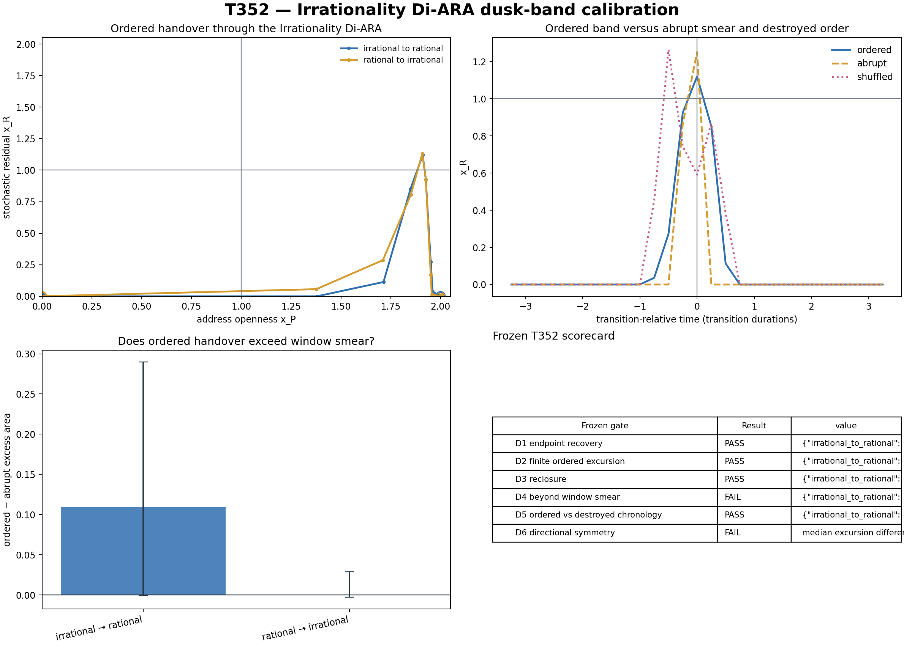

# T352 — Irrationality Di-ARA dusk band

**Run date:** 11 August 2026  
**Evidence boundary:** synthetic known-referee transition/instrument calibration  
**Verdict:** **MEASUREMENT DUSK ONLY**  
**Frozen gates:** **4/6 passed**

## Answer first

T352 tested whether the existing Irrationality Di-ARA resolves a finite ordered handover between structured non-closing and rationally closing movement, after subtracting the transition produced by passing an abrupt switch through the same sliding window.

The result is an instrument calibration. The generator supplies the changing rule; the test asks whether the frozen coordinates distinguish ordered transition, abrupt measurement smear and destroyed chronology without using those labels in the measurements.

## Directional results

| direction | ordered excursion | ordered−abrupt excess area | shuffled−ordered roughness | final post error |
|---|---:|---:|---:|---:|
| irrational to rational | 1.151405 [0.638499, 1.474620] | +0.109192 [-0.000959, +0.226039] | +0.017921 [+0.007217, +0.029936] | 0.000000 |
| rational to irrational | 1.155634 [0.737368, 1.788240] | -0.000434 [-0.002560, +0.037764] | +0.017487 [+0.006385, +0.026977] | 0.000000 |

## Frozen gates

| gate | verdict | value |
|---|---|---|
| D1 endpoint recovery | PASS | `{"irrational_to_rational": {"irrational_x_p": 2.0, "rational_x_p": 0.0, "pre_x_r": 8.403243578365138e-05, "post_x_r": 0.0}, "rational_to_irrational": {"irrational_x_p": 2.0, "rational_x_p": 0.0, "pre_x_r": 0.0, "post_x_r": 8.403243578365029e-05}}` |
| D2 finite ordered excursion | PASS | `{"irrational_to_rational": {"estimate": 1.1514046291434865, "ci_low": 0.6384986175910181, "ci_high": 1.4746202341352868, "n": 96}, "rational_to_irrational": {"estimate": 1.155634025847392, "ci_low": 0.7373676808389991, "ci_high": 1.7882396438008, "n": 96}}` |
| D3 reclosure | PASS | `{"irrational_to_rational": {"error": {"estimate": 0.0, "ci_low": 0.0, "ci_high": 0.0, "n": 96}, "post_share": 1.0}, "rational_to_irrational": {"error": {"estimate": 1.7414997395548415e-18, "ci_low": 8.944667923005412e-19, "ci_high": 9.718652748888501e-16, "n": 96}, "post_share": 1.0}}` |
| D4 beyond window smear | FAIL | `{"irrational_to_rational": {"estimate": 0.10919198974175179, "ci_low": -0.0009585001334661775, "ci_high": 0.22603880916012092, "n": 96}, "rational_to_irrational": {"estimate": -0.0004343912856636777, "ci_low": -0.002559629183546562, "ci_high": 0.03776361997649724, "n": 96}}` |
| D5 ordered vs destroyed chronology | PASS | `{"irrational_to_rational": {"estimate": 0.017920736931661345, "ci_low": 0.007216783117589054, "ci_high": 0.02993582939069389, "n": 96}, "rational_to_irrational": {"estimate": 0.017487146248858672, "ci_low": 0.00638475830960622, "ci_high": 0.02697722130981367, "n": 96}}` |
| D6 directional symmetry | FAIL | `median excursion difference=0.004229` |

## Interpretation boundary

Passing would show that the frozen instrument can distinguish an ordered finite handover from abrupt window mixing and destroyed order in controlled paths. It would not establish a physical dusk band in bubbles or another domain. Failure of D4 means the visible transition is adequately explained by measurement-window mixing; failure of D5 means the instrument does not preserve the difference between smooth and order-destroyed handover.

## Reproduction artifacts

- `T352_IRRATIONALITY_DI_ARA_DUSK_BAND_WINDOWS.csv`
- `T352_IRRATIONALITY_DI_ARA_DUSK_BAND_EVENTS.csv`
- `T352_IRRATIONALITY_DI_ARA_DUSK_BAND_PREFIX_PARENT.csv`
- `T352_IRRATIONALITY_DI_ARA_DUSK_BAND_FROZEN_GATES.csv`
- `T352_IRRATIONALITY_DI_ARA_DUSK_BAND_RESULTS.json`
- `T352_IRRATIONALITY_DI_ARA_DUSK_BAND_FIGURE.png`
- `t352_irrationality_di_ara_dusk_band.py`
