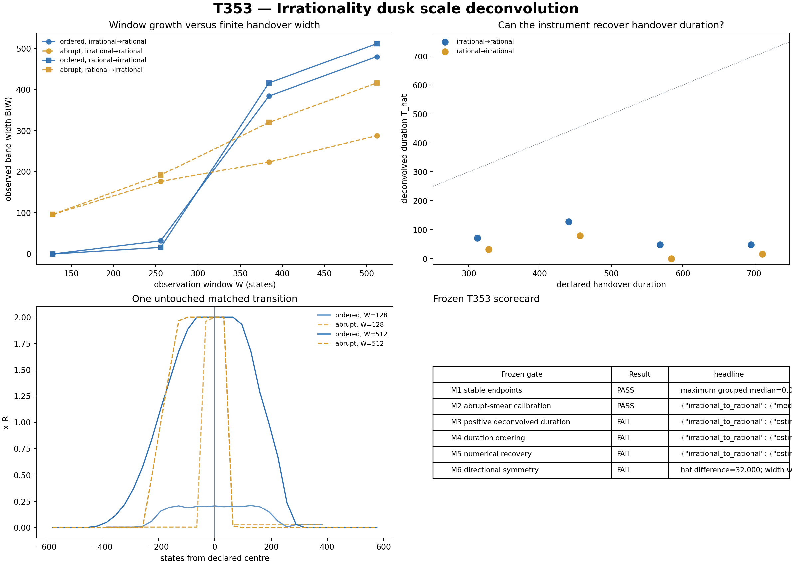

# T353 — Irrationality dusk scale deconvolution

**Run date:** 11 August 2026  
**Evidence boundary:** synthetic known-referee multiscale follow-up  
**Verdict:** **WINDOW SMEAR ONLY**  
**Frozen gates:** **2/6 passed**

## Answer first

T353 changed the observer rather than the event. Four window sizes measured each new ordered handover and its matched abrupt switch. The abrupt width estimates measurement smear; subtracting it tests whether a finite transition duration remains.

## Directional recovery

| direction | median T_hat | Spearman with declared duration | median absolute error | positive window count |
|---|---:|---:|---:|---:|
| irrational to rational | 56.000 [8.000, 96.000] | -0.0340 [-0.2058, 0.1401] | 352.000 | 2.0/4 |
| rational to irrational | 24.000 [0.000, 72.000] | -0.0169 [-0.1859, 0.1543] | 376.000 | 2.0/4 |

## Frozen gates

| gate | result | headline |
|---|---|---|
| M1 stable endpoints | PASS | `maximum grouped median=0.013715` |
| M2 abrupt-smear calibration | PASS | `{"irrational_to_rational": {"median_abs_intercept": 32.00000000000008, "median_r2": 0.9846153846153847}, "rational_to_irrational": {"median_abs_intercept": 15.999999999999893, "median_r2": 0.9956363636363637}}` |
| M3 positive deconvolved duration | FAIL | `{"irrational_to_rational": {"estimate": 56.0, "ci_low": 8.0, "ci_high": 96.0, "n": 144}, "rational_to_irrational": {"estimate": 24.0, "ci_low": 0.0, "ci_high": 72.0, "n": 144}}` |
| M4 duration ordering | FAIL | `{"irrational_to_rational": {"estimate": -0.03401822905328951, "ci_low": -0.2057825541583835, "ci_high": 0.14006697955178715, "n": 144}, "rational_to_irrational": {"estimate": -0.016945439536800937, "ci_low": -0.185892612860386, "ci_high": 0.15434449285436394, "n": 144}}` |
| M5 numerical recovery | FAIL | `{"irrational_to_rational": {"estimate": 352.0, "ci_low": 304.0, "ci_high": 448.0, "n": 144}, "rational_to_irrational": {"estimate": 376.0, "ci_low": 352.0, "ci_high": 448.0, "n": 144}}` |
| M6 directional symmetry | FAIL | `hat difference=32.000; width wins={'irrational_to_rational': 2, 'rational_to_irrational': 2}` |

## Interpretation boundary

The generator contains the transition duration by construction. Passing shows only that the frozen residual plus matched abrupt control can recover that duration across new parameters and scales. It is not physical-domain evidence.

## Artifacts

- `T353_IRRATIONALITY_DUSK_SCALE_DECONVOLUTION_BANDS.csv`
- `T353_IRRATIONALITY_DUSK_SCALE_DECONVOLUTION_PROFILES.csv`
- `T353_IRRATIONALITY_DUSK_SCALE_DECONVOLUTION_IDENTITIES.csv`
- `T353_IRRATIONALITY_DUSK_SCALE_DECONVOLUTION_FROZEN_GATES.csv`
- `T353_IRRATIONALITY_DUSK_SCALE_DECONVOLUTION_RESULTS.json`
- `T353_IRRATIONALITY_DUSK_SCALE_DECONVOLUTION_FIGURE.png`
- `t353_irrationality_dusk_scale_deconvolution.py`
