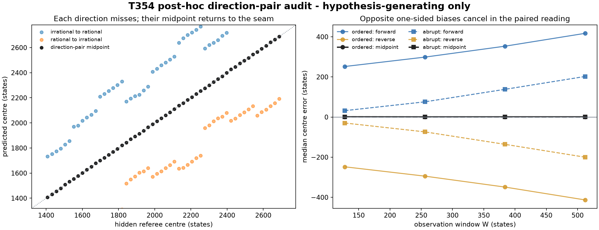

# T354 post-hoc direction-pair audit

**Status:** hypothesis-generating; not a frozen T354 gate

The frozen single-direction ridge test failed. Its directional errors were nevertheless nearly equal and opposite. Pairing the independently measured forward and reverse centres and taking their midpoint recovered the known seam to within a few states.

- ordered median paired absolute error: `1.437063` states
- ordered 95th percentile paired absolute error: `5.787137` states
- abrupt median paired absolute error: `1.133154` states
- abrupt 95th percentile paired absolute error: `6.384792` states

## Boundary

The generator uses exactly reversed endpoint paths, so antisymmetric cancellation may be partly forced by the synthetic construction. This result cannot rescue the frozen T354 verdict. It motivates a new preregistered test in which a simultaneous two-sided pair must recover the parent ridge under controlled child asymmetry.
