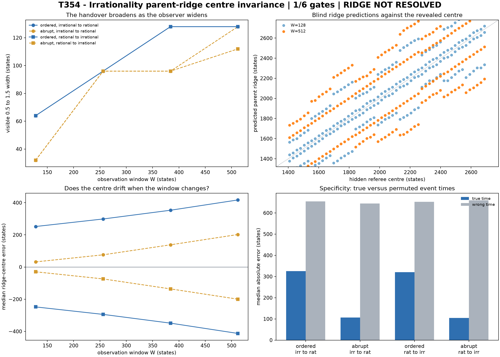

# T354 - Irrationality parent-ridge centre invariance

**Run date:** 11 August 2026  
**Evidence boundary:** synthetic known-referee instrument calibration  
**Verdict:** **RIDGE NOT RESOLVED**  
**Frozen gates:** **1/6 passed**

## Answer first

T354 varied observer width while hiding identity-specific transition times from the estimator. The primary question was whether the midpoint between the two stable Irrationality endpoint coordinates stays fixed even when its visible transition run broadens.

## Headline localization

| direction | mode | median absolute error | median window range |
|---|---|---:|---:|
| irrational to rational | ordered | 325.223 [320.303, 334.514] | 166.328 [164.074, 167.672] |
| irrational to rational | abrupt | 107.032 [105.101, 108.889] | 172.075 [170.998, 172.873] |
| rational to irrational | ordered | 320.327 [316.614, 332.406] | 165.861 [163.742, 167.971] |
| rational to irrational | abrupt | 104.894 [104.036, 107.395] | 173.071 [169.575, 173.850] |

## Frozen gates

| gate | result | headline |
|---|---|---|
| R1 endpoint separation | PASS | `minimum grouped median=1.409589; prediction rate=1.0000` |
| R2 known-centre localization | FAIL | `{"irrational_to_rational:ordered": {"estimate": 325.2231030928165, "ci_low": 320.3025984196229, "ci_high": 334.5143633115813, "n": 54}, "irrational_to_rational:abrupt": {"estimate"` |
| R3 window invariance | FAIL | `{"irrational_to_rational:ordered": {"estimate": 166.32844317656338, "ci_low": 164.07404852026252, "ci_high": 167.67186609098587, "n": 54}, "irrational_to_rational:abrupt": {"estima` |
| R4 directional complement | FAIL | `{"irrational_to_rational": 325.2231030928165, "rational_to_irrational": -320.3270847886845}` |
| R5 broadening without centre drift | FAIL | `{"irrational_to_rational:ordered": {"widths": [64.0, 96.0, 128.0, 128.0], "centre_error_slope": 0.42958125837403144}, "irrational_to_rational:abrupt": {"widths": [32.0, 96.0, 96.0,` |
| R6 wrong-time control | FAIL | `{"irrational_to_rational:ordered": {"true_median": 325.2231030928165, "wrong_median": 653.9219446671343, "difference": {"estimate": 431.9124307721472, "ci_low": 184.01123431182396,` |

## Interpretation boundary

A pass supports only a stable parent midpoint in the existing synthetic Irrationality coordinate. It does not identify an Irrationality dusk/dawn child pair or prove that a physical transition uses this geometry.

## Artifacts

- `T354_IRRATIONALITY_PARENT_RIDGE_CENTRE_SERIES.csv`
- `T354_IRRATIONALITY_PARENT_RIDGE_CENTRE_PROFILES.csv`
- `T354_IRRATIONALITY_PARENT_RIDGE_CENTRE_IDENTITIES.csv`
- `T354_IRRATIONALITY_PARENT_RIDGE_CENTRE_WRONG_TIME_CONTROLS.csv`
- `T354_IRRATIONALITY_PARENT_RIDGE_CENTRE_FROZEN_GATES.csv`
- `T354_IRRATIONALITY_PARENT_RIDGE_CENTRE_RESULTS.json`
- `T354_IRRATIONALITY_PARENT_RIDGE_CENTRE_FIGURE.png`
- `t354_irrationality_parent_ridge_centre.py`
