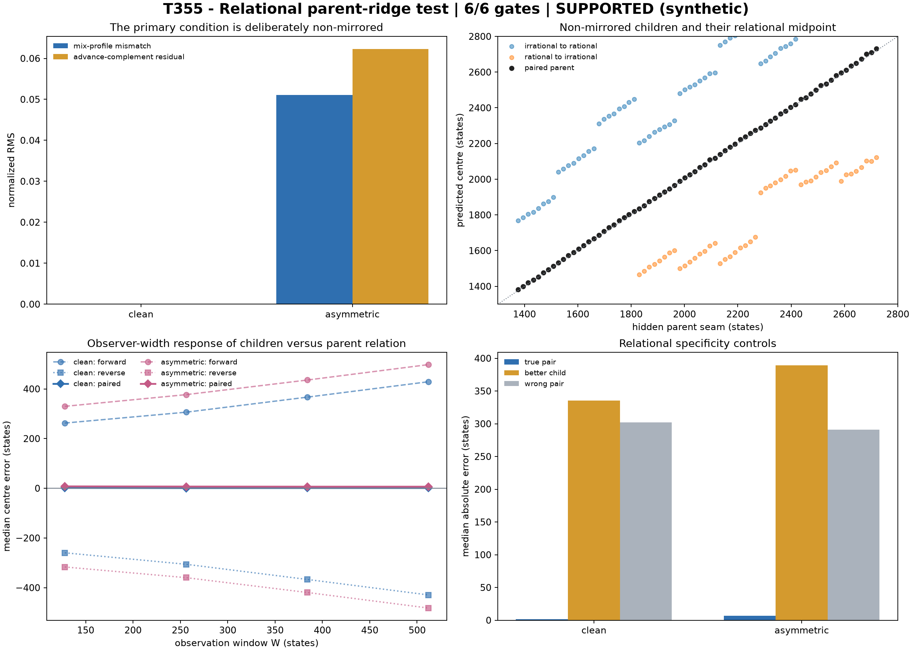

# T355 - Irrationality relational parent ridge

**Run date:** 11 August 2026  
**Evidence boundary:** synthetic known-referee relational-instrument calibration  
**Verdict:** **SUPPORTED [SYNTHETIC RELATIONAL PARENT-RIDGE INSTRUMENT ONLY]**  
**Frozen gates:** **6/6 passed**

## Answer first

T355 froze the parent estimate as the unweighted midpoint of two independently measured directional child ridges. The primary condition used unequal timing, nonlinear shapes, independent phases and different tapered child perturbations while retaining one hidden parent seam.

## Relational recovery

| condition | paired median error | paired window range | better single child | wrong pair |
|---|---:|---:|---:|---:|
| clean | 1.426 [1.121, 1.645] | 2.510 [1.831, 3.420] | 335.274 | 302.248 |
| asymmetric | 6.674 [6.217, 7.964] | 2.939 [2.304, 4.461] | 389.461 | 290.918 |

## Frozen gates

| gate | result | headline |
|---|---|---|
| P1 asymmetry audit | PASS | `{"clean_mix_rms": 0.0, "asymmetric_mix_rms": 0.051063103889792086, "asymmetric_advance_rms": 0.06226125222917572}` |
| P2 endpoint recovery | PASS | `minimum grouped median=1.100430; prediction rate=1.0000` |
| P3 relational localization | PASS | `{"clean": {"identity": {"estimate": 1.425888672470819, "ci_low": 1.1208897120436632, "ci_high": 1.6450959726996643, "n": 72}, "window_medians": {"128": 2.3669920287802597, "256": 1` |
| P4 relational window invariance | PASS | `{"clean": {"estimate": 2.5104554617771555, "ci_low": 1.8311252746798345, "ci_high": 3.420499897441232, "n": 72}, "asymmetric": {"estimate": 2.938798484799122, "ci_low": 2.304238598` |
| P5 pair beats either child | PASS | `{"clean": {"paired_median": 1.425888672470819, "better_single_median": 335.2735210367788, "gain": {"estimate": 333.9468777238946, "ci_low": 327.91175659659467, "ci_high": 354.66395` |
| P6 wrong-pair specificity | PASS | `{"clean": {"paired_median": 1.425888672470819, "wrong_pair_median": 302.2476832838746, "gain": {"estimate": 301.06117586227464, "ci_low": 293.56935706803546, "ci_high": 304.1324733` |

## Interpretation boundary

A pass is synthetic evidence for this paired instrument, not proof of a universal physical ridge. Both children were generated around a supplied common seam; physical transfer still requires an independently justified pairing and an unseen event time.

## Artifacts

- `T355_IRRATIONALITY_RELATIONAL_PARENT_RIDGE_ASYMMETRY_AUDIT.csv`
- `T355_IRRATIONALITY_RELATIONAL_PARENT_RIDGE_CHILDREN.csv`
- `T355_IRRATIONALITY_RELATIONAL_PARENT_RIDGE_PAIRS.csv`
- `T355_IRRATIONALITY_RELATIONAL_PARENT_RIDGE_IDENTITIES.csv`
- `T355_IRRATIONALITY_RELATIONAL_PARENT_RIDGE_FROZEN_GATES.csv`
- `T355_IRRATIONALITY_RELATIONAL_PARENT_RIDGE_RESULTS.json`
- `T355_IRRATIONALITY_RELATIONAL_PARENT_RIDGE_FIGURE.png`
- `t355_irrationality_relational_parent_ridge.py`
