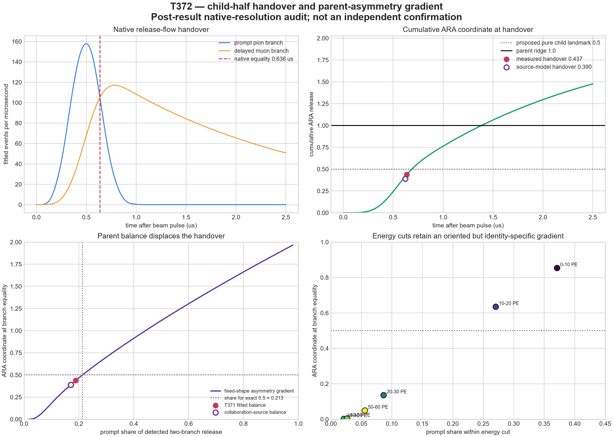

# T372 — child-half handover and parent-asymmetry gradient

**Date:** 13 August 2026  
**Verdict:** **HANDOVER GRADIENT MAPPED; EXACT CHILD-HALF REMAINS UNCONFIRMED**  
**Evidence class:** post-result native-resolution calibration on the opened T371 physical record

## Result first

The proposed theory is now recorded precisely:

\[
r_A(t_H)=r_B(t_H),
\qquad
x(t_H)=0.5+\Delta_H.
\]

`t_H` is the moment when the two instantaneous release branches are equal.
`x(t_H)` is the combined cumulative release on the parent ARA `0–2` diameter.
The pure proposed child landmark is `0.5`; `Delta_H` is the identity-specific
displacement caused by unequal parent abundance, cadence or branch shape.

T372 found a clean parent-balance gradient, but it also corrected the apparent
exact result visible in T371. The T371 plot gave `(0.492 us, 0.494 ARA)` because
completed 0.5-microsecond bins were displayed at their centres. Reconstructing
the official source templates at native 1-nanosecond timing gave:

| reading | prompt share | equality time | cumulative ARA at equality |
|---|---:|---:|---:|
| free T371 fit, native timing | 0.1886 | 0.6361 us | **0.4374** |
| collaboration-source mixture | 0.1704 | 0.6199 us | **0.3895** |
| exact child-half on these fixed shapes | 0.2135 | — | **0.5000** |

The fitted native coordinate has 95% parametric-bootstrap interval
**[0.1787, 0.6916]**. Therefore `0.5` remains compatible with this record but
is not confirmed. The source-model value is inside the same interval.

## What the gradient says

Holding the two measured native branch shapes fixed and changing only their
relative parent weights produces a monotone map:

\[
\text{parent balance}
\longrightarrow
\text{equality time}
\longrightarrow
x(t_H).
\]

More prompt weight moves equality later and moves the cumulative handover
farther along the `0–2` diameter. Less prompt weight produces an earlier,
lower-coordinate handover. The fitted prompt share is `0.0249` below the share
that would put equality at exact `0.5`, matching the observed negative
displacement

\[
\Delta_H=0.4374-0.5=-0.0626.
\]

This supports Dylan's relational refinement: a pure landmark can remain fixed
while its physical expression is displaced by the asymmetry of the coupled
parents. However, the sweep is an exact consequence of the already extracted
branch shapes. It is a calibration and prediction instrument, not independent
evidence for universality.

## Visual reading



The panels show:

1. the prompt flow falling through the delayed flow at `0.636 us`;
2. the cumulative parent coordinate at that same moment (`0.437`), followed by
   the later parent ridge at `1.0`;
3. the monotone displacement created by changing the two parent weights;
4. energy-band sensitivity cuts. These cuts share one experiment and are not
   six independent confirmations.

## What survived and what did not

**Survived**

- T371's two-stage ordered physical release and Di-ARA reading;
- a resolvable instantaneous handover;
- an oriented, monotone asymmetry-to-handover gradient;
- compatibility of the measured handover with the proposed `0.5` landmark;
- the distinction between pure geometry and identity-specific flow.

**Did not survive as stated**

- the central claim that T371 itself measured an almost exact cumulative
  `0.5` handover;
- treating microseconds as though they were already ARA coordinates;
- any claim that this confirms a universal child-half release law.

## Scientific boundary and next confirmation

T372 is post-result. The same T371 record suggested the theory and supplied
the branch shapes used to map it. The current status must therefore remain:

> **Strong ARA theory, operationally coherent and compatible with this physical
> record, but not yet independently confirmed.**

The next test must freeze an independent two-branch physical release, estimate
parent asymmetry without inspecting its equality handover, predict the sign
and approximate magnitude of `Delta_H`, and only then open the native timing.
That test can confirm or falsify transfer of the rule.

No universal Phi law is used or revived.

## Reproduction

```powershell
$env:PYTHONPATH='F:\SystemFormulaFolder\.codex_python_packages;F:\SystemFormulaFolder\GIT\ARA-GIT\analysis\muon'
& 'C:\Users\Dylan\.cache\codex-runtimes\codex-primary-runtime\dependencies\python\python.exe' `
  'F:\SystemFormulaFolder\GIT\ARA-GIT\analysis\muon\t372_child_half_handover_gradient.py'
```

Primary machine record: `T372_CHILD_HALF_HANDOVER_GRADIENT_RESULTS.json`.

