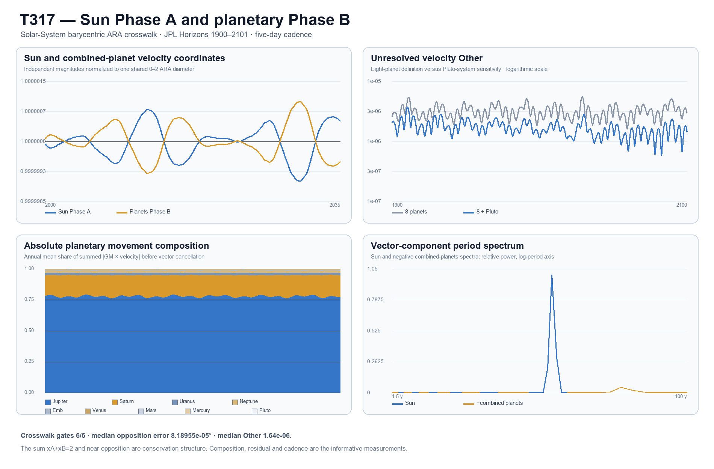

# Sun and Planets as One Solar-System ARA Pair

**Test:** T317  
**Date:** 31 July 2026  
**Evidence class:** public-data crosswalk/calibration; established conservation is not a discovery  
**Primary result:** **6/6 registered crosswalk gates passed**

## Technical summary

The corrected Solar-System assignment works numerically:

\[
\underbrace{\mathbf A(t)}_{\text{Sun / Phase A}}
+
\underbrace{\mathbf B(t)}_{\text{planetary systems / Phase B}}
\longrightarrow
\underbrace{\text{Solar-System barycentric parent}}_{\text{completed whole}}.
\]

Across `14,683` public five-day JPL Horizons states from 1900
through 2100, the extended Sun-versus-planets velocity pair sat at
`x_A=1.000000016` and `x_B=0.999999984`. Its
median opposition error was `8.18955418e-05°` and its
unresolved velocity Other was `1.64412597e-06` TE-ARA units.
The GM-weighted position pair also closed, with median opposition error
`0.00582895504°` and Other
`0.000146374784`.

That is a faithful ARA crosswalk, but its central closure is established
barycentric mechanics. The useful extra description is the changing planetary
composition, the residual left by omitted small bodies and the cadence carried
through both sides of the pair.



## The Solar-System identity is Sun versus the planetary collective

The previous orbital T309 cut used Earth relative to the Sun as one child and
projected it directly against Galactic parent travel. T317 restores the missing
Solar-System level. Earth is one contribution inside Phase B; it is not the
Sun's complete opposite pole.

The primary eight-planet pair had median velocity Other
`3.11536326e-06`. Adding Pluto's system reduced that median by
`47.23%` to `1.64412597e-06`. The remaining Other is
kept visible rather than assigned to either pole; it can include integrated
asteroids and differences between the retained mass model and the full JPL
ephemeris.

## Phase B is a changing web, not one planet

Jupiter supplied the largest absolute signed projection onto the combined
planetary vector in `100.0%` of time slices.
The median shares of total absolute planetary movement were:
jupiter 77.9%, saturn 17.3%, uranus 1.8%, neptune 1.8%. These are kinematic composition shares, not mass
shares.

The stacked composition in the figure uses each system's absolute
\(|GM\,\mathbf v|\) divided by the sum across retained planetary systems. It
therefore shows how much movement each child carries before vector
cancellation. Signed projection shares are retained separately in
`T317_SOLAR_SYSTEM_BARYCENTRIC_ARA_COMPOSITION.csv`.

## The same cadence appears on both sides because they are a conserved pair

The strongest Sun-vector periods were 11.823 y, 28.714 y, 5.912 y, 15.461 y, 3.941 y. The normalized
component-spectrum cosine similarity between the Sun and the negative
combined-planet vector was `1.000000000`.

This shared spectrum is expected: the planetary collective generates the
Sun's barycentric counter-motion. It is still useful for the ARA architecture
because it shows that the Phase-A and Phase-B labels refer to two measurable
sides of one dynamical identity rather than two unrelated curves.

## The completed parent follows the external Galactic translation

After internal A/B cancellation, adding the modern Galactocentric parent
vector gave a median completed-whole deviation of
`2.05128372e-05 m/s` from that
parent. The retained bodies' median internal barycentre offset was
`118.070007 km`.

This is the correct rung order:

\[
\text{Sun + planets}
\longrightarrow
\text{Solar-System parent}
\longrightarrow
\text{that parent translated through the Galaxy}.
\]

It is a frame reconstruction, not a new model of Galactic gravity.

## What passed, what is forced and what remains informative

All `6` registered numerical crosswalk gates
passed. Three boundaries must
remain attached to that statement:

1. \(x_A+x_B=2\) is imposed by normalization.
2. Near opposition and low Other are expected from established barycentric
   conservation.
3. The informative non-forced results are the time-varying child composition,
   the size and identity of the residual, and the cadence decomposition.

Therefore T317 supports the corrected **placement** of the ARA cut. It does
not independently validate universal ARA dynamics or recover new Solar-System
physics.

## Scope and method

- Source: NASA/JPL Horizons vector tables, targets `10` and `1`–`9`, all
  relative to `500@0`.
- Interval: 1900-01-01 through 2101-01-01 TDB at five-day cadence.
- Frame: ecliptic ICRF/J2000, geometric vectors, no aberration correction.
- Weighting: JPL DE440 gravitational parameters.
- Phase A: \(GM_\odot\mathbf v_\odot\).
- Phase B: the vector sum of planetary-system \(GM_i\mathbf v_i\).
- Other: normalized magnitude of the unresolved vector sum.
- Cadence: Hann-windowed FFT power summed across all three vector components.

## Limitations and next test

This test uses planetary-system barycentres and does not individually unpack
moons, asteroids or other small bodies. Its central balance is a known
conservation identity and should be treated as a calibration of ARA language.

The next non-trivial test should freeze a prediction from the child
composition—such as when Jupiter/Saturn directional dominance changes or how
much a named omitted-body group reduces Other—and score that prediction on a
held-out interval or a higher-completeness ephemeris.

## Reproduction

```powershell
python t317_solar_system_barycentric_ara.py --fetch
python validate_t317_solar_system_barycentric_ara.py
```

Primary sources:

- JPL Horizons: https://ssd.jpl.nasa.gov/horizons/
- JPL Horizons manual: https://ssd.jpl.nasa.gov/horizons/manual.html
- JPL DE440 astrodynamic parameters: https://ssd.jpl.nasa.gov/astro_par.html
