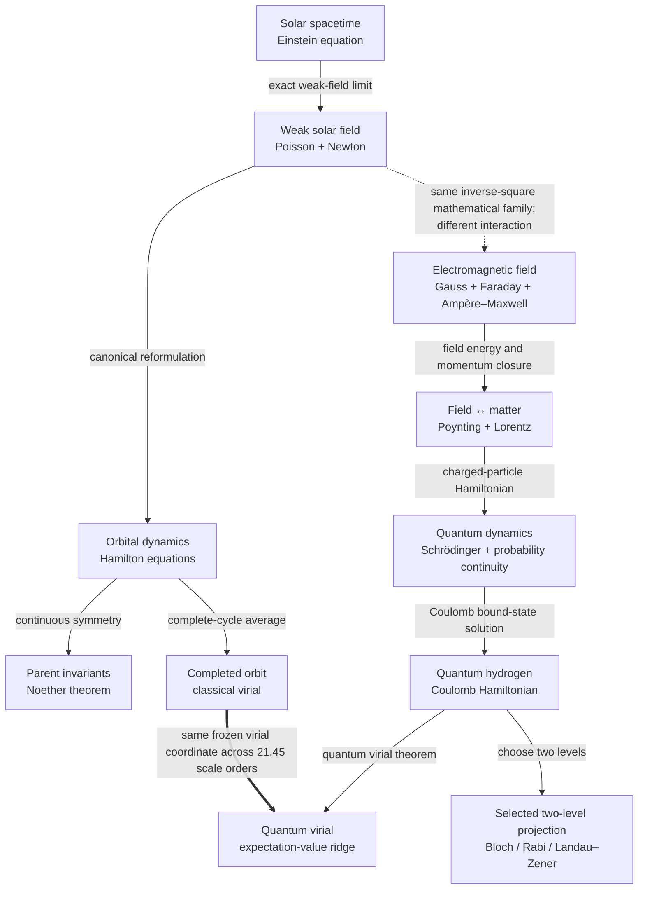

# ARA physics ladder: solar spacetime to quantum hydrogen

**Date:** 23 July 2026  
**Status:** technical reconstruction atlas; exact equations and exact declared coordinate crosswalks are separated
from ARA interpretation  
**Orientation:** when a bounded diameter is valid, `0` names the declared Phase-A/Connection-side pole, `2` names
the declared Phase-B/Traversal-side pole, and `1` names equal contribution on that particular axis. Reversing the
orientation gives \(x'=2-x\).

## Technical summary

The wider ladder does **not** say that every physical law sits at the ARA `1.0` ridge. It shows something more
useful:

1. a recurring two-channel-plus-relation geometry can be declared without changing the native equations;
2. the same local balance grammar—stored change, boundary flux, source/handover—appears in relativity,
   electromagnetism and quantum probability;
3. several laws admit exact bounded `0–2` coordinates, but their `1.0` points mean different physical equalities;
4. the transitions between laws have different scientific status and must remain labelled;
5. the inverse-distance virial theorem is the one existing numerical thread that stays exactly at `1.0` from a
   planetary orbit to ideal quantum hydrogen.

The Sun-to-hydrogen path is therefore a **typed network of laws**, not a claim that general relativity has been
algebraically reduced to quantum mechanics.

## Visual ladder: how the laws connect



The solid arrows are established reductions, reformulations or physical consequences. The dotted gravity-to-
electromagnetism arrow is only a **sibling mathematical bridge**: Newtonian gravity and Coulomb attraction both
contain a \(1/r\) potential and \(1/r^2\) force, but gravity does not derive electric charge or Maxwell's equations.

## The recurring ARA canvas

```text
          declared Phase A                 relation / equality                 declared Phase B
ARA              0 ------------------------------- 1 ------------------------------- 2
                 |                                 |                                 |
Newton       force toward A                 equal active opposition             force toward B
Hamilton     all potential                       K = V                          all kinetic
Virial       binding C                    2<T> = |<V>|                         traversal R
Gauss E      negative source                equal signed source                 positive source
Gauss B      inward flux                   equal boundary flux                  outward flux
Ampère       conduction                    equal participation                  displacement
Poynting     input/accumulation             equal throughput                    output/release
Maxwell      electric energy                  u_E = u_B                         magnetic energy
Lorentz      electric channel              equal channel magnitude             magnetic channel
Quantum      outcome A                     equal A/B probability                outcome B
L–Z          bare state A                  equal instantaneous mix              bare state B
```

This diagram is a coordinate legend, not a claim that every listed system is presently at its centre. Faraday is
better represented by the four signed quadrants of
\((\Phi_B,\dot\Phi_B)\). Noether describes a conserved parent quantity rather than a diameter position. Einstein's
equation is initially a directed source–response relation rather than a bounded opposition coordinate.

## The strongest equation-level Accumulation–Release spine

\[
\underbrace{\frac{\partial q}{\partial t}}_{
\substack{\text{mathematics: local stored change}\\
\text{ARA: accumulation or depletion}}}
+
\underbrace{\nabla\!\cdot\mathbf J}_{
\substack{\text{mathematics: net outward flux}\\
\text{ARA: release through the boundary}}}
=
\underbrace{s}_{
\substack{\text{mathematics: source minus sink}\\
\text{ARA: coupling or handover to another account}}}.
\tag{1}
\]

The physical meanings change while this grammar survives:

| Theory | Stored quantity | Boundary flux | Source or handover |
|---|---|---|---|
| General relativity | stress-energy/momentum account | covariant transport | included matter–field and geometric relation |
| Electromagnetic charge | charge density \(\rho\) | electric current \(\mathbf J\) | zero for the closed charge account |
| Electromagnetic energy | field energy \(u_{\rm EM}\) | Poynting flux \(\mathbf S\) | \(-\mathbf J\cdot\mathbf E\), field–matter handover |
| Quantum mechanics | probability density \(|\psi|^2\) | probability current \(\mathbf j\) | zero for closed unitary evolution |

This is the strongest established home for the name **Accumulation–Release Asymmetry**. It is widespread
conservation mathematics. The stronger ARA claim begins when a reusable normalized geometry predicts something
not already forced by the balance law.

## Two-column physics–ARA cross-scale ladder

| ARA math and version | Established physics equation |
|---|---|
| **1. Einstein / cosmic parent.** Directed appearance: \(\underbrace{T_{\mu\nu}}_{\text{source/Phase A}}\xrightarrow{\ \kappa\ }\underbrace{G_{\mu\nu}+\Lambda g_{\mu\nu}}_{\text{geometric response/Phase B}}\), with \(\kappa=8\pi G/c^4\). This is not yet a unique bounded opposition coordinate. The exact ARA-shaped balance is \(\nabla_\mu T^{\mu\nu}=0\). **Status:** E0 law; E1 continuity skeleton; A1 source–response reading. | \(\displaystyle G_{\mu\nu}+\Lambda g_{\mu\nu}=\frac{8\pi G}{c^4}T_{\mu\nu},\qquad \nabla_\mu T^{\mu\nu}=0.\) Stress-energy and spacetime curvature are locally related; the Bianchi identity enforces covariant stress-energy conservation. |
| **2. Einstein → Newton rung crossing.** \(\underbrace{g_{\mu\nu}}_{\text{full geometry}}\rightarrow\underbrace{\Phi}_{\text{compressed potential}}\rightarrow\underbrace{\mathbf g=-\nabla\Phi}_{\text{field/movement tendency}}\rightarrow\underbrace{m\ddot{\mathbf r}}_{\text{matter response}}\). This is an exact reduction under its assumptions. | For a stationary weak field and slow motion, \(\displaystyle g_{00}\simeq-(1+2\Phi/c^2),\quad\nabla^2\Phi=4\pi G\rho,\quad \ddot{\mathbf r}=-\nabla\Phi.\) For a spherical source, \(\Phi=-GM/r\), recovering Newton's inverse-square field. |
| **3. Newton I–III.** On a declared axis, \(\displaystyle x_F=\frac{2F_B}{F_A+F_B}\), \(\Sigma_F=F_A+F_B\), and \(\boxed{m a_\parallel=\Sigma_F(x_F-1)}\). Equal nonzero anti-directed forces give the active parent ridge \(x_F=1\); no forces give the distinct undefined-ratio/null case. | \(\displaystyle \mathbf F_{\rm net}=d\mathbf p/dt\), reducing to \(m\mathbf a\) at constant mass. Newton III gives \(\mathbf F_{A\leftarrow B}=-\mathbf F_{B\leftarrow A}\). Newton I gives constant momentum when the external resultant is zero. |
| **4. Hamilton.** \(\displaystyle t_V=2V/H,\quad t_K=2K/H,\quad t_V+t_K=2,\quad x_H=t_K.\) The harmonic oscillator traverses \(0\rightarrow1\rightarrow2\rightarrow1\rightarrow0\); signed \((Q,P)\) supplies the four quadrants lost by the diameter. | \(\displaystyle H(q,p)=K(p)+V(q),\quad\dot q=\partial H/\partial p,\quad\dot p=-\partial H/\partial q.\) For the rescaled oscillator, \(Q^2+P^2=2H\), an exact phase-space circle. |
| **5. Noether.** Keep \(\sum_ct_c^{(\mathcal P)}=2\) separate from \(dQ_{\rm physical}/dt=0\). TE-ARA closure is normalized bookkeeping; Noether identifies which native parent quantity is physically conserved while the state moves. | \(\displaystyle \partial\mathcal L/\partial t=0\Rightarrow\dot H=0\); spatial translation symmetry gives momentum conservation; rotational symmetry gives angular-momentum conservation. |
| **6. Virial theorem.** Declare \(C=|\langle V\rangle|\) and \(R=2\langle T\rangle\). Then \(\displaystyle x_{\rm vir}=\frac{2R}{C+R}=1\) for inverse-distance binding. The separate raw energy allocation remains \(\frac23+\frac43=2\). | \(\displaystyle 2\langle T\rangle=\langle\mathbf r\cdot\nabla V\rangle\). For \(V\propto-1/r\), \(\displaystyle2\langle T\rangle=|\langle V\rangle|\), classically and for quantum expectation values. |
| **7. Gauss electric.** With \(\displaystyle x_Q=\frac{2Q_+}{Q_++Q_-}\) and \(T_Q=Q_++Q_-\), \(\boxed{Q_{\rm net}=T_Q(x_Q-1)}\). At \(x_Q=1\), the signed boundary reading cancels while \(T_Q\) retains internal activity. | \(\displaystyle\oint_{\partial V}\mathbf E\cdot d\mathbf A=\frac{Q_{\rm inside}}{\varepsilon_0},\qquad\nabla\cdot\mathbf E=\rho/\varepsilon_0.\) |
| **8. Gauss magnetic.** Split a nonempty closed-boundary account into inward and outward flux magnitudes. \(\displaystyle x_B=\frac{2\Phi_{\rm out}}{\Phi_{\rm out}+\Phi_{\rm in}}=1\). With zero total activity the ratio is undefined, not an active ridge. | \(\displaystyle\oint_{\partial V}\mathbf B\cdot d\mathbf A=0,\qquad\nabla\cdot\mathbf B=0.\) Standard electromagnetism contains no measured magnetic monopole source. |
| **9. Faraday.** The ARA object is the continuous four-quadrant path \((\Phi_B,\dot\Phi_B)\). \(\Phi_B=0\) changes orientation; \(\dot\Phi_B=0\) switches accumulation/release. A sinusoid gives magnetic flux and induced circulation in quadrature. | \(\displaystyle\oint_{\partial S}\mathbf E\cdot d\boldsymbol\ell=-\frac{d\Phi_B}{dt},\qquad\nabla\times\mathbf E=-\frac{\partial\mathbf B}{\partial t}.\) |
| **10. Ampère–Maxwell.** Define \(C=|\mathbf J|\), \(D=|\varepsilon\,\partial_t\mathbf E|\), and \(\displaystyle x_{D/C}=\frac{2D}{C+D}\). Its centre is equal participation, not cancellation; the signed vector phase must remain part of the state. | \(\displaystyle\nabla\times\mathbf B=\mu_0\mathbf J+\mu_0\varepsilon_0\frac{\partial\mathbf E}{\partial t}.\) In an ideal charging capacitor, conduction in the wire and displacement in the gap carry one continuous current account. |
| **11. Poynting / Maxwell wave.** Form \(P_{\rm in}=[-\nabla\cdot\mathbf S]_++[-\mathbf J\cdot\mathbf E]_+\) and \(P_{\rm out}=[\nabla\cdot\mathbf S]_++[\mathbf J\cdot\mathbf E]_+\). Then \(\displaystyle x_P=\frac{2P_{\rm out}}{P_{\rm in}+P_{\rm out}}\). Separately, a vacuum plane wave has \(\displaystyle x_{E/B}=2u_B/(u_E+u_B)=1\), while \(\mathbf S\propto\mathbf E\times\mathbf B\) is the oriented relational third. | \(\displaystyle\partial_tu_{\rm EM}+\nabla\cdot\mathbf S=-\mathbf J\cdot\mathbf E,\quad\mathbf S=\frac1{\mu_0}\mathbf E\times\mathbf B.\) For a vacuum plane wave \(u_E=u_B\), \(\mathbf E\perp\mathbf B\perp\mathbf S\), and \(E,B\) are temporally in phase at a point. |
| **12. Lorentz and electromagnetic momentum.** \(\displaystyle x_L=\frac{2|q\mathbf v\times\mathbf B|}{|q\mathbf E|+|q\mathbf v\times\mathbf B|}\) is only the channel composition; the two directions and their angle are required to reconstruct the force. The parent account \(\nabla\cdot\mathbf T=\partial_t\mathbf g_{\rm EM}+\mathbf f_{\rm matter}\) is a three-term Information³-style conservation lock. | \(\displaystyle\mathbf F=q(\mathbf E+\mathbf v\times\mathbf B)\), \(\displaystyle\mathbf f_{\rm matter}=\rho\mathbf E+\mathbf J\times\mathbf B\), and \(\displaystyle\nabla\cdot\mathbf T=\partial_t(\varepsilon_0\mathbf E\times\mathbf B)+\mathbf f_{\rm matter}\). |
| **13. Schrödinger and quantum continuity.** \(\displaystyle\partial_t|\psi|^2+\nabla\cdot\mathbf j=0\) is the same accumulation–boundary-release grammar with a different conserved quantity. For a declared two-outcome axis, \(\displaystyle x_Q=2p_B=1-\mathbf r\cdot\hat{\mathbf n}\). Equal probability at \(1\) does not distinguish coherent superposition from incoherent mixture without phase and purity. | \(\displaystyle i\hbar\partial_t\psi=\hat H\psi,\qquad \rho=|\psi|^2,\qquad\partial_t\rho+\nabla\cdot\mathbf j=0.\) For a two-level density matrix, \(p_B=(1-\mathbf r\cdot\hat{\mathbf n})/2\). |
| **14. Quantum hydrogen.** The Coulomb Hamiltonian contains the Connection/traversal pair \(V_C\) and \(T\); its expectation values satisfy the exact virial ridge. A selected pair of levels may be decompressed into a Bloch sphere or Landau–Zener handover, but that is an additional declared projection. | \(\displaystyle\hat H=-\frac{\hbar^2}{2\mu}\nabla^2-\frac{k_e e^2}{r},\qquad\hat H\psi=E\psi,\qquad2\langle T\rangle=|\langle V\rangle|.\) A two-level avoided crossing uses \(\hat H_2=(vt/2)\sigma_z+g\sigma_x\). |

## Worked Sun-to-hydrogen reading

### 1. The Sun begins near the weak-field end of the relativistic parent

The Sun's surface compactness is approximately

\[
u_\odot=\frac{2GM_\odot}{R_\odot c^2}=4.24501\times10^{-6}.
\]

That is why Einstein's solar exterior can be compressed extremely accurately into the Newtonian potential used
for ordinary planetary motion. The reduction is physical and established; the optional ARA compactness
normalization layered on it is not uniquely forced by GR.

### 2. The Sun–Earth pair separates parent balance from local movement

At one astronomical unit, the equal Newton-III force pair is approximately

\[
|\mathbf F_{E\leftarrow S}|=|\mathbf F_{S\leftarrow E}|
=3.5415454\times10^{22}\ {\rm N}.
\]

The enclosing internal-force ledger is at \(x_{\rm pair}=1\), but Earth and the Sun have very unequal nonzero
accelerations. This is an active parent ridge, not stillness.

### 3. Hamilton and Noether retain the moving orbit

Hamilton's equations preserve the full phase-space trajectory. Noether associates time-translation symmetry with
conserved orbital energy and rotational symmetry with angular momentum. The parent invariant remains stable while
position, momentum and any selected ARA allocation keep cycling.

### 4. Virial averaging supplies the exact planetary-to-quantum numerical thread

The inverse-distance virial coordinate is

\[
x_{\rm vir}=1
\]

for the Earth–Sun orbit, an ideal circular Earth satellite, the classical Coulomb comparison at the Bohr radius,
and ideal quantum hydrogen `1s`. The characteristic length changes by

\[
\log_{10}\!\left(\frac{1\ {\rm AU}}{a_0}\right)=21.4513
\]

orders of magnitude.

### 5. The interaction changes identity before the quantum step

Newtonian gravity and electrostatic attraction share the mathematical potential \(V\propto-1/r\). They do not
share the same source: mass-energy belongs to gravitation; electric charge belongs to Maxwell theory. Gauss's law
and the Maxwell equations establish the electric field that enters hydrogen's Coulomb Hamiltonian.

### 6. Quantum hydrogen closes the worked path without inventing a classical orbit

For the ideal nonrelativistic `1s` state,

\[
\langle T\rangle=13.6056931\ {\rm eV},
\qquad
\langle V\rangle=-27.2113862\ {\rm eV},
\qquad
2\langle T\rangle=|\langle V\rangle|.
\]

These are quantum expectation values. They show that the same weighted ARA virial relation survives the classical–
quantum change of method; they do not describe an electron travelling around a classical orbit.

## What this wider ladder establishes

- **The equation atlas is internally traversable.** Every arrow has a named physical operation rather than a vague
  resemblance.
- **One balance skeleton genuinely recurs.** Relativistic stress-energy, charge, electromagnetic energy and
  quantum probability all have established local continuity forms.
- **Several exact ARA coordinates coexist.** Newton, Hamilton, Gauss, Poynting, Lorentz-channel composition,
  Bloch-state probability and the virial theorem can all be expressed on declared `0–2` diameters.
- **Their centres are not interchangeable.** Force cancellation, equal energy, equal flux, equal probability and
  equal throughput are different measurements.
- **The virial relation is the strongest current cross-scale numeric invariant.**
- **ARA currently organises and preserves the equations; it has not replaced or derived them.**

## Evidence fence

This document is a `(R)` reconstruction/crosswalk under the repository's broad-mapping policy. It is not one new
prospective confirmation. Exact algebraic reparameterizations cannot fail once their definitions are chosen, so
their value is fidelity, compression and comparison—not independent discovery.

In particular, the ladder does not prove:

- that GR and quantum mechanics have been unified;
- that Maxwell's equations emerge from Newtonian gravity;
- that all physical systems occupy a universal `1.0` ridge;
- that the ARA `0–2` line uniquely follows from established physics;
- Phi, hexagon–pentagon leakage, logarithmic octaves or universal fractality;
- a new prediction beyond the equations used in each row.

The most informative negative result remains the Lorentz rung-up test: an exact particle-level ARA decomposition
did not survive naïve separate coarse-graining because covariance/correlation terms were discarded. That is the
kind of controlled failure a genuine fractal aggregation law must recover rather than explain away.

## Validation and reproduction

The independent synthesis validator passed **15/15** checks, including:

- presence of Einstein, Newton, Hamilton, Noether, virial, Gauss, Faraday, Ampère–Maxwell, Poynting, Lorentz,
  Schrödinger and hydrogen;
- explicit classification of every bridge;
- 10,000 independent Newton, Gauss, Poynting, Hamilton and Bloch algebra checks;
- exact virial `1.0` placement over `21.4513` spatial orders;
- a four-domain continuity spine;
- confirmation that the atlas retains at least thirteen different meanings of relation/equality rather than
  flattening every `1.0`.

Reproduction:

```powershell
cd F:\SystemFormulaFolder\GIT\ARA-GIT
python .\analysis\physics_ladder\ara_physics_cosmic_quantum_ladder.py
python .\analysis\physics_ladder\validate_ara_physics_cosmic_quantum_ladder.py
```

Generated files:

- `ARA_PHYSICS_LAW_LADDER.csv`
- `ARA_PHYSICS_LANDMARK_MATRIX.csv`
- `ARA_PHYSICS_TRAVERSAL_PATH.csv`
- `ARA_PHYSICS_CONTINUITY_SPINE.csv`
- `ARA_PHYSICS_VIRIAL_SCALE_THREAD.csv`
- `ARA_PHYSICS_COSMIC_QUANTUM_LADDER_RESULTS.json`
- `ARA_PHYSICS_COSMIC_QUANTUM_LADDER_VALIDATION.json`
- `ARA_PHYSICS_COSMIC_QUANTUM_REPORT_ARTIFACT.json`

## Next discriminating test

The atlas makes the missing mathematical component more precise: ARA still needs a frozen transformation law
that carries a resolved child account into a parent account while predicting the relation terms lost during
coarse-graining.

A strong next test would apply one unchanged operator to:

1. Newtonian pair momentum;
2. electromagnetic energy and momentum continuity;
3. quantum probability current;
4. a controlled open system with a known boundary/source term.

Success would require recovering the correct missing boundary or covariance term without refitting the operator
for each theory. Failure in one of the declared controls would narrow the universal fractal claim rather than being
absorbed into the vocabulary.

