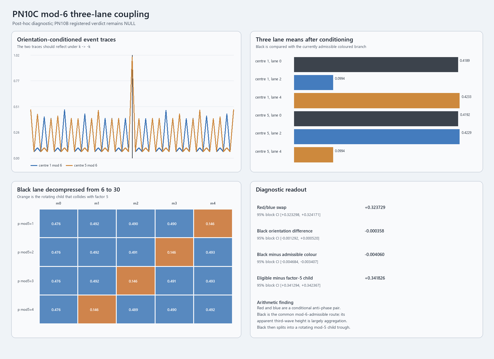

# PN10C: the three marked prime lanes are real, conditional, and recursive

## Technical summary

The three families Dylan marked in the PN10B parent trace are reproducible. The red and blue families form an almost exact orientation-conditioned pair: changing the centre prime from `1 mod 6` to `5 mod 6` makes them exchange roles. The frozen swap contrast is **+0.323729** (95% contiguous-block bootstrap interval **[+0.323298, +0.324171]**). Reflecting one trace through the event centre before comparing it with the other reduces mean absolute mismatch from **0.107882** to **0.000515**, a **99.52% reduction**.

The black family is also real, but this test does **not** support calling it an independent stronger third wave at the mod-6 grain. Its two centre orientations are invariant within uncertainty: difference **-0.000358**, 95% interval **[-0.001292, +0.000520]**. Once red and blue are separated by centre orientation, black is **0.004060 lower**, not higher, than the currently admissible coloured branch (95% interval **[-0.004684, -0.003407]**, standardized difference **-0.153**). Its large unconditioned appearance comes from being the route that remains admissible in both orientations, while each coloured lane is suppressed in one orientation.

Black then decomposes cleanly at the next wheel rung. Writing a black offset as `k=6m`, one value of `m mod 5` in each centre-`mod 5` row collides with factor 5. That rotating child has parent progress **0.145586686**, exactly the factor-5 value, while eligible children average **0.487412541**. The contrast is **+0.341826**, 95% interval **[+0.341294, +0.342367]**.

This is a strong recovery of hierarchical modular geometry using the ARA decomposition. It is not a new theorem about primes and cannot change PN10B's registered `NULL` predictive verdict.

## The red and blue lanes are a conditional anti-phase pair

Every prime above 3 lies in one of two mod-6 orientations: `1 mod 6` or `5 mod 6`. The two marked shoulder families are offsets `2 mod 6` and `4 mod 6`.

| Centre orientation | Black `k=0 mod 6` | Blue `k=2 mod 6` | Orange `k=4 mod 6` |
|---:|---:|---:|---:|
| `p=1 mod 6` | 0.418868 | 0.099378 | 0.423268 |
| `p=5 mod 6` | 0.419226 | 0.422946 | 0.099378 |

For a `1 mod 6` centre, adding a `2 mod 6` offset lands on `3 mod 6`, so every such location is divisible by 3 and the blue family becomes the trough. Adding a `4 mod 6` offset remains prime-admissible. For a `5 mod 6` centre the relation reverses, so orange becomes the factor-3 trough and blue becomes admissible.

In compact ARA-labelled form:

\[
\underbrace{p\equiv1\pmod6}_{\substack{\text{centre orientation A}\\\text{ARA Phase A view}}}
\xrightarrow{\ k\equiv2\ }
\underbrace{p+k\equiv3\pmod6}_{\substack{\text{factor-3 collision}\\\text{suppressed branch}}},
\qquad
\underbrace{p\equiv5\pmod6}_{\substack{\text{centre orientation B}\\\text{ARA Phase B view}}}
\xrightarrow{\ k\equiv4\ }
\underbrace{p+k\equiv3\pmod6}_{\substack{\text{same collision}\\\text{roles reversed}}}.
\]

Plainly: red and blue are not fixed “good” and “bad” lanes. Which one can continue depends on which way the centre prime is oriented. Flip the centre and their jobs swap. This matches the ARA expectation of a reversible phase/anti-phase relation much better than the unconditioned average did.

## Black is the shared route, not a stronger independent third wave at this grain

Black consists of nonzero offsets divisible by 6. Adding one preserves either prime-admissible mod-6 orientation:

\[
\underbrace{(6a\pm1)}_{\substack{\text{prime-admissible centre}\\\text{one of two orientations}}}
+
\underbrace{6m}_{\substack{\text{black/common lane}\\\text{preserves orientation}}}
=
\underbrace{6(a+m)\pm1}_{\substack{\text{still admissible past 2 and 3}\\\text{shared route}}}.
\]

Plainly: the black path does not choose between the two centre orientations. It carries either one forward without hitting factors 2 or 3. That is why it looks like a large third line when the two centre orientations are mixed together.

The independent-third-wave discriminator was deliberately stricter: compare black only with the coloured lane that is admissible in the same centre orientation. Black does not remain higher; it is slightly lower by **0.004060**. Therefore the observed mod-6 structure is best stated as:

1. two conditional orientations that exchange their coloured branches;
2. one common path that preserves either orientation;
3. not three independent sources at this measurement grain.

This does not make Dylan's black marking spurious. It identifies what the marked line is. The “oxygen plus two hydrogens” analogy may remain useful as a visual prompt, but this calculation does not recover three independent arithmetic identities analogous to three atoms.

## The common lane contains a rotating child structure at 30

The black lane is not featureless. Let `k=6m`. Because `6=1 mod 5`, moving one black child step changes the factor-5 phase by one:

\[
\underbrace{p\bmod5}_{\substack{\text{centre's factor-5 phase}\\\text{parent orientation}}}
+
\underbrace{m\bmod5}_{\substack{\text{black child coordinate}\\k=6m}}
\equiv0\pmod5
\quad\Longrightarrow\quad
\underbrace{p+k}_{\substack{\text{child collision}\\\text{factor-5 trough}}}.
\]

The measured matrix is:

| Centre `p mod 5` | `m=0` | `m=1` | `m=2` | `m=3` | `m=4` |
|---:|---:|---:|---:|---:|---:|
| 1 | 0.476 | 0.492 | 0.490 | 0.490 | **0.146** |
| 2 | 0.476 | 0.492 | 0.491 | **0.146** | 0.493 |
| 3 | 0.476 | 0.492 | **0.146** | 0.491 | 0.493 |
| 4 | 0.476 | **0.146** | 0.489 | 0.490 | 0.492 |

Plainly: the trough walks one cell sideways when the centre's relation to 5 changes. This is the next child decomposition of the black line. In established number theory it is the mod-30 wheel created by factors 2, 3 and 5. In ARA language, the common parent route has been opened and its smaller phase-dependent branches become visible.

## The surrounding geometry is modular rather than unique to prime centres

A matched control used the same number of composite centres that are coprime to 6, separated into the same `1 mod 6` and `5 mod 6` orientations. Its red/blue swap was **+0.323995**, essentially the same as the prime-centred **+0.323729**. Its black-minus-admissible-colour difference was **+0.001080**, again small.

Therefore the repeating shoulders around the event are a property of the modular lattice around any compatible centre, not a special signal emitted only by primes. What is prime-specific in this plot is the exact **1.0 event centre**: the prime survived every required factor gate, whereas the surrounding modular lanes merely describe which early gates remain open.

This control is important for the ARA claim. It shows that the decomposition found a real geometry, while preventing us from incorrectly upgrading a general modular pattern into a prime-specific wave.

## Scope, definitions and method

- Interval: `[4,000,000,000, 4,001,000,000)`.
- Interior prime centres: **45,156**, after reserving 150 integers on each boundary.
- Offset window: `-150` through `+150`.
- Matched control: **45,156** deterministically sampled composite centres coprime to 6, orientation-matched to the prime centres.
- Parent factor-progress coordinate: `1` for a prime; `2 log(LPF(n))/log(n)` for a composite.
- Uncertainty: 2,000 deterministic bootstrap draws over 100 contiguous centre blocks.
- Primary frozen tests: red/blue role exchange, reflection symmetry, black orientation invariance, black-versus-admissible-colour discriminator, and the `6 -> 30` factor-5 child decomposition.
- Supporting checks: prime rate, `c=.90` survivor rate, divisibility identities, positive/negative offset summaries, worked event examples and a matched composite control.

The protocol was written before calculating the lane-conditioned results. The base interval and original event trace were already open, so the evidence remains post-hoc rather than prospective.

## Robustness and limitations

Independent validation passed **17/17 checks**. It regenerated the interval, recomputed every prime-centred offset profile, independently recovered the headline contrasts, checked all worked examples, and found zero violations of the mod-3 and mod-5 identities.

The tight intervals do not mean ARA independently predicted unknown number theory. These effects are mostly deterministic consequences of modular arithmetic applied to a large sample. The evidential value lies in whether ARA's proposed way of decomposing an aggregate ridge leads to the correct conditional structure and avoids flattening it.

The result supports:

- the visual identification of three aggregate lane families;
- the red/blue interpretation as a reversible conditional pair;
- the black interpretation as an invariant common route;
- recursive child decomposition from a mod-6 parent to a mod-30 structure.

It does not by itself support:

- a universal physical wave ontology;
- three independent waves at the mod-6 grain;
- a novel formula for locating primes;
- predictive superiority over sieve or Hardy-Littlewood methods;
- promotion of PN10B from `NULL`.

## Recommended next test

The next honest step is a **prospectively frozen wheel-hierarchy test** on a new untouched integer interval. Before opening it, define the expected transformations `6 -> 30 -> 210`, including which parent lanes must split, which child collision must rotate, and which reflection relations must remain invariant. Include both prime and matched coprime-composite centres.

Success would not be merely finding known divisibility patterns. A stronger ARA result would need to specify, in advance, an additional relational statistic—such as the magnitude or ordering of the eligible child lanes—that is not fixed automatically by the wheel and then recover it on untouched numbers.

## Further questions

1. Does conditioning the four eligible mod-30 children on the centre's `mod 7` orientation produce the predicted rotating `210`-wheel child without changing the common-parent relations?
2. Can ARA specify a nontrivial continuous coordinate among the still-eligible lanes before the target is opened?
3. Does the same reflection-and-common-lane decomposition hold at multiple untouched numerical scales after normalizing the parent coordinate?
4. Which part of the decomposition is uniquely ARA rather than a relabelling of an established wheel sieve, and can that difference generate a prospective prediction?
