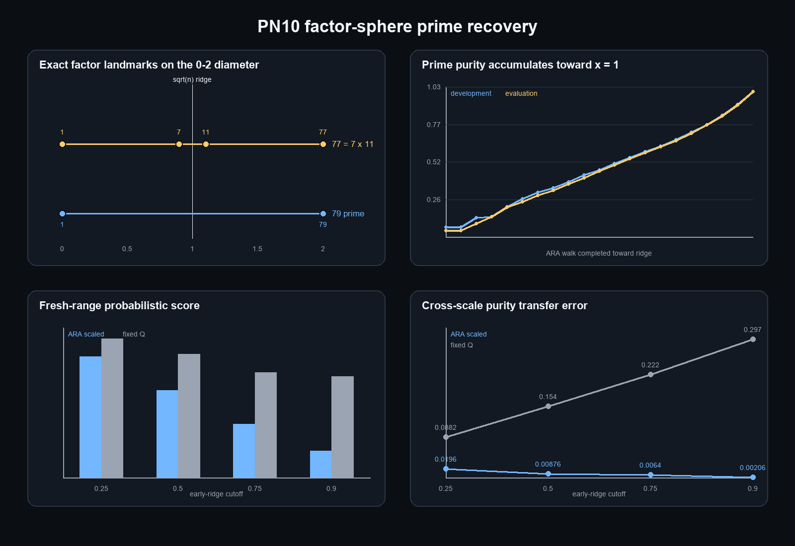

# PN10 factor-sphere prime recovery report

**Test ID:** `PN10/FACTOR-SPHERE/PRIME-RECOVERY-AND-EARLY-RIDGE-TRANSFER/v1`  
**Date:** 20 July 2026  
**Evidence class:** frozen exact crosswalk plus fresh cross-scale computational transfer  
**Registered result:** `P1-P6 PASS; independent validation 64/64 PASS`  
**Protected material:** the p31 primorial wheel was not constructed; R12 remained unopened

## The method works exactly at the ridge and probabilistically before it

Yes: the factor-sphere method can work out primes exactly.

For each integer `n`, PN10 walked prime divisor gates from the `0` endpoint towards the factor ridge at `1.0`. A
divisor encountered on or before the ridge classified `n` as composite. Reaching the ridge without a collision
classified `n` as prime.

On the fresh interval `[2,000,000,000, 2,001,000,000)`, the rule identified all **46,903 primes** among one million
integers with zero false positives and zero false negatives. An independently coded segmented sieve and direct
cutoff reconstruction reproduced all headline results: **64 of 64 validation checks passed**.

The important qualification is equally clear. This exact method is ordinary square-root trial division written in
the ARA coordinate system. It is a clean and useful crosswalk, but not yet a faster or mathematically new prime
algorithm.

Before the ridge, the ARA coordinate did more than merely redraw the path. Its survivor purity transferred strongly
from the million-number development interval near `10^6` to the fresh interval near `2 x 10^9`. At the `0.90`
cutoff, development predicted `83.7346%` prime survivors and the fresh result was `83.5286%`, an error of only
**0.206 percentage points**. The matched unscaled fixed-divisor control missed by **29.735 percentage points**.

However, the `0.90` ARA survivor set still contained **9,249 composites**. One factor-depth coordinate therefore
does not yet tell us which individual survivors are prime before the ridge.

## One factor sphere has two reversible directions

For `n>1`, the frozen coordinate is

\[
\underbrace{x_n(d)}_{\substack{\text{ARA factor position}\\0\text{ to }2}}
=
\underbrace{\frac{2\log d}{\log n}}_{\substack{\text{factor scale}\\\text{relative to the whole }n}}.
\]

Plainly: `d=1` sits at `0`, `d=sqrt(n)` sits at the `1.0` ridge, and `d=n` sits at `2`. The logarithm makes the
two factor directions comparable across small and large integers.

If `d` is a factor, its partner `n/d` lies at the reflected position:

\[
\underbrace{x_n(d)}_{\text{small-factor direction}}
+
\underbrace{x_n(n/d)}_{\text{large-factor direction}}
=2.
\]

Plainly: factorisation from the whole number downward and sieve accumulation from `1` upward are not two different
mathematical objects. They are opposite walks through the same ARA factor sphere. PN10 checked this closure across
every composite in both million-number intervals. The largest numerical error was
`4.44 x 10^-16`.

This yields a particularly clean prime/composite distinction:

- a prime has only the endpoint landmarks `1` and `n`, at ARA positions `0` and `2`;
- a non-square composite has one or more reflected interior factor pairs;
- a prime square `p^2` has `p` exactly at `1.0`, where both sides meet at the ridge.

PN10 checked all **1,229 prime squares** with root at most `10,000`; every root landed on the ridge within the frozen
tolerance.

## The exact ARA procedure

For a proposed integer `n`:

1. Begin at factor endpoint `d=1`, or `x=0`.
2. Test prime gates `q=2,3,5,7,...` in increasing order.
3. For each gate compute `x_n(q)=2 log(q)/log(n)`.
4. If `q` divides `n` while `x_n(q)<=1`, stop: `n` is composite. The reflected partner is `n/q` at `2-x_n(q)`.
5. If the walk reaches `x=1` with no divisor collision, stop: `n` is prime.

The first 25 primes recovered in the fresh interval were:

`2,000,000,011`, `2,000,000,033`, `2,000,000,063`, `2,000,000,087`, `2,000,000,089`,
`2,000,000,099`, `2,000,000,137`, `2,000,000,141`, `2,000,000,143`, `2,000,000,153`,
`2,000,000,203`, `2,000,000,227`, `2,000,000,239`, `2,000,000,243`, `2,000,000,269`,
`2,000,000,273`, `2,000,000,279`, `2,000,000,293`, `2,000,000,323`, `2,000,000,333`,
`2,000,000,357`, `2,000,000,381`, `2,000,000,393`, `2,000,000,407`, `2,000,000,413`.

These values were generated by the frozen method and independently reproduced. Their presence is not a prediction
claim beyond the declared computation; the evaluation interval was freshly constructed only after the protocol was
hashed.

## Partial walks transfer scale but do not identify every prime

At an early cutoff `c<1`, PN10 removed every integer whose least divisor had already collided with the ARA walk. It
then measured the share of primes among the survivors.

| ARA cutoff | Development prime purity | Fresh prime purity | Transfer error | Fresh composites still surviving |
|---:|---:|---:|---:|---:|
| 0.25 | 26.4130% | 24.4528% | 1.960 pp | 144,907 |
| 0.50 | 46.2393% | 45.3634% | 0.876 pp | 56,491 |
| 0.75 | 67.1078% | 66.4678% | 0.640 pp | 23,662 |
| 0.90 | 83.7346% | 83.5286% | 0.206 pp | 9,249 |
| 1.00 | 100% | 100% | 0 pp | 0 |

Plainly: as the two factor directions approach their ridge, composite possibilities are progressively removed and
the remaining population becomes more prime-rich. Only the complete ridge walk separates every prime from every
composite.

The curve also transferred across scales. The development-to-evaluation purity error averaged **0.9205 percentage
points** for the ARA-scaled path, compared with **19.0307 percentage points** for the fixed absolute divisor cutoff.
The corresponding fresh-range Brier score averaged `0.021150` versus `0.034329`, a **38.4% reduction** in squared
probability error.

This supports the dimensionless factor position as a useful coarse-graining coordinate. It does not show that ARA
contains information unavailable to established number theory: standard factor and rough-number methods also scale
the divisor boundary relative to `n`.

## All six registered support criteria passed

| Criterion | Result | Evidence |
|---|---|---|
| P1 exact recovery | **Pass** | 2,000,000 integers; zero false positives or negatives |
| P2 reversible pair closure | **Pass** | maximum error `4.44 x 10^-16` |
| P3 square ridge | **Pass** | 1,229/1,229 prime squares at `x=1` |
| P4 accumulating information | **Pass** | survivor prime purity increased monotonically to 100% in both intervals |
| P5 fresh probabilistic value | **Pass** | mean Brier `0.021150 < 0.034329` fixed-Q |
| P6 fresh calibration | **Pass** | mean purity error `0.009205 < 0.190307` fixed-Q |

The test was intentionally registered before either PN10 interval was constructed. The frozen protocol hash was
`A46FC79D82034CB827F907C531C4DF208B9E33E3AFCE8E9E00D60E637D8F4BEE`.

## What this result adds—and what it does not

PN10 supports four precise statements:

1. The multiplicative and sieve-survivor descriptions fit one reversible ARA factor sphere cleanly.
2. The `1.0` factor ridge is exactly the square-root completeness boundary.
3. Primes are the identities with no interior factor collision; composites expose child factor landmarks.
4. Partial factor progress becomes a transferable prime-probability coordinate when scaled to the identity being
   measured.

It does not establish:

1. a new proof of the distribution of primes;
2. an algorithm faster than classical trial division or sieving;
3. exact individual prime prediction before the factor ridge;
4. a distinction between ARA and established relative-logarithmic factor geometry by this test alone;
5. universal physical fractality from an arithmetic crosswalk.

The strongest honest wording is:

> ARA exactly recovers the classical prime/composite boundary as a reversible factor sphere and supplies a strongly
> transferable coordinate for partial sieve depth. The exact classifier is a re-expression of known mathematics;
> the useful new work is the unified geometric representation and the hypotheses it lets us state for additional
> child coordinates.

## Best next prime test

The next nontrivial question is not whether the factor walk can reach the ridge—it can. It is whether a second native
ARA relation can identify more of the **9,249 hidden composites** remaining at `c=0.90` without simply continuing
ordinary trial division.

A clean PN10B design would freeze, before opening a new interval:

1. the parent coordinate: current factor-walk depth `c`;
2. two child coordinates: reversible distances to the neighbouring untested divisor-gate relations;
3. one three-part information lock: left child, right child and their relation to the parent identity;
4. exact fixed-complexity controls using the same raw divisor information;
5. an untouched interval on which individual ranking, calibration and computational cost are all scored.

If those child relations predict which pre-ridge survivors are prime better than matched number-theory controls,
that would move beyond the exact crosswalk established here. If they do not, PN10 still remains a successful and
honest ARA coordinate recovery.

## Reproducibility artifacts

- `PN10_FACTOR_SPHERE_PRIME_RECOVERY_PROTOCOL.md`
- `PN10_FREEZE_MANIFEST.json`
- `pn10_factor_sphere_prime_recovery.py`
- `PN10_FACTOR_SPHERE_RESULTS.json`
- `PN10_FACTOR_SPHERE_PATHS.csv`
- `PN10_FACTOR_SPHERE_TRANSFER.csv`
- `PN10_FACTOR_SPHERE_FIGURE.png`
- `pn10_validate_factor_sphere.py`
- `PN10_FACTOR_SPHERE_VALIDATION.json`
- `PN10_FACTOR_SPHERE_PRIME_RECOVERY.ipynb`
- `PN10_COMPLETE_MANIFEST.json`

