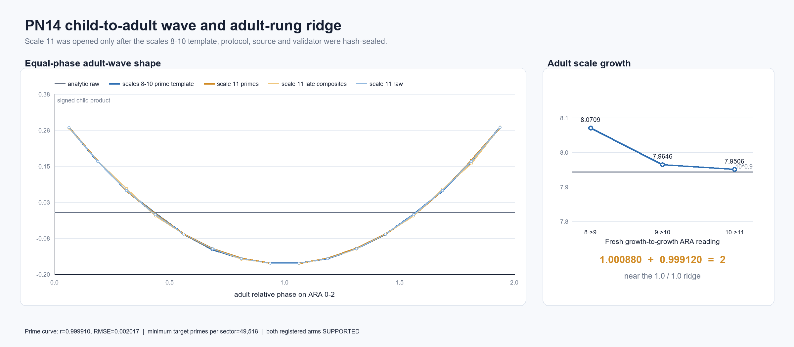

# PN14 child-to-adult wave and adult-rung ridge

**Test ID:** `PN14/CHILD-ADULT-RIDGE/v1`  
**Run:** 21 July 2026  
**Orientation:** up is a tenfold raw-number scale step; the two adjacent residue children generate their coprime
joint adult period.  
**Status:** Arm A `SUPPORTED [pre-registered; frozen scale-11 target]`; Arm B
`SUPPORTED [pre-registered; frozen scale-11 target]`.

## Technical summary

The untouched scale-11 result supports Dylan's corrected reading of the earlier `8.07/7.96` relation as a near
`1.0` adult-rung ridge.

- The median adult joint period grew from `3,477,342,957` at scale 10 to `27,646,876,802` at scale 11: a multiplier
  of `7.950575`, only `+0.0918%` from the frozen `10^0.9=7.943282` expectation.
- Comparing the preceding and fresh adult-growth multipliers and normalising their pair to TE-ARA `=2` produced
  `1.000880 + 0.999120 = 2`. Both entries are far inside the frozen `[0.98,1.02]` ridge interval.
- The sealed scales 8-10 prime phase template recovered the scale-11 prime curve at `r=0.999910`, RMSE `0.002017`.
  The correct adult coordinate reduced error by `98.63%` versus zero and beat the wrong-coordinate control by a
  factor of about `88` in RMSE.
- Primes and paid-sieve-surviving composites drew essentially the same curve. The result therefore recovers the
  modular child/adult geometry very strongly, but does not by itself distinguish or predict primes.

Both registered arms passed every target criterion. The status remains `SUPPORTED`, not `CONFIRMED`: the target
arithmetic was independently reproduced, but the complete validator remains visibly `4/5` because its deliberately
strict small-prime calibration threshold was slightly too tight.

## The fresh rung tightened the adult `1.0` ridge

For each scale `d`, PN14 retained the nine largest prime gates below `(4*10^d)^0.45`. Each neighboring child pair
has exact joint period `q*r`; `J_d` is the median of the eight pair periods.

| Scale | Median adult period `J_d` | Growth to next scale |
|---:|---:|---:|
| 8 | 54,096,009 | `8.070855` |
| 9 | 436,601,021 | `7.964578` |
| 10 | 3,477,342,957 | `7.950575` |
| 11 | 27,646,876,802 | - |

The earlier comparison Dylan identified was

\[
\frac{8.070855}{7.964578}=1.013344.
\]

Treating the two growth steps as one TE-ARA allocation gives

\[
\underbrace{\frac{2(8.070855)}{8.070855+7.964578}}_{\substack{\text{first adult}\\\text{growth entry}}}
+
\underbrace{\frac{2(7.964578)}{8.070855+7.964578}}_{\substack{\text{second adult}\\\text{growth entry}}}
=
1.006628+0.993372=2.
\]

On the untouched step, the quotient tightened from `1.013344` to `1.001761`, and the two-entry reading became

\[
\underbrace{1.000880}_{\substack{\text{scale 9->10}\\\text{adult growth}}}
+
\underbrace{0.999120}_{\substack{\text{scale 10->11}\\\text{adult growth}}}
=2.
\]

**Arm A verdict: `SUPPORTED`.** The adult wavelength did not merely grow by another similar-looking number: the
fresh scale factor followed the fixed two-child exponent and its comparison with the previous step landed very near
the ARA equality ridge.

This is nevertheless a consistency result rather than a parameter-free discovery. Gates were deliberately selected
near `n^0.45`, so `q*r` is expected to scale near `n^0.90`. Local prime spacing supplies the small departure from the
ideal `10^0.9` multiplier.

## Equal adult phase recovered one shared child-product wave

PN13 had compared equal one-million-integer windows. Those windows covered `22.9%`, `1.83%`, and `0.345%` of the
adult relative-phase drift at scales 8-10, so their means were not measurements of equivalent parts of the wave.
PN14 instead used

\[
\underbrace{\theta_{q,r}(n)}_{\substack{\text{position around the}\\\text{child-pair adult wave}}}
=
\left(
\underbrace{n}_{\text{raw integer position}}
\underbrace{\frac{r-q}{qr}}_{\substack{\text{relative child}\\\text{phase advance}}}
\right)\bmod1
\]

and measured the signed child product

\[
\underbrace{Z_{q,r}(n)}_{\substack{\text{whether the two children}\\\text{lean together or oppose}}}
=
\left(2\frac{n\bmod q}{q}-1\right)
\left(2\frac{n\bmod r}{r}-1\right).
\]

The 16 fixed sectors of `theta` were displayed on the ARA `0-2` diameter. At scale 11 the representative pair was
`q=166,289`, `r=166,273`; its exact adult period was `27,649,370,897` and its local relative-phase period was about
`1.728 billion` raw integers.

The target geometry is a symmetric U-shaped cycle:

- prime crest `Z=+0.27328` near ARA `0.0625` (the equivalent raw and composite crests occur near the two ends);
- prime trough `Z=-0.16510` near ARA `1.0625`, immediately beside the opposition/cancellation ridge;
- the sign crosses between the aligned ends and opposed middle;
- raw integers, primes and late composites lie almost on top of one another.

Target phase-collapse checks:

| Frozen criterion | Target result | Pass |
|---|---:|:---:|
| prime curve correlation with scales 8-10 template `>=0.90` | `0.999910` | yes |
| prime curve RMSE `<=0.075` | `0.002017` | yes |
| at least 40% lower RMSE than zero | `98.63%` lower | yes |
| lower RMSE than wrong coordinate | `0.002017` versus `0.177442` | yes |
| at least 100 primes in every sector | minimum `49,516` | yes |

The target sectors contained `21,285,008` raw integers, `796,385` primes and `159,543` late composites.

**Arm B verdict: `SUPPORTED`.** Equal relational phase, rather than equal raw distance, recovered the same adult
shape on a genuinely untouched scale.

## What is ARA here, and what is already established arithmetic?

The ARA interpretation cleanly separates three levels:

1. each gate is a child cycle with a signed `0-2` residue phase;
2. two coprime children close only after `q*r`, producing a larger/slower adult identity;
3. neighboring adult scale-growth steps are two comparable entries whose equality is read as the `1.0` ridge.

The internal U-curve is also the known autocorrelation of two centered sawtooth phases. For uniformly sampled raw
phases its analytic form is

\[
C(\theta)=\frac13-2\theta+2\theta^2.
\]

The scales 8-10 prime template matched this established curve at `r=0.999939`, RMSE `0.001642`. Therefore the
result should not be advertised as a new number-theory waveform. The stronger ARA-specific contribution is the
successful relational bookkeeping: the failed PN13 amplitude comparison was decompressed into child period, adult
wavelength, equal phase coverage and adult-rung ridge. That change of coordinate predicted the fresh geometry
accurately.

## Controls, robustness and implementation record

The frozen wrong-coordinate control kept the same signed child product but assigned phase from the representative
first gate and the ninth paid gate. Its target-to-template RMSE was `0.177442`, versus `0.002017` for the intended
adjacent-pair adult coordinate. Zero had RMSE `0.147689`. Thus the success is not obtained by any arbitrary modular
coordinate or by a nearly flat curve.

The independent validator used a separate bytearray prime sieve and reproduced:

- every frozen source hash;
- all nine scale-11 gates and eight adjacent-pair periods;
- the median period and deterministic representative pair;
- every one of the 16 sector centers, block bounds, raw/prime/late-composite counts and signed-product means;
- the fresh growth and ridge readings to floating equality.

Its auxiliary full-cycle fixture at `q=101`, `r=103` reached analytic-curve correlation `0.998941` and RMSE
`0.006841`. The validator had frozen stricter gates of `r>=0.999` and RMSE `<=0.005`, so the overall packet remains
`4/5`, `passed=false`. This is a finite-small-grid calibration miss, not a mismatch in any target value; the gate was
not relaxed after inspection.

The frozen primary script wrote the target JSON and CSV, then exited with `ModuleNotFoundError: matplotlib` during
its optional plotting step. A Pillow-only renderer was added afterward and is explicitly excluded from the frozen
target calculation. The arithmetic artifacts precede and do not depend on that renderer.

## Scope and definitions

- **Raw population:** every integer in the 16 targeted phase blocks.
- **Prime population:** exact primes under a complete segmented square-root sieve.
- **Late composite:** composite numbers surviving every paid gate up to the representative pair's larger gate.
- **Adult period:** exact least-common-multiple of two distinct prime child periods, equal to their product.
- **Adult growth:** ratio of median adjacent-pair adult periods on neighboring decimal scales.
- **Ridge reading:** two consecutive adult-growth multipliers normalised together to total `2`; equality is `1+1`.

The deterministic integer sequence is the data source. No synthetic values or external downloads enter the target.

## Recommended next steps

1. **Test the full square-root boundary separately.** Gates near `n^0.5` predict adult growth near `10`, not
   `10^0.9`. Freeze the pair rule and a new scale before calculating it.
2. **Test specificity.** Repeat equal-phase collapse on non-prime coprime child periods. If the same curve always
   appears, that confirms the coordinate is general modular geometry and limits any prime-specific claim.
3. **Test predictive value only after the geometry is fixed.** Ask whether phase sector adds out-of-sample prime
   discrimination beyond the paid-sieve parent and established baselines. The current prime/composite overlap says
   not to assume it will.
4. **Open the other seven adjacent adults.** The present test uses one deterministic median-product pair for the
   detailed curve. Mapping all eight without selection would test the proposed web/sphere filling rather than one
   circumference slice.

## Further questions

- Does the adult-growth ridge continue to tighten across more untouched rungs, or is the present convergence merely
  the expected asymptotic regularity of prime locations?
- Which ARA observable, if any, distinguishes prime survivors from late composites once their shared modular adult
  wave is accounted for?
- Does a comparable child-period -> adult-wavelength -> equal-phase recovery improve a non-arithmetic dataset where
  the adult relation is not algebraically guaranteed?

## Reproduction artifacts

- fidelity: `PN14_ADULT_WAVE_RIDGE_FIDELITY_PACKET_v1.md`
- frozen protocol: `PN14_ADULT_WAVE_RIDGE_PROTOCOL_v1_FROZEN.md`
- pre-target manifest: `PN14_TARGET_FREEZE_MANIFEST.json`
- primary script: `pn14_adult_wave_ridge.py`
- open-scale data/template: `PN14_DEVELOPMENT_RESULTS.json`, `PN14_DEVELOPMENT_TEMPLATE.json`,
  `PN14_DEVELOPMENT_SECTORS.csv`
- fresh target: `PN14_TARGET_RESULTS.json`, `PN14_TARGET_SECTORS.csv`
- independent validator: `validate_pn14_adult_wave_ridge.py`, `PN14_ADULT_WAVE_RIDGE_VALIDATION.json`
- post-target renderer and figure: `pn14_render_adult_wave_ridge.py`, `PN14_ADULT_WAVE_RIDGE.png`

