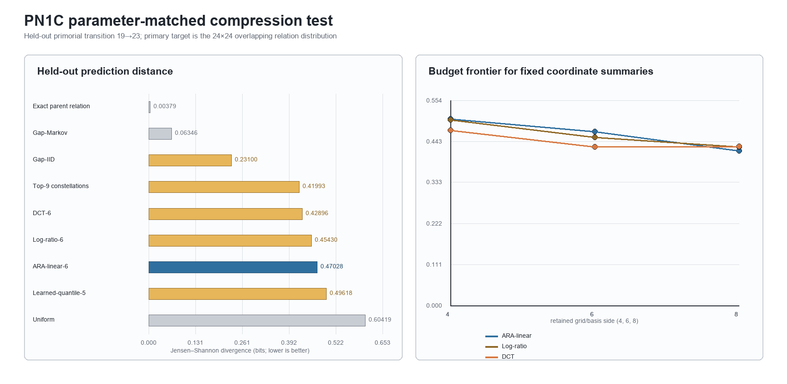
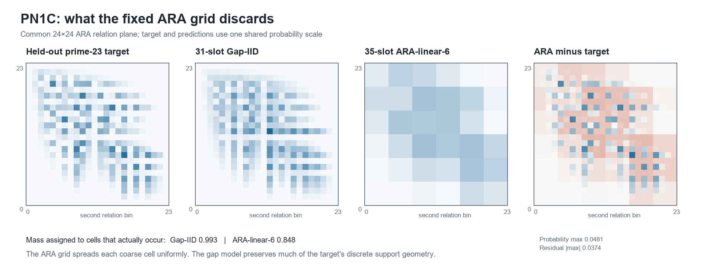

# PN1C parameter-matched sieve-rung compression competition — result

**Test ID:** `T228 / PN1C/v1`  
**Registered and run:** 17 July 2026  
**Status:** `NOT SUPPORTED [pre-registered compression advantage]`  
**Frozen protocol:** `PN1C_COMPRESSION_PROTOCOL_v1_FROZEN.md`  
**Frozen SHA-256:** `7DAA061BA790B12461ED60136FD9C50F3A36C10BED472819CFCC08B4B3462DBF`

## Answer first

The strict PN1C prediction failed. At the frozen ceiling of 36 declared scalar slots, the fixed 6×6 ARA grid did **not** predict the held-out prime-23 wheel's overlapping relation better than every ordinary competitor.

The 35-slot `ARA-linear-6` model scored `0.470280` bits of Jensen–Shannon divergence. The 31-slot `Gap-IID` model won at `0.230999` bits. Lower is better, so ARA's error was `2.036×` the winner's. Both predeclared child-half checks failed in the same direction. All exact implementation and target checks passed.

This rejects one narrow claim: **a uniformly decoded 6×6 linear ARA grid is the most efficient ≤36-slot summary for this prime-wheel transition.** It does not reject the ARA coordinate, PN1's inherited-order finding, or the broader ARA framework.

## Frozen primary result

| Rank | Model | Declared slots | Eligible | Held-out JSD (bits) | Gain over uniform per slot |
|---:|---|---:|:---:|---:|---:|
| 1 | Gap-IID | 31 | yes | **0.230999** | **0.012038** |
| 2 | Top-9 constellations | 36 | yes | 0.419932 | 0.005118 |
| 3 | DCT-6 | 36 | yes | 0.428965 | 0.004867 |
| 4 | Log-ratio-6 | 35 | yes | 0.454302 | 0.004283 |
| 5 | ARA-linear-6 | 35 | yes | 0.470280 | 0.003826 |
| 6 | Learned-quantile-5 | 28 | yes | 0.496182 | 0.003857 |
| — | Uniform | 0 | reference | 0.604190 | undefined |
| — | Gap-Markov | 271 | high-budget reference | 0.063456 | 0.001995 |
| — | Exact parent relation | 575 | full parent reference | 0.003793 | 0.001044 |

Plainly: the ARA grid was better than saying every location was equally likely, but several equally small summaries were better. Most importantly, the winning gap model used four fewer declared slots than ARA, so the result is not explained by giving the rival a larger parameter allowance.

## What was measured

For three consecutive circular prime-wheel gaps \(g_i,g_{i+1},g_{i+2}\), the frozen local coordinate was

\[
\underbrace{x_i}_{\substack{\text{ARA reading of}\text{first gap pair}}}
=
\frac{
2\underbrace{g_{i+1}}_{\text{right / release-side gap}}
}{
\underbrace{g_i}_{\text{left / accumulation-side gap}}
+
\underbrace{g_{i+1}}_{\text{right / release-side gap}}
},
\qquad
\underbrace{Z_i}_{\substack{\text{overlapping local}\text{relation identity}}}
=
\left(
\underbrace{x_i}_{\text{first relation}},
\underbrace{x_{i+1}}_{\text{next relation}}
\right).
\]

Plainly: each gap pair becomes one bounded reading from 0 to 2. Two readings that share their middle gap form a 2D local relation. PN1C asked which small summary of the fully known prime-19 parent best predicted the unopened prime-23 child's 24×24 relation distribution.

`ARA-linear-6` divided each 0–2 axis into six equal regions, stored the resulting 36 coarse masses (35 independent values), and spread each coarse mass uniformly back over its 4×4 fine cells. `Gap-IID` stored the parent's 16 distinct gap labels and their 15 independent frequencies, then projected independent triples of those gaps into the same ARA plane. Both predictions were made without using the prime-23 phase, survivor mask or target distribution.

## Why the fixed grid lost

The child distribution is not a smooth cloud. It occupies a structured, partly discrete web in the relation plane. The gap model placed `99.28%` of its predicted mass on cells that actually occurred in the child. The fixed ARA grid placed `84.80%` there because uniform decompression smears every retained coarse cell across fine cells that the arithmetic process rarely or never reaches.

Plainly: the ARA coordinate did not erase the structure; the chosen **compression and decompression law** did. Six equal bins per direction retained broad location but discarded too much of the discrete gap identity inside each block. The winning model kept the possible gap sizes, then rebuilt where their combinations land on the ARA plane.

This diagnosis agrees with the high-information references:

- the exact prime-19 relation was extremely close to prime 23 (`0.003793` bits);
- the 271-slot first-order gap Markov model remained strong (`0.063456` bits);
- therefore the parent-to-child inheritance found by PN1 is still present;
- the loss occurs when that inherited web is compressed to a smooth 6×6 block field.

## Robustness and exact checks

The two equal child halves independently gave:

| Child half | ARA JSD | Gap-IID JSD | ARA wins? |
|---:|---:|---:|:---:|
| 1 | 0.470292 | 0.230997 | no |
| 2 | 0.470271 | 0.231003 | no |

The fixed-coordinate budget frontier also did not rescue the primary claim:

| Retained side | ARA-linear | Log-ratio | DCT |
|---:|---:|---:|---:|
| 4 | 0.503902 | 0.501625 | **0.473900** |
| 6 | 0.470280 | 0.454302 | **0.428965** |
| 8 | **0.417866** | 0.429167 | 0.430439 |

ARA becomes the best of these three fixed-coordinate summaries at 8×8, but that uses 63 independent masses and lies outside the frozen 36-slot primary budget. It also remains far behind the 31-slot Gap-IID result. This is useful sensitivity information, not a post-hoc rescue.

Every frozen exact check passed: protocol hash, parent count and period, child survivor and gap counts, gap sum, positivity, evenness, survivor multiplier, prediction normalization, orientation invariance, and equality between the primary and separately chunked target streams.

A standalone validator then rebuilt the parent by repeated modulus filtering, materialized the complete `36,495,360`-gap child cycle, counted circular relations through indexed chunks, and reconstructed all nine models without importing the primary analysis. It reproduced:

- target gap SHA-256 `F68A8E707D9836C03C8FE5A84AD3FD3CA397F1736562CC2279094B631585923C`;
- target and half-count matrices exactly;
- every prediction array exactly;
- every published metric within `8.33e-17` bits.

## What this changes for ARA

PN1 and PN1C now give a more precise combined result.

1. **Supported by PN1:** local relational order survives nested primorial sieve rungs. Destroying order while retaining every parent gap makes the parent much less child-like.
2. **Rejected by PN1C:** a fixed low-resolution linear ARA grid with uniform within-cell decompression is not the best small description of that inherited order.
3. **Still open:** an ARA compression that retains discrete identity, transition or phase information may compete better—but it must be specified using the now-open prime-23 result as development data and tested on a genuinely new rung.

In the framework's language, this resembles a flattening failure. The broad 0–2 position is not enough to reconstruct the child web after coarse-graining. The decompressed state needs some account of which local identities can occupy each region and how they hand over to the next relation. That interpretation is consistent with the numbers, but it is a development hypothesis rather than a confirmed result.

## Limits

1. This is one deterministic finite arithmetic transition, not an independent population sample.
2. A “scalar slot” is a parameter-count proxy, not a literal compressed bitstream. A gap label, probability, boundary and coefficient each count as one slot even though their encoded bit costs differ.
3. Fixed decoding rules are not charged. This benefits all models, but their algorithmic description lengths differ.
4. Prime 23 is now open development data and cannot be reused as a blind confirmation target.
5. Nothing here establishes or refutes the Riemann Hypothesis, phi constants, physical universality or ARA as bedrock geometry.

## Clean next experiment

Use rungs through prime 23 for development, then freeze a prime-29 holdout before constructing it. Compare at least:

- literal minimum-description-length or fixed-bit encodings, not only scalar slots;
- the present linear-grid decoder;
- a predeclared sparse/support-aware ARA decoder;
- a small ARA-plus-transition state that explicitly retains one child/phase relation;
- IID and first-order gap summaries at the same true bit budget;
- learned categorical, DCT and constellation controls.

The crucial rule is that any improved ARA decompression must be fully chosen before opening prime 29. PN1C can teach the design; it cannot confirm the design it inspired.

## Post-open implementation disclosure

The first complete target run calculated both streams and wrote the score CSVs and target archive, then strict JSON output failed because pandas converted the zero-slot Uniform reference's undefined gain-per-slot from `None` to `NaN`. JSON does not permit `NaN` under the frozen strict writer. The only repair converted non-finite display values to JSON `null`. No target count, prediction, model, budget, metric, threshold or conclusion changed. The deterministic run was then repeated successfully, and the independent validator reproduced it.

## Provenance

- Frozen protocol: `PN1C_COMPRESSION_PROTOCOL_v1_FROZEN.md`
- Primary implementation: `pn1c_compression_test.py`
- Independent implementation: `pn1c_independent_validator.py`
- Machine result: `PN1C_COMPRESSION_RESULTS.json`
- Independent validation: `PN1C_INDEPENDENT_VALIDATION.json`
- Primary scores: `PN1C_MODEL_SCORES.csv`
- Budget frontier: `PN1C_BUDGET_FRONTIER.csv`
- Split-half checks: `PN1C_SPLIT_HALF.csv`
- Exact checks: `PN1C_CALIBRATION_CHECKS.csv`
- Saved target and predictions: `PN1C_TARGET_AND_PREDICTIONS.npz`
- Reproducible notebook: `PN1C_COMPRESSION_REPRODUCIBILITY.ipynb`
