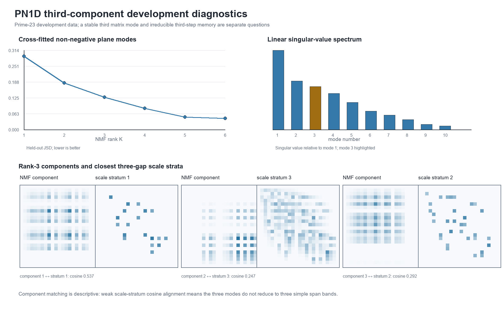

# PN1D third-component development analysis

**Test ID:** `PN1D/DEV/v1`  
**Run date:** 17 July 2026  
**Status:** `STRONG DEVELOPMENT SIGN; NOT A BLIND CONFIRMATION`  
**Development target:** complete prime-23 wheel  
**Reserved target:** prime 29 remains unopened  
**Frozen protocol:** `PN1D_THIRD_COMPONENT_DEVELOPMENT_PROTOCOL.md`  
**Protocol SHA-256:** `9D6F2EFC3774B84F04AFBCCEBD0782F3B02F62A53A783712408112F5642A60DF`

## Answer first

Dylan's visual impression that the prime relation data may contain a third wave or component was worth testing. Two distinct tests found reproducible third-order structure.

1. A three-component nonnegative description predicted the opposite half of the prime-23 relation plane substantially better than a two-component description. Mean held-out Jensen-Shannon divergence fell from `0.184717` to `0.128250` bits. The rank-3 improvement was `53.4%` as large as the major rank-1 to rank-2 improvement, and the three fitted shapes matched across halves with minimum cosine similarity `0.999999974`.
2. Three successive ARA relation readings retained `0.474249` bits of conditional mutual information. Exact overlap from independent gaps already creates `0.136776` bits, and a fitted first-order Markov gap process creates `0.273769` bits. The empirical sequence still retains `0.200480` bits beyond that stronger control.

An independent implementation reconstructed every probability tensor exactly and confirmed the spatial result with a different method: held-out truncated SVD improved from `0.181943` bits at rank 2 to `0.119908` bits at rank 3 in both directions.

The scientifically accurate wording is therefore:

> Prime-23 development data contain a stable third representational component and irreducible third-step dependence under these controls.

This does **not** yet show exactly three components or three physical waves. Ranks 4 and 5 also improve the spatial reconstruction, so the observed object is a richer coupling web with at least three resolvable modes.

## What the two tests ask

The phrase "third wave" can refer to two different mathematical claims. PN1D kept them separate.

### A. Is a third spatial component needed?

For adjacent prime-wheel gaps (g_i,g_{i+1}), the bounded ARA coordinate is

\[
\underbrace{x_i}_{\substack{\text{ARA reading}\\0<x_i<2}}
=
\frac{2\underbrace{g_{i+1}}_{\text{right gap}}}
{\underbrace{g_i}_{\text{left gap}}+\underbrace{g_{i+1}}_{\text{right gap}}}.
\]

Two successive readings form the local plane (Z_i=(x_i,x_{i+1})). The complete prime-23 cycle was divided into two consecutive halves. Nonnegative matrix factorization was fitted to each half separately at ranks 1 through 6 and scored only against the other half.

| NMF rank | Mean held-out JSD (bits) | Improvement from prior rank |
|---:|---:|---:|
| 1 | 0.290458 | - |
| 2 | 0.184717 | 0.105741 |
| 3 | **0.128250** | **0.056467** |
| 4 | 0.083827 | 0.044423 |
| 5 | 0.049285 | 0.034542 |
| 6 | 0.044064 | 0.005221 |

Plainly: adding a third nonnegative shape makes a large, repeatable improvement. It is not a tiny decorative correction. However, the improvement curve continues beyond three. This rules out the strongest interpretation that the plane contains only three components.

The ordinary singular-value spectrum supports the same restraint. The first three linear modes contain `47.21%`, `17.80%`, and `13.98%` of squared spectral energy, or `78.99%` cumulatively. The fourth and fifth modes still contain `9.96%` and `5.63%`.

### B. Is there information requiring a third step?

Three successive binned ARA readings were represented by (X_i,X_{i+1},X_{i+2}). The tested quantity was

\[
\underbrace{I(X_i;X_{i+2}\mid X_{i+1})}_{\substack{\text{information linking the first and third readings}\\\text{after the middle reading is already known}}}.
\]

Plainly: if the middle reading completely explains the handover, this number is zero. If the first reading still helps predict the third, the sequence contains memory or closure that cannot be flattened to one adjacent transition.

| Sequence model | Conditional mutual information (bits) | JSD from empirical tensor (bits) |
|---|---:|---:|
| Empirical prime-23 order | **0.474249** | 0 |
| IID gaps with exact shared-gap projection | 0.136776 | 0.264292 |
| First-order gap Markov projection | 0.273769 | 0.105436 |
| Empirical half 1 | 0.474342 | 0.00000167 from full |
| Empirical half 2 | 0.474168 | 0.00000177 from full |

The IID control is essential. Consecutive ARA readings share a gap, so overlap alone manufactures apparent dependence even when the gaps are independent. The Markov control is stronger because it also retains the observed transition probabilities between gap sizes. The remaining `0.200480` bits above the Markov projection are the defensible third-step signal.

In ARA language, the visible pair and their immediate handover do not completely close the local identity. Some information about the earlier orientation persists into the next reading. That is compatible with Dylan's triangle-lock intuition, but the statistic itself measures dependence, not a literal geometric triangle.

## Is the third component merely a third scale band?

The cycle was divided into three predeclared local span strata using the one-third and two-third quantiles of (g_i+g_{i+1}+g_{i+2}). The upper-inclusive boundaries were 16 and 20.

The best one-to-one cosine matches between the three rank-3 NMF components and the three scale strata were only `0.537`, `0.247`, and `0.292` (mean `0.359`). Therefore the three nonnegative components do not reduce cleanly to small-, middle-, and large-span bands.

Plainly: scale contributes to the pattern, but the third shape is not just "the large-gap layer." It appears to encode a mixture of relation orientation, discrete gap identities, and sequential handover.

## Independent validation

The validator did not import the primary PN1D analysis. It independently:

- rebuilt the prime-19 reduced residues by repeated modulus filtering;
- generated all `36,495,360` prime-23 circular gaps;
- recovered gap SHA-256 `F68A8E707D9836C03C8FE5A84AD3FD3CA397F1736562CC2279094B631585923C`;
- reconstructed the empirical, IID and Markov three-reading tensors exactly;
- reconstructed all three scale-stratum matrices exactly;
- reproduced every reported information measure;
- cross-checked the spatial conclusion with truncated SVD instead of NMF.

Every independent check passed. Prime 29 was not constructed or read.

## What this implies for ARA

This result adds credibility to a narrow mathematical part of the framework: the prime-wheel relation is not adequately described as two isolated modes or a memoryless chain of pairwise readings. A third component and a third relational step both carry substantial, stable information.

It also fits the proposed recursive-web picture better than a strict binary family tree. Two local ARA readings can be the visible phase/anti-phase pair, while their shared identities and handover retain another relational degree of freedom. That "informative third" is measurable here.

The result does not by itself establish:

- that the informative third is a physically independent wave;
- that there are exactly three modes;
- that prime arithmetic and physical waves share one causal mechanism;
- that the same thresholds or component shapes transfer to another domain.

The present evidence is mathematical development evidence in one deterministic arithmetic system. Its value is that the proposed structure generated a specific diagnostic that survived exact controls and independent reconstruction.

## Best next step

Before opening prime 29, use the now-open prime-23 result to define a fixed predictive object that distinguishes three hypotheses:

1. **Two-mode model:** only the leading two spatial components or one-step relation state.
2. **Three-mode model:** exactly one additional predeclared component or one additional relation-memory state.
3. **Richer-web model:** ranks 4 to 6 or a higher-order categorical transition model.

The clean future question is not merely whether rank 3 improves on rank 2—it already does on development data. It is whether a fixed three-component description transfers to the unopened rung efficiently enough that its third component is reproducible, while extra ranks add only smaller gains after an honest description-length penalty.

Until that model and penalty are frozen, prime 29 should remain unopened.

## Provenance

- Protocol: `PN1D_THIRD_COMPONENT_DEVELOPMENT_PROTOCOL.md`
- Primary analysis: `pn1d_third_component_development.py`
- Independent validator: `pn1d_independent_validator.py`
- Machine result: `PN1D_RESULTS.json`
- Independent validation: `PN1D_INDEPENDENT_VALIDATION.json`
- NMF cross-fit table: `PN1D_NMF_CROSSFIT.csv`
- Independent SVD cross-fit table: `PN1D_INDEPENDENT_SVD_CROSSFIT.csv`
- Third-step table: `PN1D_THIRD_STEP_MODELS.csv`
- Scale-stratum table: `PN1D_SCALE_STRATA.csv`
- Saved matrices: `PN1D_MATRICES.npz`
- Diagnostic figure: `PN1D_THIRD_COMPONENT_DIAGNOSTIC.png`
- Reproducibility notebook: `PN1D_THIRD_COMPONENT_REPRODUCIBILITY.ipynb`
