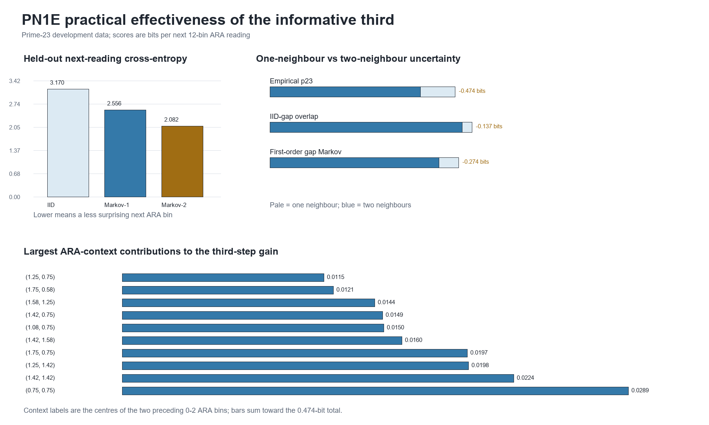

# PN1E: how effective is the informative third?

**Test ID:** `PN1E/DEV/v1`  
**Run date:** 17 July 2026  
**Status:** `STRONG PRACTICAL EFFECT ON PRIME-23 DEVELOPMENT DATA`  
**Reserved target:** prime 29 remains unopened  
**Frozen protocol:** `PN1E_THIRD_MEMORY_EFFECTIVENESS_PROTOCOL.md`  
**Protocol SHA-256:** `484B45190DCDC3823CDF6B2F644FCC87FCD925DA22B45321D2C334E56B8C77EB`

## Answer first

The third relation is not merely statistically detectable. It makes a large held-out improvement when predicting the next ARA reading.

On the primary 12-bin version of the 0--2 line, knowing only the current ARA reading gave a held-out cross-entropy of `2.5565` bits per next reading. Knowing the previous reading as well reduced this to `2.0823` bits. That is:

- `0.4742` fewer bits of surprise per prediction;
- an `18.55%` reduction in predictive uncertainty;
- a `28.01%` reduction in perplexity, from `5.883` plausible bins to `4.235`;
- exact-bin accuracy rising from `31.70%` to `41.71%`;
- top-three accuracy rising from `69.46%` to `83.90%`;
- Brier score improving from `0.7896` to `0.7031`.

Both cross-fit directions produced essentially the same gain: `0.47413` and `0.47430` bits. The effect also survived the predeclared 8-, 12-, and 16-bin resolutions. It therefore passes the frozen definition of a **strong practical effect**.

The important qualification is that `0.4742` bits is the **gross benefit of the third reading**, not all uniquely unexplained structure. Exact controls show that shared-gap overlap and ordinary adjacent gap transitions generate some of it automatically. The amount remaining above the first-order raw-gap Markov control is `0.20048` bits per reading.

## What is being predicted?

Four consecutive prime-wheel gaps are converted into three overlapping ARA readings:

\[
\underbrace{x_i}_{\text{first ARA reading}}
=\frac{2g_{i+1}}{g_i+g_{i+1}},\qquad
\underbrace{x_{i+1}}_{\text{current ARA reading}}
=\frac{2g_{i+2}}{g_{i+1}+g_{i+2}},\qquad
\underbrace{x_{i+2}}_{\text{next ARA reading}}
=\frac{2g_{i+3}}{g_{i+2}+g_{i+3}}.
\]

Each reading lies on the same 0--2 ARA line. In the primary test, that line is divided into 12 equal regions. One prediction therefore asks:

> Which of the 12 ARA regions will the next relation occupy?

This is the relational scale used by every primary score. A bit here is not a physical energy unit or a percentage of the ARA line. It is an information unit measuring how surprised the predictor is by the next 12-bin ARA position.

## The two operational predictors

The names `ARA-Markov-1` and `ARA-Markov-2` describe how many prior ARA positions the predictor remembers:

| Predictor | Information supplied | Plain-language question |
|---|---|---|
| ARA-Markov-1 | current ARA bin only | Given where the relation is now, where is it likely to go next? |
| ARA-Markov-2 | previous and current ARA bins | Given where it came from **and** where it is now, where is it likely to go next? |

The second predictor contains the informative third: the earlier position, present position, and next position form the three-part closure. It is not given the answer. Each model is trained on one consecutive half of the complete prime-23 cycle and scored on the other half, then the direction is reversed.

| Primary model | Cross-entropy (bits/read) | Perplexity | Exact bin | Top three | Brier score |
|---|---:|---:|---:|---:|---:|
| ARA-IID | 3.1697 | 8.999 | 22.91% | 47.77% | 0.8742 |
| ARA-Markov-1 | 2.5565 | 5.883 | 31.70% | 69.46% | 0.7896 |
| **ARA-Markov-2** | **2.0823** | **4.235** | **41.71%** | **83.90%** | **0.7031** |

Plainly: the current ARA position already helps substantially. Adding the route into that position helps again by a comparable, practically useful amount.

## Where the raw-gap Markov control sits

The phrase **raw-gap Markov control** names a different object from the two operational ARA predictors above. It is a hypothetical generator that preserves only the observed immediate transition rule

\[
P(g_{i+1}\mid g_i),
\]

then projects its generated gap sequences through the same three-reading, 12-bin ARA construction. It asks how much apparent third-reading memory would arise even if the raw gaps had no memory beyond one adjacent transition.

The three matched-scale comparisons are:

| World projected onto the same 12-bin ARA task | One-reading uncertainty | Two-reading uncertainty | Gain from the third | Fraction removed |
|---|---:|---:|---:|---:|
| Independent gaps, with ratio overlap retained | 2.7943 | 2.6576 | 0.1368 bits | 4.89% |
| First-order raw-gap Markov world | 2.6090 | 2.3352 | 0.2738 bits | 10.49% |
| **Real ordered prime-23 cycle** | **2.5565** | **2.0822** | **0.4742 bits** | **18.55%** |

In plain language:

1. The ARA readings overlap because neighbouring ratios share a gap. That mechanical overlap alone produces `0.1368` bits of apparent third memory.
2. Real immediate gap-to-gap tendencies raise the expected effect to `0.2738` bits.
3. The actual ordered prime cycle contains `0.4742` bits.

Thus the raw first-order transition control reproduces about `57.7%` of the gross information gain. The remaining `0.20048` bits, or about `42.3%` of the gross gain, cannot be explained by that control. This remainder is evidence of ordered structure beyond one raw-gap transition. It is not yet proof that the cause is exactly three waves or uniquely ARA.

## Resolution sensitivity

| ARA bins | One-reading cross-entropy | Two-reading cross-entropy | Gain | Exact-bin improvement |
|---:|---:|---:|---:|---:|
| 8 | 2.2418 | 2.0071 | 0.2347 bits | 34.92% to 41.89% |
| 12 | 2.5565 | 2.0823 | 0.4742 bits | 31.70% to 41.71% |
| 16 | 2.7117 | 2.0891 | 0.6226 bits | 30.34% to 42.69% |

The benefit grows when the ARA line is resolved more finely. That is compatible with the earlier observation that flattening the relation discards child identity. It also means the numerical gain depends on measurement grain, so the bin count must always travel with the result.

## Is one special pattern causing the result?

No single ARA context dominates the gain:

- 112 two-reading ARA contexts contribute;
- the largest five account for `22.53%` of total conditional information;
- the largest ten account for `36.85%`;
- the largest twenty account for `57.83%`.

At the raw level, 4,636 four-gap constellations participate. Their positive contributions sum to `0.62583` bits per reading and their negative contributions sum to `-0.15158`, giving the net `0.47425` bits. The strongest individual constellation is `(2,4,8,6)`, which maps to approximate ARA-bin centres `(1.4167,1.4167,0.9167)` and contributes `0.02025` bits per reading globally.

Plainly: some routes are much more informative than others, but the result is a distributed nonlinear web rather than one cherry-picked prime-gap pattern.

## What this implies for ARA

This test supports a narrow and important ARA proposition:

> A relation's present 0--2 location does not always contain its whole predictive state. Its direction of arrival can remain part of the local identity.

That is a numerical version of Dylan's triangle-lock language. The pair of visible states is more informative when their relation through time is retained. The improvement is large enough to matter operationally, and the stronger effect at finer grain fits the view that coarse flattening hides child structure.

It does **not** establish that:

- there are exactly three independent waves;
- prime arithmetic and physical wave systems share one cause;
- all of the `0.20048`-bit excess is unique to ARA rather than another higher-order arithmetic model;
- the result transfers to prime 29.

Prime 23 is development data. Prime 29 remains unopened, so this result can still be used to design a future frozen transfer test without contaminating that target.

## Recommended next branch

The next development analysis should identify what information the second ARA memory is carrying. A useful decomposition is:

1. **direction only:** whether the first-to-second ARA move rises, falls, or remains near the ridge;
2. **distance only:** how far that move travels on the 0--2 line;
3. **raw child identity:** which shared central gaps produced the same apparent ARA route;
4. **full two-reading state:** the current PN1E model.

Comparing those nested predictors on the same held-out scale would show whether the gain comes mainly from orientation, amplitude, discrete child identity, or their interaction. That is a better immediate probe than opening prime 29. The winning fixed representation can later be frozen for the true transfer test.

## Validation and provenance

The independent validator does not import the primary PN1E analysis. It independently reconstructs the complete prime-23 gap cycle, relation encoding, cross-fit scores, entropy controls and contribution tables. All declared checks pass, with maximum primary-score disagreement `7.11e-15` from floating-point rounding. Prime 29 is neither constructed nor read.

- Protocol: `PN1E_THIRD_MEMORY_EFFECTIVENESS_PROTOCOL.md`
- Primary analysis: `pn1e_third_memory_effectiveness.py`
- Independent validator: `pn1e_independent_validator.py`
- Machine result: `PN1E_RESULTS.json`
- Cross-fit scores: `PN1E_EFFECTIVENESS_SCORES.csv`
- Control-scale table: `PN1E_ENTROPY_SCALE.csv`
- ARA-context attribution: `PN1E_CONTEXT_ATTRIBUTION.csv`
- Raw attribution: `PN1E_GAP_QUADRUPLE_ATTRIBUTION.csv`
- Top raw constellations: `PN1E_TOP30_GAP_QUADRUPLES.csv`
- Exact checks: `PN1E_EXACT_CHECKS.csv`
- Independent validation: `PN1E_INDEPENDENT_VALIDATION.json`
- Diagnostic figure: `PN1E_EFFECTIVENESS_DIAGNOSTIC.png`
- Executed notebook: `PN1E_THIRD_MEMORY_EFFECTIVENESS_REPRODUCIBILITY.ipynb`
