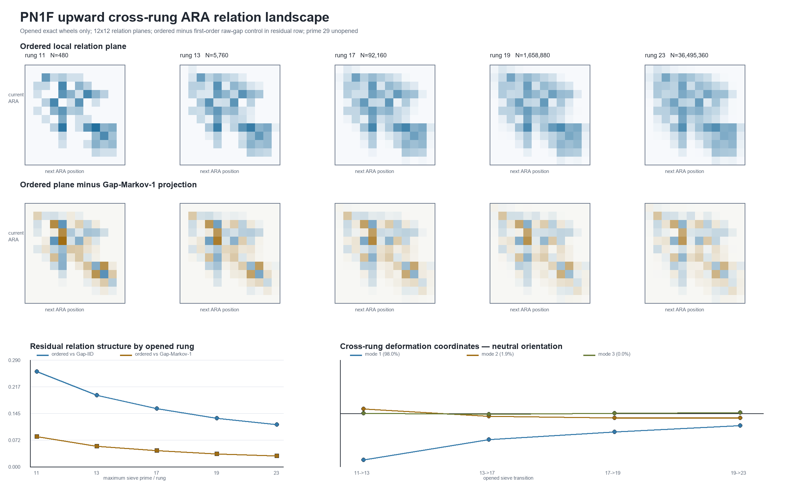
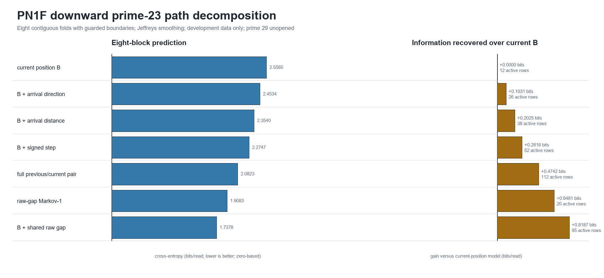

# PN1F bidirectional prime-wheel landscape — report

**Development ID:** `PN1F/DEV/v1`  
**Run date:** 17 July 2026  
**Status:** `DEVELOPMENT LANDSCAPE / NOT BLIND CONFIRMATION`  
**Orientation:** up = later sieve prime/larger primorial; down = child/path decomposition within the already-open prime-23 wheel.  
**Protected target:** prime 29 remains unopened.  
**Protocol SHA-256:** `4ABCCB50E62780E41D9FF48455C1DC413926B9E5E527654E2B4F7108CAF004D7`

## Answer first

The opened sieve rungs expose a highly persistent parent-scale deformation **direction**, but not a completed parent wave.

After subtracting the relation plane generated by each rung's ordinary first-order raw-gap transition matrix, the remaining shape changes in almost the same direction from `11 -> 13 -> 17 -> 19 -> 23`. Consecutive residual-shape cosines rise from `0.9892` to `0.9981`; consecutive signed deformation cosines are `0.9794`, `0.9905`, and `0.9924`. One mode contains `98.01%` of the 12-bin deformation energy. At 24 bins, the same result strengthens to `99.05%`.

The amplitude of that residual steadily contracts. No turn, flip, return, or opposite branch is observed in the opened range. The defensible conclusion is therefore **a stable relation shape undergoing a one-direction scale progression**, compatible with one visible branch of a larger ARA occurrence but insufficient to establish a cycle.

Drilling downward inside prime 23 shows that the child identity matters more than the position-only path representation. Relative to the current ARA position alone:

- arrival direction recovers `0.1031` bits/read;
- arrival distance recovers `0.2025`;
- their coarse signed interaction recovers `0.2818`;
- the full previous/current ARA pair recovers `0.4742`;
- a first-order raw-gap Markov model recovers `0.6481`;
- current ARA position plus the exact shared raw gap recovers `0.8187`.

The result supports Dylan's statement that child waves are more visible at this scale. It does not show that the bounded ARA position is the most efficient arithmetic representation: the raw shared-gap identity and ordinary raw-gap Markov comparator retain more predictive information.

## Plain-language description

Each sieve rung was drawn with the same local ARA map. The maps look increasingly smooth as the wheel becomes larger, but the extra structure that remains after an ordinary gap model is removed keeps essentially the same shape. It is fading or contracting without changing direction very much.

That looks like watching one branch of a larger motion, not watching a complete oscillation. We have not yet seen it turn around.

Inside the prime-23 rung, knowing only “where the ARA reading is now” loses important information. Knowing which direction it arrived from helps. Knowing how far it moved helps more. Knowing the actual shared gap—the child object beneath both readings—helps most.

## Part A — upward landscape

For each opened core rung, the ordered relation plane was compared with:

1. `Gap-IID`: the same one-gap inventory with independent successive gaps;
2. `Gap-Markov-1`: the same one-gap inventory plus its fitted immediate raw-gap transitions.

The signed residual was

\[
R_k=P_k^{ordered}-P_k^{Gap\text{-}Markov1}.
\]

The cross-rung deformation was

\[
D_{k\to k+1}=R_{k+1}-R_k.
\]

### Rung-level measurements

| Rung | Slots | Ordered adjacent MI | JSD vs Gap-IID | JSD vs Gap-Markov-1 | Residual L2 | Mean absolute child step |
|---:|---:|---:|---:|---:|---:|---:|
| 11 | 480 | 1.11836 | 0.25872 | 0.08191 | 0.09511 | 0.58750 |
| 13 | 5,760 | 0.89498 | 0.19389 | 0.05602 | 0.07520 | 0.59230 |
| 17 | 92,160 | 0.76672 | 0.15763 | 0.04361 | 0.06393 | 0.59707 |
| 19 | 1,658,880 | 0.67523 | 0.13182 | 0.03520 | 0.05573 | 0.60208 |
| 23 | 36,495,360 | 0.61324 | 0.11429 | 0.02962 | 0.05004 | 0.60669 |

Three things occur together:

1. ordinary one-step gap structure accounts for an increasing fraction of the visible relation plane;
2. the residual amplitude contracts;
3. the residual shape becomes more stable rather than dissolving.

The circular mean signed child step is exactly zero at every rung by telescoping closure, but the child directions are
not equally populated. At rung 11, rising/equal/falling shares are `36.04% / 11.67% / 52.29%`; at rung 23 they are
`39.75% / 10.02% / 50.23%`. The less frequent rising events have larger average steps, balancing the more frequent
smaller falling events. This is a direct example of a zero parent projection hiding asymmetric child motion; it must
not be described as child-level balance or a self-certifying ridge.

### Transition geometry

| Transition | Ordered-plane JSD | Residual-shape cosine | Deformation L2 | Cosine with previous deformation | Turn angle |
|---|---:|---:|---:|---:|---:|
| `11 -> 13` | 0.02303 | 0.98920 | 0.02347 | — | — |
| `13 -> 17` | 0.00762 | 0.99514 | 0.01318 | 0.97937 | 11.66° |
| `17 -> 19` | 0.00432 | 0.99670 | 0.00952 | 0.99055 | 7.88° |
| `19 -> 23` | 0.00230 | 0.99814 | 0.00654 | 0.99242 | 7.06° |

The transition turns get smaller while the deformation amplitude decreases. That is a strong geometric regularity in the opened exact construction. It is also compatible with ordinary convergence toward a limiting relation distribution, so it must not be called a new number-theory wave without a successful next-rung prediction.

### Mode decomposition

The four 12-bin deformation fields have energy fractions:

- mode 1: `98.0149%`;
- mode 2: `1.9366%`;
- mode 3: `0.0481%`;
- mode 4: `0.0005%`.

At 24 bins across `13 -> 17 -> 19 -> 23`:

- mode 1: `99.0531%`;
- mode 2: `0.9397%`;
- mode 3: `0.0072%`.

Dividing every deformation by its unequal logarithmic rung step `log(q)` leaves the adjacent directions unchanged
and gives mode 1 `98.28%` of the energy. The dominant direction is therefore not produced by pretending every added
prime is an equal-size scale step.

This is a **single dominant deformation direction**, not evidence for exactly one physical wave. The sign of a singular vector is arbitrary, and Dylan has not yet assigned ARA orientation to the map.

## Part B — downward prime-23 decomposition

The task predicted the same next 12-bin ARA reading in eight guarded contiguous folds.

| Representation | Cross-entropy | Gain vs current B | Relative reduction | Active context rows | Active conditional df |
|---|---:|---:|---:|---:|---:|
| Current position `B` | 2.55650 | 0 | 0% | 12 | 132 |
| `B + direction` | 2.45338 | 0.10312 | 4.03% | 26 | 286 |
| `B + distance` | 2.35401 | 0.20248 | 7.92% | 38 | 418 |
| `B + signed step` | 2.27473 | 0.28177 | 11.02% | 52 | 572 |
| Full `(A,B)` | 2.08227 | 0.47423 | 18.55% | 112 | 1,232 |
| Raw-gap Markov-1 | 1.90835 | 0.64815 | 25.35% | 20 | 380 |
| `B + shared raw gap` | **1.73777** | **0.81872** | **32.03%** | 94.875 | 1,043.625 |

Every decompressed model preserved its gain in all eight folds. The tiny fold-to-fold standard deviations reflect the deterministic wheel's strong internal symmetry and are not independent replication.

### What the decomposition locates

- Direction alone explains approximately `21.7%` of the full `(A,B)` gain.
- Distance alone explains approximately `42.7%`.
- Their seven-class signed combination explains approximately `59.4%`.
- The remaining full-pair gain depends on finer arrival position than the coarse signed-step categories retain.
- The exact shared raw gap carries information that cannot be recovered from the two bounded positions alone.

The ordinary raw-gap Markov predictor is especially important: it uses only 20 active current-gap rows and beats the full ARA pair. Any future claim of ARA compression advantage must beat or complement that comparator under an honest bit/parameter budget.

## Combined interpretation

The two directions give a consistent lay of the land:

- **Upward:** the same non-Markov relation shape persists while its amplitude contracts across sieve rungs.
- **Downward:** local position is a compressed shadow; direction, distance, and especially the shared child gap restore structure that compression removed.

An ARA-compatible reading is that a parent-scale branch is expressed through increasingly numerous child relations while its normalized residual amplitude becomes smaller. The evidence does not determine whether the missing opposite branch occurs at later sieve rungs, in another arithmetic coordinate, or not at all.

## What may and may not be claimed

### Supported as development description

- a stable cross-rung non-Markov relation shape exists through the opened range;
- its signed changes are almost collinear and decrease in amplitude;
- direction and distance both carry next-reading information;
- exact child identity contains substantial information lost by the bounded position-only projection.

### Not established

- a completed cross-rung wave, cycle, flip, or singularity;
- a Space/Time or Phase-A/Phase-B orientation;
- unique information in ARA rather than the equivalent log-ratio coordinate;
- superiority over ordinary raw-gap modelling;
- any implication for RH, prime unpredictability, physics, or universal ARA geometry.

## Safe next step

1. Dylan orients the neutral upward residual and deformation maps.
2. Use the opened rungs to choose a low-parameter parent state: a stable spatial template plus a rung-dependent amplitude, with extra modes charged explicitly.
3. Choose the downward state to carry forward. At minimum, the frozen comparison must include signed-step ARA, full `(A,B)`, raw-gap Markov-1, and shared-gap identity.
4. Freeze the next-rung direction, amplitude interval, shape similarity, scoring rules, complexity budget, and failure conditions.
5. Only then implement a streamed prime-29 target that cannot be inspected during design.

Prime 29 must remain closed until steps 1–4 are complete.

## Validation

The independent artifact validator passed every check:

- protocol hash and source prime ceiling;
- prime-23 count, period and inherited PN1C/PN1D gap hash through the primary run;
- normalized planes and zero-sum residuals;
- exact deformation definition and SVD reconstruction;
- cross-rung JSD and cosine recomputation;
- eight-fold downward score and gain recomputation;
- reconciliation with PN1E (`2.5565 -> 2.0823` bits);
- 24-bin shape and deformation sensitivity;
- final PNG dimensions.

## Provenance

- Protocol: `PN1F_BIDIRECTIONAL_LANDSCAPE_DEVELOPMENT_PROTOCOL.md`
- Primary implementation: `pn1f_bidirectional_landscape.py`
- Independent validator: `pn1f_validate_outputs.py`
- Reproducibility notebook: `PN1F_BIDIRECTIONAL_LANDSCAPE_REPRODUCIBILITY.ipynb`
- Notebook execution record: `PN1F_NOTEBOOK_EXECUTION_VALIDATION.json`
- Machine result: `PN1F_RESULTS.json`
- Validation record: `PN1F_VALIDATION.json`
- Saved matrices: `PN1F_BIDIRECTIONAL_MATRICES.npz`
- Tables: `PN1F_RUNG_METRICS.csv`, `PN1F_TRANSITION_METRICS.csv`, `PN1F_DEFORMATION_MODE_SCORES.csv`, `PN1F_DOWNWARD_FOLD_SCORES.csv`, `PN1F_DOWNWARD_MODEL_SUMMARY.csv`
