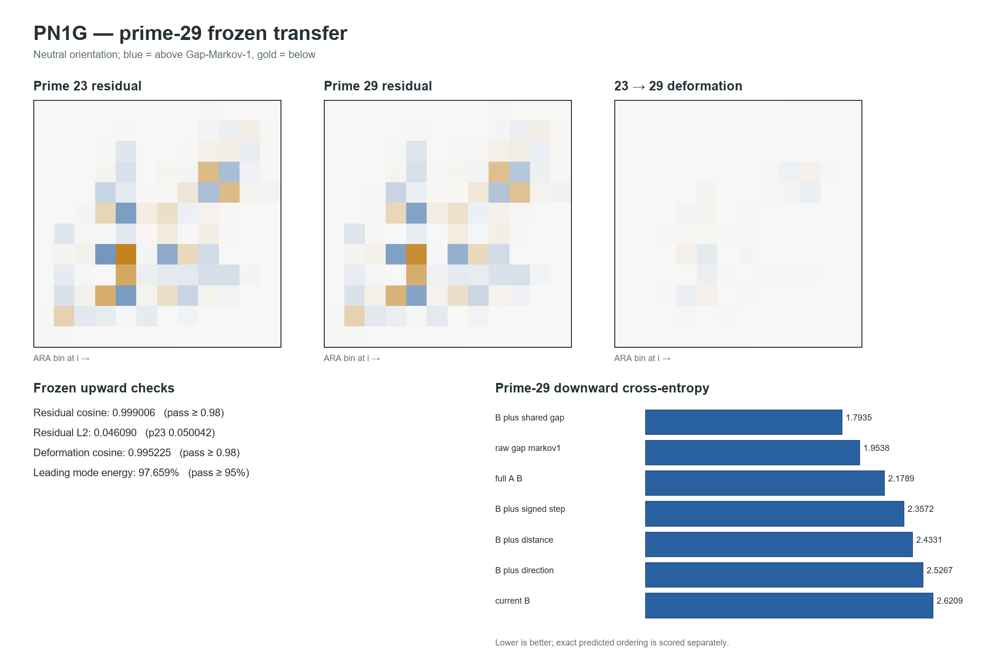

# PN1G prime-29 frozen transfer — report

**Test ID:** `PN1G/TRANSFER/v1`  
**Run date:** 17 July 2026  
**Status:** `FROZEN NEXT-RUNG TRANSFER TEST — 6/6 REGISTERED CHECKS PASSED`  
**Protocol SHA-256:** `FC568F2D1913F163A81146A089F0D1F42981F7E9EFB5FAFBA5C097D92387732B`  
**Target status:** prime 29 was unopened when the protocol was hashed; it is now open development data.

## Answer first

The neutral structure found through prime 23 transferred cleanly to the untouched prime-29 sieve rung.

All six frozen checks passed:

| Frozen check | Registered criterion | Prime-29 result | Verdict |
|---|---:|---:|---:|
| residual-shape inheritance | cosine at least `0.98` | `0.999006` | pass |
| continued residual contraction | below p23 `0.0500419` | `0.0460902` | pass |
| deformation-direction continuation | cosine at least `0.98` | `0.995225` | pass |
| low-dimensional progression | leading energy at least `95%` | `97.6588%` | pass |
| downward representation order | exact seven-model order | exact; Kendall `tau=1.0` | pass |
| non-base fold stability | positive gain in every fold | all six models, all eight folds | pass |

This is a strong transfer result for this arithmetic hierarchy. The cross-rung object did not merely remain similar: the new signed change continued the previously observed direction within `5.60 degrees`, while the residual amplitude contracted again. Independently, the entire downward information ordering transferred exactly across a wheel almost 28 times larger than prime 23.

It is not a proof of a physical wave, universal ARA geometry, the Riemann hypothesis, or prime predictability. The observed trajectory could still be ordinary convergence toward a limiting wheel distribution, and the raw-gap representations remain stronger predictors than compressed ARA position alone.

## Plain-language explanation

Before looking at prime 29, we drew a compact picture of what should survive from the earlier prime wheels.

First, we predicted that the leftover relation shape—after removing what an ordinary one-step gap model already explains—would look almost the same. It did: similarity was `0.999` on a scale where `1` is identical.

Second, we predicted that the shape would keep fading in strength without changing direction. It did. Its size fell from about `0.0500` to `0.0461`, and the new change pointed almost exactly along the earlier change.

Third, we predicted the order in which progressively decompressed descriptions would recover the next ARA reading. The exact child gap was best, then the ordinary raw-gap transition, then the full two-position ARA history, signed step, distance, direction, and current position alone. Prime 29 reproduced that complete order exactly.

So the result supports two connected ideas: a stable parent-scale relation persists across rungs, and drilling downward restores child information that the compressed 0–2 position hides.

## Frozen setup

For circular gaps `(g_i)`, PN1G retained the previously fixed coordinate

\[
x_i=\frac{2g_{i+1}}{g_i+g_{i+1}},
\qquad
Z_i=(x_i,x_{i+1}).
\]

At each rung, the exact ordered relation plane was compared with:

1. `Gap-IID`, preserving only the one-gap inventory;
2. `Gap-Markov-1`, preserving the fitted immediate raw-gap transition matrix.

The primary residual and unopened deformation were

\[
R_{29}=P_{29}^{ordered}-P_{29}^{Gap\text{-}Markov1},
\qquad
D_{23\to29}=R_{29}-R_{23}.
\]

The primary plane used 12 by 12 bins. A 24 by 24 replay was frozen as sensitivity only. No Space/Time, Phase A/Phase B, accumulation/release, or ARA latitude was assigned by the calculation.

## Exact streamed construction

The complete prime-29 wheel has:

- primorial period `6,469,693,230`;
- `1,021,870,080` circular gap slots;
- 23 observed gap sizes, the even values `2` through `46`;
- exact gap SHA-256 `92646B2A27C0836D0D99B49B83C3982FC9FE604E3A9780F2DC8FDDBB99DF8A2C` under the saved int32 stream convention.

The target was streamed from lifted prime-23 residues and never materialized as a billion-entry residue or gap array.

Before opening prime 29, the identical stream counter replayed the known `19 -> 23` transition and reproduced exactly:

- period and slot count;
- total gap sum;
- the inherited p23 gap SHA-256;
- raw-gap transition counts;
- 12-bin and 24-bin relation planes;
- the previously saved PN1F normalized planes.

Only after all eight rehearsal checks passed did the target stream begin.

## Upward transfer

### Primary 12-bin measurements

| Quantity | Result |
|---|---:|
| cosine `R23` versus `R29` | `0.9990059870` |
| p23 residual L2 | `0.0500418653` |
| p29 residual L2 | `0.0460901755` |
| new deformation L2 | `0.0044945646` |
| cosine previous versus new deformation | `0.9952250626` |
| deformation turn | `5.6014 degrees` |
| leading energy after appending new deformation | `97.6588%` |
| ordered-plane JSD p23 versus p29 | `0.00119868` bits |

### 24-bin sensitivity

The higher-resolution replay agreed:

- residual cosine `0.998896`;
- deformation cosine `0.994998`;
- leading deformation-mode energy `98.6554%`.

The 12-bin primary therefore did not pass because coarse bins accidentally erased the difference.

### What this establishes

The frozen prediction that the same neutral cross-rung shape and signed direction would continue survived one untouched rung. That is a real improvement over PN1F, which only described opened data.

### What remains unresolved

The amplitude is still contracting and the turn angle is still shrinking. No opposite branch, reversal, flip, or return has appeared. The most economical ordinary explanation remains convergence toward a limiting relation distribution. An ARA reading of one visible parent branch remains compatible with the data, but a completed parent wave is not established.

## Downward transfer

All models predicted the same next 12-bin ARA reading in eight guarded contiguous folds. Lower cross-entropy is better.

| Representation | p29 cross-entropy | Gain over current `B` | Minimum fold gain | Active conditional df |
|---|---:|---:|---:|---:|
| `B + shared raw gap` | **1.79352** | **0.82741** | `0.82738` | `1362.6` |
| raw-gap Markov-1 | 1.95376 | 0.66716 | `0.66714` | `506.0` |
| full `(A,B)` | 2.17886 | 0.44206 | `0.44204` | `1307.6` |
| `B + signed step` | 2.35715 | 0.26377 | `0.26375` | `616.0` |
| `B + distance` | 2.43314 | 0.18778 | `0.18776` | `451.0` |
| `B + direction` | 2.52672 | 0.09420 | `0.09418` | `297.0` |
| current `B` | 2.62092 | 0 | 0 | `132.0` |

The exact frozen order transferred with Kendall rank agreement `1.0`. Every added representation retained positive gain in all eight folds.

The folds are deterministic subdivisions of one highly symmetric wheel, not eight independent replications. Their value is protection against local overfitting and exact transfer of the registered scoring rule.

## Post-open development observation

This subsection was not a frozen prediction and cannot be counted as an additional confirmation.

Relative to prime 23, the coarse bounded-path gains became smaller while the child/raw-gap gains became slightly larger:

| Added state | p23 gain | p29 gain | Direction of change |
|---|---:|---:|---:|
| direction | 0.10312 | 0.09420 | down |
| distance | 0.20248 | 0.18778 | down |
| signed step | 0.28177 | 0.26377 | down |
| full `(A,B)` | 0.47423 | 0.44206 | down |
| raw-gap Markov-1 | 0.64815 | 0.66716 | up |
| `B + shared raw gap` | 0.81872 | 0.82741 | up |

One plausible reading is that, as the wheel grows, exact child identity and discrete transition structure carry an increasing share of the recoverable information while the coarse 0–2 arrival path carries less. This matches the earlier decompression observation, but it was noticed after target opening and needs a later frozen rung to test.

The child direction split also continued smoothly. Prime 29 has rising/equal/falling shares `40.282% / 9.816% / 49.902%`, compared with prime 23's approximately `39.75% / 10.02% / 50.23%`. Circular mean signed motion remains exactly zero by closure while the child populations remain asymmetric.

### Pyramid/capstone interpretation supplied by Dylan

Dylan's post-open geometry reading is that multiple information triangles connect to support the largest parent
identity or "capstone" at each rung. Adding the next prime requires more child connections, while the complete
connected object carries more information.

There is a precise arithmetic part and a proposed ARA part. The exact lift rule is

\[
N_{k+1}=(q-1)N_k,
\]

because each parent residue has `q` lifted copies and exactly one is removed by the new prime `q`. For `23 -> 29`,
the slot count therefore rises exactly `28x`, from `36,495,360` to `1,021,870,080`.

A compact information-triangle notation is

\[
\triangle_i=
\left(
x_i,
x_{i+1},
C(x_i,x_{i+1})
\right),
\qquad
\mathcal P_{k+1}=\mathcal C_q\!\left(\{\triangle_i\}_{i=1}^{(q-1)N_k}\right),
\]

where `C` is the relation closing two readings and `P` is the parent/capstone aggregate. This notation is a proposed
ARA description, not evidence that literal Euclidean triangles exist in the number line.

The measurements separate **per-connection intensity** from **whole-rung carried relation**:

- adjacent ARA mutual information falls `0.613245 -> 0.571406` bits;
- normalized residual L2 falls `0.050042 -> 0.046090`;
- exact shared-child gain rises slightly `0.818724 -> 0.827405` bits/event;
- slot count rises exactly `28x`;
- summed shared-child log-loss advantage rises from approximately `29.88 million` to `845.50 million` bits, a
  `28.2969x` increase across the complete wheel.

The summed value is a coding/prediction quantity over all wheel events, not physical energy flow. The resulting
testable picture is nevertheless clean: **more child closures support the parent capstone; the total carried relation
grows, while each normalized local appearance becomes quieter and more distributed.** This is now a post-open
development hypothesis for a later rung or independently defined hierarchy.

## Implication for the ARA framework

This result adds credibility to a narrow, load-bearing part of ARA:

1. **Cross-scale relation:** one coordinate and one ordinary-control subtraction declared on earlier rungs recovered nearly the same residual geometry at an untouched larger rung.
2. **Directional continuation:** the signed transformation between appearances transferred, not merely the static heatmap.
3. **Recursive decompression:** direction, distance, their interaction, full path, and exact child identity retained the predicted information hierarchy.
4. **Compression boundary:** the bounded ARA coordinate remains visibly lossy. Raw child identity and ordinary raw-gap transition modelling outperform position-only ARA and must remain in every serious comparator set.

The result does not establish that the statistical residual is a physical ARA wave. It establishes that the proposed relational measurement has stable, prospectively transferable structure in this exact nested arithmetic system.

## Independent validation

The separate validator passed `38/38` checks. It did not trust the headline JSON. From the saved aggregate counts it independently recomputed:

- primorial and totient arithmetic;
- gap marginal and transition closure in both directions;
- 12-bin and 24-bin ordered and projected control planes;
- residuals, deformations, cosines and SVD energies;
- every fold-level cross-entropy, perplexity, accuracy, Brier score and complexity count;
- exact model ordering and minimum fold gains;
- figure dimensions and result metadata.

The complete streaming run was repeated after adding the compact audit inventories. Both runs produced identical gap hash, upward values, downward values and frozen verdicts.

## Provenance

- frozen protocol: `PN1G_PRIME29_TRANSFER_PROTOCOL_v1_FROZEN.md`
- primary streamed implementation: `pn1g_prime29_transfer.py`
- independent validator: `pn1g_independent_validator.py`
- machine result: `PN1G_RESULTS.json`
- saved aggregate inventories: `PN1G_PRIME29_COUNTS_AND_MATRICES.npz`
- fold scores: `PN1G_DOWNWARD_FOLD_SCORES.csv`
- model summary: `PN1G_DOWNWARD_MODEL_SUMMARY.csv`
- upward metrics: `PN1G_UPWARD_TRANSFER_METRICS.csv`
- frozen verdicts: `PN1G_FROZEN_CHECKS.csv`
- validation record: `PN1G_INDEPENDENT_VALIDATION.json`
- reproducibility companion: `PN1G_PRIME29_TRANSFER_REPRODUCIBILITY.ipynb`

**Final status:** `6/6 FROZEN CHECKS PASS / 38/38 INDEPENDENT CHECKS PASS / CROSS-RUNG SHAPE AND DIRECTION TRANSFER / EXACT DOWNWARD ORDER TRANSFER / NO COMPLETED WAVE OR PHYSICAL ORIENTATION ESTABLISHED / PRIME 29 NOW DEVELOPMENT DATA`.
