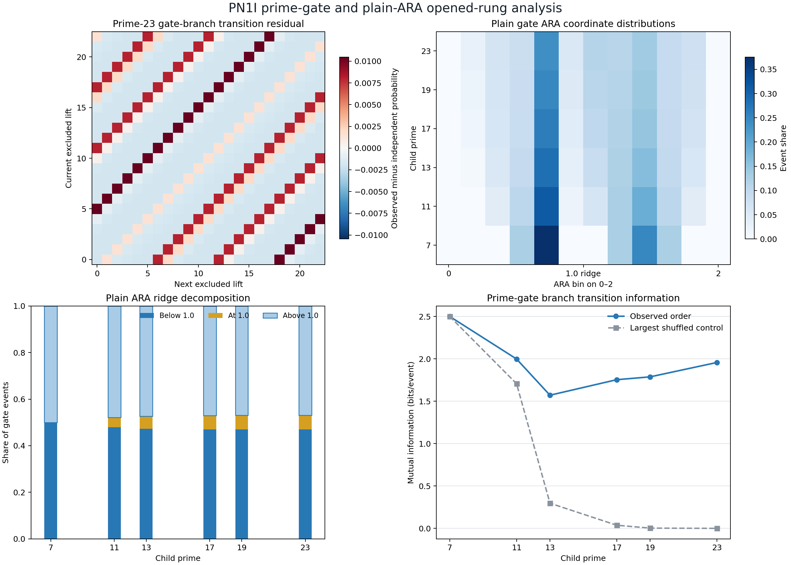
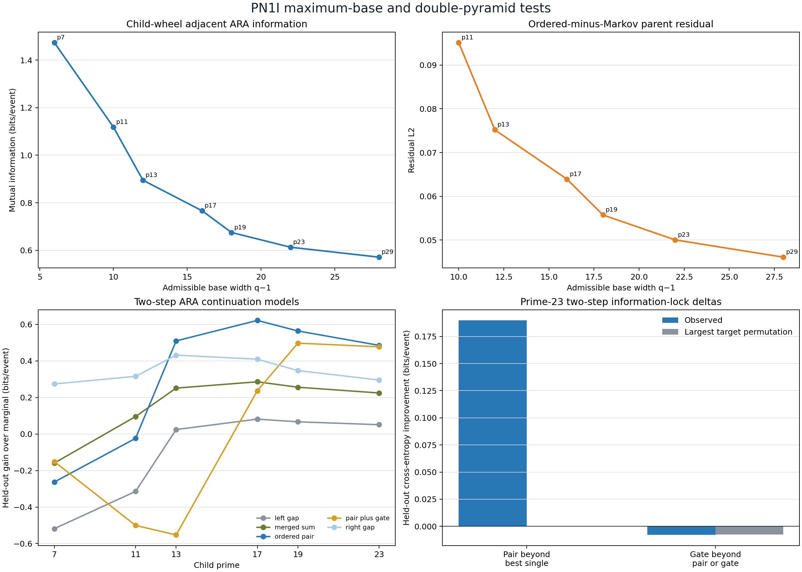

# PN1I prime-gate, pyramid and plain-ARA development report

**Date:** 17 July 2026  
**Status:** development analysis complete on opened rungs; prime 31 untouched  
**Protocol:** `PN1I/DEVELOPMENT/v1`  
**Protocol SHA-256:** `B713DAB0803545F201F2C712303E1C5E11BABC4538740381421AFF1BCBBE9F5C`

## Technical summary

Four ARA readings were tested on exact primorial-wheel transitions through prime 23, with saved aggregate comparisons
through the already opened prime 29 result.

1. **The pyramid has an exact arithmetic skeleton.** Every parent residue has `q` possible lifts, one is removed by
   the new prime, and the largest admissible base contains exactly `q-1` surviving children. All `36/36` exact
   construction checks passed.
2. **The prime gate is an exact phase transform of the parent wave.** Its internal step obeys
   `t*_(i+1)-t*_i = -P^(-1)g_i (mod q)`. Crossing the parent-cycle seam introduces a one-lift holonomy; `q`
   traversals close it. Ordered gate transitions exceeded every shuffled-order control on five of six rungs. The
   exception was the eight-event prime-7 rung, where observed and shuffled mutual information both saturated at
   `2.5` bits.
3. **Plain ARA is recovered exactly, not merely approximately.** The deletion coordinate
   `x=2g_R/(g_L+g_R)` is the parent wheel's ordinary adjacent-gap ARA coordinate with an index shift. Its mean is
   exactly `1.0`, its below- and above-ridge shares are exactly equal, and its exact pair distribution is reflection
   symmetric on all six transitions. Ordered ARA dependence exceeded every shuffled control on the same five
   sufficiently populated rungs.
4. **The ordered two-sided pair carries a non-overlapping continuation signal.** When predicting the ARA coordinate
   two steps ahead, the ordered `(g_L,g_R)` pair beat the best of left, right or merged-sum alone at primes
   `13,17,19,23`; the improvement was positive in every fold and exceeded all 16 target-permutation controls. At
   prime 23 the additional held-out gain was `0.189765` bits/event, with a minimum-fold gain of `0.189133`.
5. **The removed-branch label is not an extra information channel for this target.** Adding gate branch `t*` to the
   ordered pair worsened held-out prediction on all six rungs. At prime 23 the decrement was `0.007899` bits/event.
   This is consistent with the gate being a phase/singularity coordinate derived from the parent gaps rather than a
   fourth independent source.

An independently coded reconstruction passed `124/124` checks. These are development results on already opened
arithmetic data. They map and constrain the proposed geometry; they are not prospective confirmation of ARA or
evidence for literal physical pyramids.

## Test A — the prime gate is a modular phase walk with a one-lift seam

For parent period `P`, parent residue `r_i`, next prime `q`, and excluded lift `t_i^*`,

\[
r_i+t_i^*P\equiv0\pmod q.
\]

Because the next residue is `r_(i+1)=r_i+g_i`, the excluded branch moves according to

\[
t_{i+1}^*-t_i^*
\equiv
-P^{-1}g_i
\pmod q.
\]

This identity held at every internal step on all six generated transitions. At the circular parent seam,

\[
t^*(r+P)=t^*(r)-1\pmod q.
\]

Equivalently, comparing the stored branch labels across the seam reveals a one-lift holonomy. Repeating the parent
cycle `q` times returns the phase label to its starting value.

The ordered transition mutual information of the gate label exceeded the largest of 32 seeded shuffled-order
controls at primes `11,13,17,19,23`. At prime 23 it was `1.957432` bits/event versus a maximum shuffled value of
`0.000252`. Prime 7 did not discriminate because its parent contains only eight events and both observed and control
sequences can saturate.

### Plain-language explanation

Imagine every parent point has `q` possible copies arranged around a lift circle. The new prime punches out one copy.
Which copy is removed is not random: moving by the next parent gap moves the punched-out position by an exactly
related modular step. When the parent circle wraps around, the removed position has shifted by one lift. After `q`
full wraps it returns. This is a precise mathematical home for the proposed gate/flip picture, but it is also a direct
consequence of modular arithmetic, so it is a mapping rather than independent evidence for universal ARA.

## Test B — the maximum-base pyramid is exact, while its information trend remains prospective

For every parent residue, the lift supplies `q` candidates. Exactly one is divisible by `q`, so

\[
\underbrace{N_q}_{\text{child slots}}
=
\underbrace{(q-1)}_{\text{largest admissible base}}
\underbrace{N_{parent}}_{\text{parent apex count}}.
\]

All transitions had one deletion per parent, `q-1` survivors per parent, and no adjacent deletions. Therefore every
local deletion was an isolated two-gap-to-one-gap operation rather than a multi-node deletion cluster.

Across the opened child rungs `7,11,13,17,19,23,29`, adjacent child-wheel ARA mutual information declined strictly
as base width increased, with Spearman rank association `-1.0`. The ordered-minus-Gap-Markov residual L2 also
declined strictly across the available rungs `11,13,17,19,23,29`, again with rank association `-1.0`.

The previously measured prime-23-to-prime-29 decomposition moves in two different directions:

| Quantity | p23 | p29 | Change |
|---|---:|---:|---:|
| Visible full A/B gain | 0.474226 | 0.442063 | -0.032163 |
| Exact shared-child gain | 0.818724 | 0.827405 | +0.008682 |
| Shared minus visible surplus | 0.344498 | 0.385342 | +0.040844 |

### Plain-language explanation

Your largest-base picture is literally present in the sieve: the parent is linked to every child that can survive,
and the prime removes exactly one forbidden branch. As the base gets wider, the visible local parent becomes quieter.
At the last opened step, exact child identity gained slightly while the visible ARA pair lost information. That is
compatible with information being distributed through a wider base, but the decreasing visible measures are also
compatible with ordinary wheel convergence. The sealed prime-31 PN1H test remains the prospective discriminator.

## Test C — the ordered pair forms a continuation lock; the gate does not add another source

The local gate coordinate is

\[
x_i=\frac{2g_{R,i}}{g_{L,i}+g_{R,i}}.
\]

Seven categorical descriptions were compared with eight contiguous held-out folds. The primary target was
`x_(i+2)`, two positions ahead. Unlike the immediate target, it shares no raw gap with the current
`(g_L,g_R)` pair.

The ordered pair's gain beyond the best single-side or merged-sum model was:

| Child prime | Events | Pair gain beyond best single (bits/event) | Minimum fold | Largest permuted-target control |
|---:|---:|---:|---:|---:|
| 7 | 8 | -0.536801 | -1.392317 | +0.255680 |
| 11 | 48 | -0.339549 | -1.394240 | -0.050109 |
| 13 | 480 | +0.077942 | +0.035380 | -0.074940 |
| 17 | 5,760 | +0.212401 | +0.198842 | -0.029796 |
| 19 | 92,160 | +0.216881 | +0.213240 | -0.003960 |
| 23 | 1,658,880 | +0.189765 | +0.189133 | -0.000356 |

The two smallest rungs fail. From prime 13 onward, the result is positive in every fold and larger than all 16
target-permutation controls. It is therefore not correct to state that the lock was established on all scales tested.

Adding the gate branch to the pair failed on every rung. The prime-23 pair alone achieved `0.485261` bits/event of
gain over the marginal target, while pair plus gate achieved `0.477362`. Gate branch alone was slightly worse than
the marginal model. The extra gate coordinate therefore did not carry independent predictive information for the
translation-invariant two-step ARA target.

### Plain-language explanation

Knowing both sides of the local shape eventually tells us more about where the ARA relation is heading than knowing
only the left side, right side, or their total width. That is the useful Information^3-like result: two readings plus
their ordered relationship lock more of the continuation. It is invisible on the tiny rungs because there are too few
examples to support the larger pair model. The prime's removed-branch number does not add another layer once the pair
is known. The clean interpretation is therefore **two sides plus their relation**, with the gate marking phase and
the singular crossing rather than supplying a separate fourth identity.

## Test D — plain ARA is an exact parent reading at every deletion

At a deleted candidate, the two merging gaps are simply consecutive parent gaps:

\[
(g_{L,i},g_{R,i})=(g_{i-1},g_i).
\]

Therefore

\[
x_i^{gate}
=
\frac{2g_i}{g_{i-1}+g_i}

\]

is exactly the ordinary parent-wheel ARA coordinate, shifted by one index. Across all six transitions:

- mean `x` was exactly `1.0`;
- below-ridge share equalled above-ridge share exactly;
- exact `(g_L,g_R)` counts equalled their reflected `(g_R,g_L)` counts;
- gate-coordinate transition MI matched the saved parent-wheel adjacent ARA MI to maximum error
  `4.44e-16` bits/event;
- ordered dependence exceeded every shuffled-order control on the five non-saturated rungs.

The prime-23 gate events, for example, divide into `46.9680%` below `1.0`, `6.0640%` at the ridge, and `46.9680%`
above `1.0`.

### Plain-language explanation

When the prime removes a point, the two gaps on either side are already a normal ARA pair. Their average whole-rung
reading lands exactly on the `1.0` ridge because every left-heavy event has a reflected right-heavy partner. That does
not mean the local events are balanced: at prime 23, almost 94% lie away from the exact ridge. The whole reads `1.0`
because its child asymmetries cancel at that measurement grain. This is a particularly clean numerical example of
your earlier ridge rule.

## Scope, robustness and limitations

- The analysis generated exact wheels only through prime 23. Prime 29 entered only through already saved aggregate
  PN1F/PN1G outputs. Prime 31 was not accessed.
- The protocol was method-locked before PN1I computation, but all source rungs were already open. These are
  development findings, not blind prospective results.
- The gate structure is explained by exact modular arithmetic. Its successful recovery is valuable as a precise ARA
  crosswalk, but it cannot be counted as unexpected evidence against standard number theory.
- The two-step pair result is held-out and controlled, but depends on the selected 12-bin ARA coordinate and this
  deterministic hierarchy. A later sensitivity test can check alternative bin counts without altering PN1H.
- Prime 7 and prime 11 are too small for the higher-state pair model and fail the proposed lock endpoint.
- The gate branch's failure is preserved. Alternative targets may be explored, but they must not retroactively rescue
  this endpoint.
- Nothing here establishes physical information flow, literal spatial pyramids, prime prediction, the Riemann
  hypothesis or universal fractal geometry.

## Recommended next steps

1. Draw the exact lift genealogy as a double cone: parent apex, `q-1` surviving base nodes, one excluded branch, and
   the one-lift seam holonomy.
2. Run a declared bin-sensitivity analysis for the two-step pair lock on opened rungs only.
3. Examine whether the pair gain stabilizes near `0.19–0.22` bits/event or continues changing on a later independent
   hierarchy.
4. Keep the gate phase as a coordinate unless a separately frozen target shows independent information beyond the
   ordered pair.
5. Complete and seal the efficient exact prime-31 runner before opening PN1H.

## Further questions

- Is the one-lift seam holonomy the precise arithmetic appearance Dylan has been describing as the singularity flip?
- Does the pair-lock gain survive alternative ARA bin counts and targets that remain independent of the current raw
  gaps?
- Is the p13 onset merely the sample size needed to support the pair state space, or does it identify a structural
  closure threshold?
- Can the same apex/base/gate decomposition be declared prospectively on a non-prime nested hierarchy?

## Reproducibility inventory

- Protocol: `PN1I_PRIME_PYRAMID_ARA_DEVELOPMENT_PROTOCOL.md`
- Main implementation: `pn1i_prime_pyramid_ara.py`
- Independent validator: `pn1i_independent_validator.py`
- Machine result: `PN1I_RESULTS.json`
- Independent validation: `PN1I_INDEPENDENT_VALIDATION.json`
- Gate metrics: `PN1I_GATE_METRICS.csv`
- Lock scores: `PN1I_LOCK_MODEL_SCORES.csv`
- Lock summaries: `PN1I_LOCK_SUMMARY.csv`
- Base crosswalk: `PN1I_BASE_ARA_CROSSWALK.csv`
- Saved matrices: `PN1I_MATRICES.npz`
- Figures: `PN1I_PRIME_GATE_ARA_FIGURE.png`, `PN1I_PYRAMID_LOCK_FIGURE.png`
