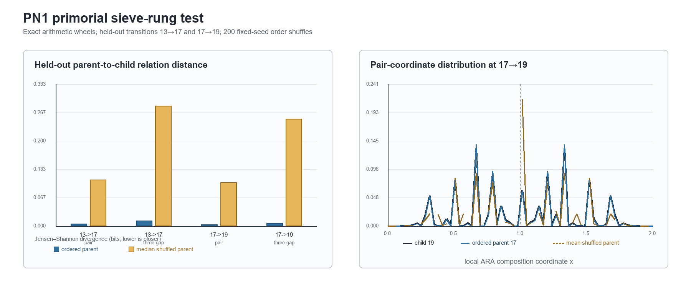

# PN1 primorial sieve-rung relational inheritance — result

**Test ID:** `T227 / PN1/v1`  
**Run date:** 17 July 2026  
**Status:** `SUPPORTED [pre-registered, arithmetic, unreplicated]`  
**Frozen protocol:** `PN1_SIEVE_RUNG_PROTOCOL_v1_FROZEN.md`  
**Frozen SHA-256:** `EE14829EEA0D2BAAE05C37FAE2AA558F015EFC649FBFA54F0A563A7CE277DF9D`

## Technical summary

PN1 passed all four frozen held-out comparisons. For both unseen primorial-wheel transitions, the ordered parent wheel's local relation distribution was substantially closer to the child wheel than an order-destroyed parent containing exactly the same circular gaps. All four one-sided permutation values were the minimum possible with 200 shuffles, (p=1/201=0.004975).

All exact sieve-calibration checks passed. All eight split-half checks and all eight predeclared bin-sensitivity checks retained the predicted direction. An independently coded incremental wheel construction reproduced the ordered distances, and an independent replay reproduced every saved null distribution.

The supported result is deliberately narrow: **cyclic local relation survives these nested sieve-rung transitions, and the bounded 0–2 coordinate retains enough of it to distinguish the real parent from its order-destroyed full-marginal control.**

## Frozen held-out result

Smaller Jensen–Shannon divergence means closer parent-to-child transfer.

| Transition | Observable | Ordered JSD (bits) | Shuffle median JSD | Null / ordered | One-sided (p) | Frozen pass |
|---|---|---:|---:|---:|---:|---|
| (13\to17) | pair (x_i), 64 bins | 0.004715 | 0.109007 | 23.1× | 0.004975 | yes |
| (13\to17) | triple ((x_i,x_{i+1})), (24^2) bins | 0.012409 | 0.282513 | 22.8× | 0.004975 | yes |
| (17\to19) | pair (x_i), 64 bins | 0.002796 | 0.101928 | 36.5× | 0.004975 | yes |
| (17\to19) | triple ((x_i,x_{i+1})), (24^2) bins | 0.006889 | 0.251811 | 36.6× | 0.004975 | yes |

Plainly: if the parent's gap sizes are retained but their order is scrambled, the parent stops looking much like the next sieve rung. Keeping the real circular order makes the parent roughly 23–37 times closer to the child by the declared distance measure. This is direct evidence that the relations between neighbouring gaps carry structure that the gap inventory alone does not.

## Scope, data and metrics

The development sequence ended at prime 13. The untouched primary transitions were (13\to17) and (17\to19), producing child periods 510,510 and 9,699,690 and child slot counts 92,160 and 1,658,880 respectively.

For adjacent positive circular gaps (g_i,g_{i+1}), PN1 used

\[
x_i=\frac{2g_{i+1}}{g_i+g_{i+1}}\in(0,2).
\]

The pair observable is the distribution of (x_i). The triple observable is the joint distribution of ((x_i,x_{i+1})), so it retains one further overlap relation. The control independently permutes the full circular gap list, preserving every gap value and destroying order only. Jensen–Shannon divergence, in bits, compares each parent representation with the corresponding child representation.

Plainly: the test did not ask whether prime-wheel gaps have an unusual size distribution. It held that distribution fixed and asked whether their **placement beside one another** carries forward across sieve rungs.

## Exact calibration ceiling

For both held-out transitions:

- the released fraction was exactly (1/q), where (q) is the newly introduced prime;
- survivors and shed slots were disjoint and reconstructed the lifted parent exactly;
- survivors matched the independently generated child wheel;
- the modular phase rule identified the released copy exactly;
- geometry alone contained zero mutual information about which lifted copy was released.

These are `RECONSTRUCTION / CALIBRATION`, not new evidence. They establish that the implementation respects the exact sieve and that a geometry-only scalar cannot replace the modular phase/mask when exact child reconstruction is required.

Plainly: the compact ARA reading preserves a real local pattern, but the complete sieve state still needs the phase rule and the released set. The compression is useful; it is not the whole arithmetic machine.

## Robustness and rivals

- All 8 split-half comparisons preserved the same direction with (p=0.004975).
- All 8 alternate-bin comparisons preserved the same direction with (p=0.004975).
- An independently implemented incremental wheel generator reproduced all ordered distances.
- A separate replay reproduced the 200-member null arrays exactly.
- The ordinary log-gap ratio (r=\log(g_{i+1}/g_i)) is in one-to-one correspondence with the ARA coordinate:

  \[
  x=\frac{2}{1+e^{-r}}.
  \]

  Under the matched bin transform it produced exactly the same pair JSD.

That last rival is important. PN1 supports the **relational representation**, not a claim that the 0–2 coordinate contains information unavailable to conventional ratio coordinates. Its benefit here is boundedness, orientation and direct ARA interpretation.

## Limitations

1. The two held-out transitions are consecutive stages of one deterministic arithmetic construction. They are robustness across rungs, not statistically independent replications.
2. The shuffle is a strong full-marginal order null but is not a parameter-matched compression tournament against Markov, constellation, run-length or learned categorical summaries.
3. The test demonstrates inherited order, which is expected in a recursively generated wheel. Novelty for ARA must come from how efficiently a frozen compressed state predicts later rungs relative to ordinary summaries.
4. Nothing in PN1 licenses an inference about the Riemann Hypothesis, phi, a universal leak constant, prime unpredictability or physical universality.

## What this implies for ARA

PN1 adds credible finite evidence for one methodological part of ARA: when a structured object is generated rung by rung, reducing it to a bag of values flattens information that survives in local relations. The 0–2 coordinate and its overlapping relation expose that loss cleanly. This matches Dylan's insistence that ARA is relational and that a rung must retain identity, coupling/order, phase and shed information rather than only a whole-signal ridge value.

It does **not** establish ARA as the bedrock geometry of mathematics. The honest result is smaller and loadbearing: a predeclared ARA-form local coordinate captured genuine transferable order in an exact scale hierarchy, survived matched order destruction and robustness checks, and remained interpretable against an exact full-state ceiling.

## Next test

Freeze a parameter-matched compression competition before opening later rungs. Give ARA, first/second-order Markov, ordinary moments, run-length/constellation summaries and a learned categorical compressor the same parameter or bit budget. Score held-out next-rung pair/triple distributions, constellation counts and information retained per parameter. That separates “the wheel has inherited order” from the stronger claim “ARA is an unusually efficient description of that order.”

PN2 residue races and PN3 prime/zero representation consistency remain separate parked branches.

## Provenance

- Reproducible notebook: `PN1_SIEVE_RUNG_REPRODUCIBILITY.ipynb`
- Analysis implementation: `pn1_sieve_rung_test.py`
- Independent validator: `pn1_validate_outputs.py`
- Validation record: `PN1_VALIDATION.json`
- Canonical machine result: `PN1_SIEVE_RUNG_RESULTS.json`
- Primary table: `PN1_PRIMARY_DISTANCES.csv`
- Robustness tables: `PN1_SPLIT_HALF_CHECKS.csv`, `PN1_BIN_SENSITIVITY.csv`
- Exact checks: `PN1_CALIBRATION_CHECKS.csv`
