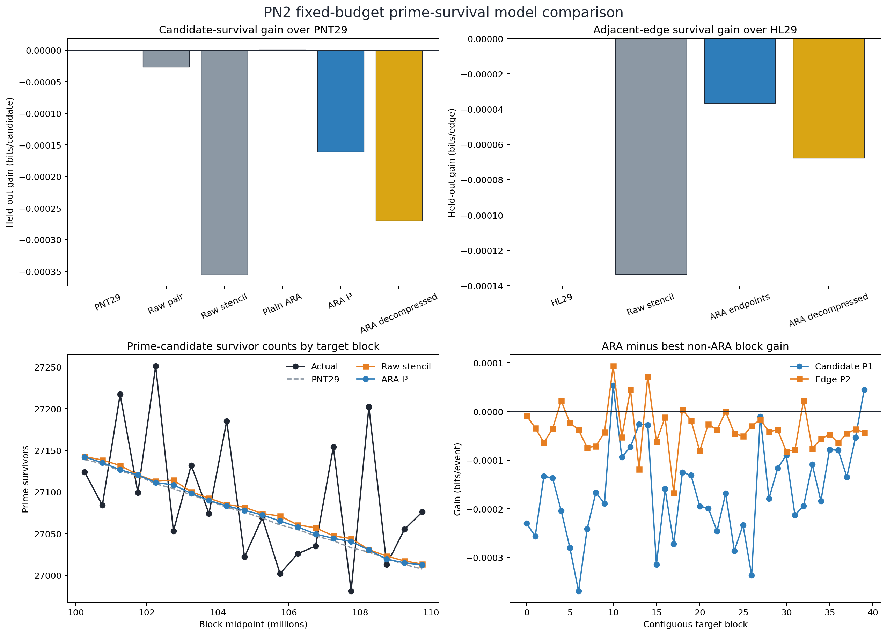
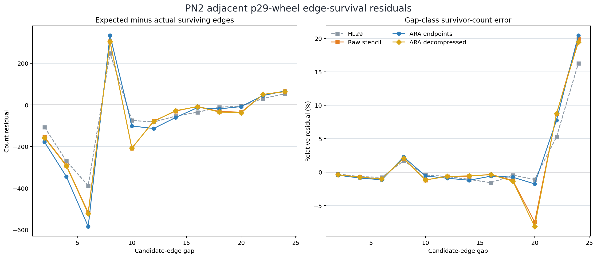

# PN2 fixed-budget prime-survival bridge

## Technical summary

**Result:** `PRIMARY ARA ENDPOINTS NOT SUPPORTED / RELIABLE NEGATIVE RESULT`.

PN2 asked the direct question that the earlier prime-wheel work had not answered: after ordinary sieving through
prime 29, can local ARA geometry predict which remaining candidates are actually prime better than strong established
baselines?

On the untouched target interval `[100,000,000,110,000,000)`, the answer was **no** for both frozen primary
endpoints:

| Endpoint | Best non-ARA baseline | Frozen ARA model | ARA gain (bits/event) | 95% block-bootstrap interval | Positive blocks |
|---|---|---|---:|---:|---:|
| Candidate survival | p29-conditioned PNT | ARA Information^3 stencil | -0.000160973 | [-0.000191083, -0.000129918] | 5% |
| Adjacent-edge survival | p29-conditioned Hardy-Littlewood | ARA edge endpoints | -0.000036725 | [-0.000050887, -0.000022377] | 15% |

Positive gain was defined in advance as lower log loss for ARA. Both intervals are wholly negative. A separately
coded full-target reconstruction passed `476/476` checks.

Plainly: the ARA models made probabilities that were extremely close to the established models, but consistently a
little worse. With more than 1.5 million events, that small difference is measured precisely.

## Key findings and visuals

### 1. Candidate survival

There were `1,579,479` p29-wheel candidates in the target; `541,854` were prime, a survival rate of `34.3059%`.
The p29-conditioned prime-number-theorem baseline achieved `0.927715514` bits/candidate. The frozen ARA
Information^3 model achieved `0.927876486`, a loss of `0.000160973` bits/candidate.

The plain 12-bin ARA candidate model produced a microscopic exception: it beat PNT29 by `0.000000772`
bits/candidate, about `1.2` total bits across all target candidates. The same plain representation lost with 8, 16
and 24 bins, while the predeclared Information^3 endpoint lost. The isolated 12-bin value is therefore a
non-robust sensitivity, not support.

Plainly: one particular ruler divided the ARA line into just the right buckets to produce a hair-width improvement.
Changing the bucket count removed it. That is exactly the kind of result that must be retained but not promoted.

### 2. Adjacent-edge survival and gap classes

There were `1,579,478` adjacent p29-wheel candidate edges. Both endpoints were prime on `184,913`, or `11.7072%`.
The conditional Hardy-Littlewood baseline beat the frozen ARA edge model on log loss and also gave the best
gap-class counts:

| Model | Gap-class Poisson deviance | Weighted absolute relative error |
|---|---:|---:|
| Hardy-Littlewood p29 | 20.7143 | 0.7356% |
| Raw edge | 36.2141 | 0.9592% |
| ARA endpoints | 36.1188 | 1.0116% |
| ARA decompressed | 36.3849 | 0.9666% |

Plainly: the fitted local models see the broad shape, but Hardy-Littlewood places the surviving pairs more accurately
across the candidate-gap classes.

### 3. Location calibration

Across 20 contiguous target blocks, PNT29 had the lowest mean absolute percentage error at `0.2088%`. The ARA
Information^3 model scored `0.2113%`; raw stencil scored `0.2158%`; decompressed ARA scored `0.2132%`.

Plainly: when the question is "how many primes occur in this part of the interval?", the established analytic curve
already answers very accurately and ARA did not sharpen it.

### 4. Crosswalk versus independent information

The mapped-log-ratio ARA control equalled its ordinary log-ratio counterpart to machine precision for both candidate
and edge predictions: maximum absolute prediction difference `0.0`.

This is a successful coordinate recovery, but not an information gain. Rewriting an established ratio in ARA
coordinates cannot beat that ratio unless an additional ARA relation is supplied.

## Scope, data and definitions

- Predictor sieve budget: all primes through 29 and no higher wheel structure.
- Development interval: `[10,000,000,20,000,000)`.
- Untouched target interval: `[100,000,000,110,000,000)`.
- Candidate event: an integer coprime to `29#`; label is prime or composite.
- Edge event: two adjacent p29-wheel candidates; label is whether both endpoints are prime.
- Primary ARA candidate: four-gap Information^3 stencil, 12 bins, shrinkage 64.
- Primary ARA edge: two-endpoint ARA representation, 12 bins, shrinkage 64.
- Primary baselines: p29-conditioned PNT, raw local pair, raw four-gap stencil, conditional Hardy-Littlewood and raw
  edge pair as declared by endpoint.
- Score: binary log loss in bits/event; lower is better.
- Uncertainty: 10,000 seeded resamples of 40 contiguous target blocks.

The prime-31 PN1H wheel target was not generated, read or summarized. Its frozen protocol and hash remain unchanged.

## Methods

The analytic candidate probability was

\[
p_{\mathrm{PNT29}}(n)=
\frac{1}{\log n\prod_{q\leq29}(1-1/q)}.
\]

This is the ordinary prime-number-theorem density conditioned on already knowing that the candidate survived the
small-prime filters through 29. The edge baseline applied the corresponding conditional Hardy-Littlewood pair
correction for its candidate gap.

All fitted tables were learned only from the development interval. Primary bin count, shrinkage, model set,
baselines, target interval, bootstrap and success criteria were frozen before target access. Sensitivity models used
8, 16 and 24 bins and shrinkages 16, 32 and 128, but did not redefine the primary result.

An independent validator did not import the primary analysis. It rebuilt target primality by a separate segmented
sieve, reloaded the frozen development model, recomputed features, predictions, scores, block intervals, gap classes,
location summaries, hashes and figure dimensions, and passed `476/476` checks.

## Limitations and robustness

1. This tests one fixed sieve budget, one development-to-target transfer and one family of local ARA features. It does
   not prove that no possible ARA model can predict primes.
2. Candidate events overlap structurally. Block bootstrapping protects the main comparison against naive
   event-independence assumptions, but the 40 blocks are still one target interval.
3. Hardy-Littlewood is used as a calibrated heuristic baseline, not as an exact theorem for each individual edge.
4. The fitted ARA models may omit a genuinely relevant cross-scale state. The present result says that the declared
   local p29 geometry did not supply it.
5. The tiny 12-bin plain-ARA gain was not stable to bin count and was not the primary endpoint. Retuning around it on
   this target would be post-hoc fishing.
6. Exact wheel identities and prime-survival forecasting are different tasks. Success on deterministic wheel
   structure cannot be counted again as survival evidence.

## What this means for ARA

PN2 narrows the claim in a scientifically useful way. ARA has recovered and organized substantial deterministic
structure inside primorial wheels. That structure did **not** automatically become an advantage at predicting which
candidates survive all unseen larger prime factors.

This does not erase PN1. It separates two layers:

1. **Wheel geometry:** exact, finite and locally measurable after a declared sieve budget.
2. **Future survival:** the cumulative action of every larger prime factor, for which PNT and Hardy-Littlewood already
   provide strong aggregate laws.

An ARA prime-calculation method now needs a predeclared variable that connects those layers and adds information not
already present in ordinary raw gaps or analytic density. Merely re-expressing the same local ratios is insufficient.

## Recommended next step

Do not tune more bins or endpoints on this target. Preserve it as the first honest bridge result.

If the prime branch continues, the cleanest next test is a **fresh, frozen residual test**: derive an ARA quantity that
predicts the signed error of PNT/Hardy-Littlewood rather than replacing their known strength, then evaluate it on a
new untouched interval or a separately frozen sieve budget. The derivation must state before opening the target why
that quantity should move the analytic residual and in which direction.

Plainly: instead of asking ARA to rediscover the very accurate average prime curve, ask whether ARA can predict the
small places where that curve is locally high or low. But the proposed correction must come from the geometry first,
not from inspecting PN2's mistakes.

## Further questions

- Does a cross-scale parent/child variable, fixed before target access, explain residuals left by PNT29 or HL29?
- Does any such correction transfer across both a new number interval and a different declared sieve budget?
- Can the ARA variable be shown not to be an invertible rewrite of raw gaps, residues or an established singular
  series factor?
- Does the p31 PN1H capstone result, once independently opened under its existing protocol, suggest a specific
  survival bridge without changing PN2 retrospectively?

## Reproducibility packet

- `PN2_PRIME_SURVIVAL_BRIDGE_PROTOCOL_v1_FROZEN.md`
- `PN2_TARGET_RUN_CONFIG_v1_FROZEN.json`
- `pn2_prime_survival_bridge.py`
- `pn2_independent_validator.py`
- `PN2_PRIME_SURVIVAL_BRIDGE_REPRODUCIBILITY.ipynb`
- `PN2_RESULTS.json`
- `PN2_MODEL_SCORES.csv`
- `PN2_BLOCK_SCORES.csv`
- `PN2_GAP_CLASS_SURVIVAL.csv`
- `PN2_LOCATION_CALIBRATION.csv`
- `PN2_INDEPENDENT_VALIDATION.json`
- `PN2_NOTEBOOK_EXECUTION_VALIDATION.json`

