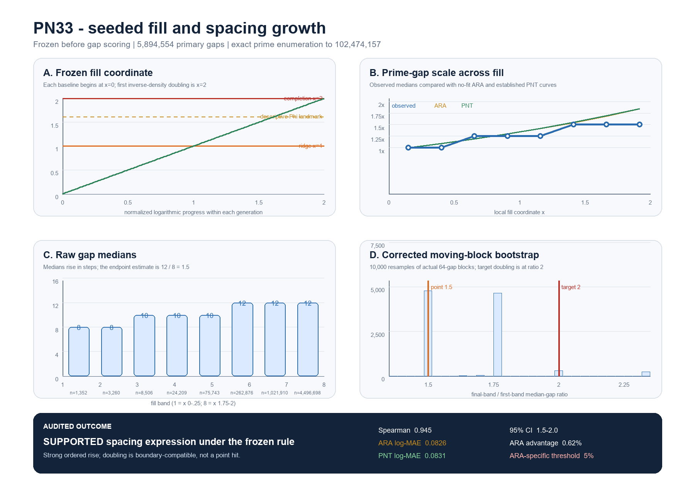

# PN33 seeded-hexagon fill and rung-doubling report

**Date:** 22 July 2026  
**Registered test:** `PN33/SEEDED-HEXAGON-FILL/v1`  
**Final registered status:** **SUPPORTED SPACING EXPRESSION**  
**Stricter ARA-specific status:** **NO DISTINCT ADVANTAGE OVER PNT**

## tl;dr

The frozen ARA coordinate organized the growth of prime-gap scale in the predicted direction. Across the eight
primary fill bands, median gaps were

`8, 8, 10, 10, 10, 12, 12, 12`,

giving a strong ordered trend (`Spearman rho = 0.9449`). The raw final/first median ratio was `12/8 = 1.5`.
After correcting an implementation error in the first bootstrap, the proper 10,000-sample moving-block 95%
interval was `[1.5, 2.0]`: it excludes the flat value `1` and just contains the frozen doubling target `2` at
its upper boundary. This passes the literal registered rule, but it is **boundary-compatible rather than a clean
point hit**.

The no-fit ARA curve had log-MAE `0.082590`; the established prime-number-theorem curve had log-MAE `0.083105`.
ARA was about `0.62%` better here, far short of the predeclared `5%` ARA-specific residual threshold. The result
therefore supports the proposed **spacing expression/crosswalk**, not a new prime law, prime generator, literal
hexagon, or Phi mechanism.

## What was frozen before looking at the target gaps

For primes `p`, PN33 used the wheel-survivor inverse-density coordinate

\[
D(p)=\frac{W(p)}{\varphi_E(W(p))}
=\prod_{r\leq p}\frac{r}{r-1}.
\]

For each baseline prime `b`, local ARA fill was

\[
x_b(p)=2\frac{\log(D(p)/D(b))}{\log 2}.
\]

Thus `x=0` is the baseline, `x=1` is the midpoint/ridge landmark, and the first prime with `x>=2` is the frozen
completion event. The next prime is the seed of a locally reset generation; raw `D` is retained.

The primary baseline was the first prime at or above `10,000`, namely `10,007`. Scale checks were separately
frozen at the first primes at or above `1,000` and `3,000`. The coordinate landmarks and exact prime list were
hashed before any gap summaries were calculated.

## Data and completion landmarks

The target prime list was enumerated exactly to `102,474,157`. Independent validation regenerated the entire
list with a separate dense sieve and found an exact match.

| Generation | Baseline | First new seed | First `x>=2` completion | Scored gaps | Completion `R=D/D(b)` |
|---|---:|---:|---:|---:|---:|
| Primary | 10,007 | 10,009 | 102,474,149 | 5,894,554 | 2.0000000115 |
| Scale A | 1,009 | 1,013 | 1,069,217 | 83,320 | 2.0000000960 |
| Scale B | 3,001 | 3,011 | 9,384,281 | 625,995 | 2.0000000259 |

The primary seed-child square was `10,009^2 = 100,180,081`, where `x=1.99645`, close to but below completion.
That is consistent with the established logarithmic relation behind Mertens/PNT: doubling this density proxy
from `b` occurs near a scale of order `b^2`. It is a useful ARA crosswalk, not an ARA-only derivation.

The prime nearest the descriptive Phi landmark was `10,406,947` at `x=1.618033991`. Phi was not an inferential
endpoint, and this construction necessarily places some prime near any prespecified internal coordinate.

## Primary spacing results

| Fill band | `x` interval | Prime gaps | Median gap | Normalized median |
|---:|---:|---:|---:|---:|
| 1 | 0.00-0.25 | 1,352 | 8 | 1.00 |
| 2 | 0.25-0.50 | 3,260 | 8 | 1.00 |
| 3 | 0.50-0.75 | 8,506 | 10 | 1.25 |
| 4 | 0.75-1.00 | 24,209 | 10 | 1.25 |
| 5 | 1.00-1.25 | 75,743 | 10 | 1.25 |
| 6 | 1.25-1.50 | 262,876 | 12 | 1.50 |
| 7 | 1.50-1.75 | 1,021,910 | 12 | 1.50 |
| 8 | 1.75-2.00 | 4,496,698 | 12 | 1.50 |

- Direction: passed (`rho = 0.944911`).
- Endpoint point estimate: `1.5`, not `2`.
- Correct moving-block 95% interval: `[1.5, 2.0]`; contains `2` at the boundary and excludes `1`.
- ARA no-fit curve log-MAE: `0.082590`.
- PNT curve log-MAE: `0.083105`.
- ARA/PNT error ratio: `0.993805`; ARA improvement approximately `0.62%`.
- Reset: passed. The next seed had local `x = 2.82e-8` while retained raw density was `2.000000031` times the
  preceding baseline.

Both scale checks had positive ordered trends (`rho = 0.9129` and `0.9759`). Their raw endpoint ratios were
`1.6667` and `2.0`. These are supportive of direction, but their different discrete medians are also a warning
against treating exact `2` as a universal point value at these sample grains.

## Controls

- **PNT rival:** nearly indistinguishable from ARA on the eight normalized medians. PN33 did not meet the frozen
  `5%` ARA-specific advantage threshold.
- **Flat control:** log-MAE `0.235728`, much worse than both ARA and PNT.
- **Raw gate-count control:** log-MAE `0.245445`, also much worse. Equal prime-count progress discards the scale
  ordering carried by the frozen coordinate.
- **Order-broken coordinate:** all 1,000 permutations were worse than the intact ARA curve; corrected empirical
  `p = 1/1001 = 0.000999`. Because the increments are extremely similar within a scale, the broken versions
  collapse close to equal-gate bins. This is evidence for chronological scale ordering, not evidence that ARA
  beats PNT.
- **Raw `p -> 2p`:** only 1,033 primary gaps and a final/first ratio of `1.0`; at least one endpoint sub-band had
  fewer than the frozen 500-gap requirement.
- **Fixed 6/12/24 gate counts:** all failed the frozen endpoint-size requirement and remain descriptive only.

## Bootstrap implementation audit

The first scoring script mistakenly resampled the median of each 64-gap block. That produced `[1.625, 2.0]`,
which did not contain the raw point estimate `1.5`. The original result was preserved rather than hidden.

The corrected calculation performs what the protocol specified: draw overlapping 64-gap blocks with replacement,
concatenate them to the original endpoint length, and then take the median. Across 10,000 repetitions, it produced
the valid interval `[1.5, 2.0]`. The full audit is in
`PN33_MOVING_BLOCK_BOOTSTRAP_IMPLEMENTATION_AUDIT.json`.

## Plain-language ARA interpretation

Starting from one prime-density state, later prime gates slowly fill a larger connection structure. On this
coordinate the fill does not close after six literal gates; it unfolds over many gates, and the raw density proxy
doubles only when the number scale has grown from roughly `b` toward `b^2`. Prime gaps also become larger as this
happens. That is the part PN33 recovered cleanly.

What PN33 did **not** recover is a uniquely ARA-shaped deviation from known prime asymptotics. The established PNT
curve predicts essentially the same rise. In ARA language, the test found a credible translation of the known
scale law into the seed -> fill -> completion -> reset geometry. It did not yet show that this translation carries
new predictive information unavailable to established mathematics.

## Scientific verdict

1. **Supported under the frozen operational rule:** the registered spacing-expression endpoint passed.
2. **Strong descriptive crosswalk:** the same ARA seed/fill/reset vocabulary organizes known prime-density and
   prime-gap scaling without changing definitions after scoring.
3. **No ARA-specific residual result:** ARA beat PNT by only `0.62%`, below the frozen `5%` threshold.
4. **Not tested:** finding the next prime from a local number in a fixed number of steps; literal spatial hexagon
   closure; a causal Phi handover; or a universal leak constant.

## Reproduction and audit files

- Frozen protocol: `PN33_SEEDED_HEXAGON_FILL_PROTOCOL_v1_FROZEN.md`
- Protocol manifest: `PN33_PROTOCOL_FREEZE_MANIFEST.json`
- Coordinate manifest: `PN33_COORDINATE_FREEZE_MANIFEST.json`
- Validated result: `PN33_SEEDED_HEXAGON_FILL_RESULTS_VALIDATED.json`
- Bootstrap audit: `PN33_MOVING_BLOCK_BOOTSTRAP_IMPLEMENTATION_AUDIT.json`
- Independent validation: `PN33_SEEDED_HEXAGON_FILL_VALIDATION.json`
- Static figure: `PN33_SEEDED_HEXAGON_FILL_FIGURE.png`
- Reproducibility notebook: `PN33_SEEDED_HEXAGON_FILL_REPRODUCIBILITY.ipynb`

