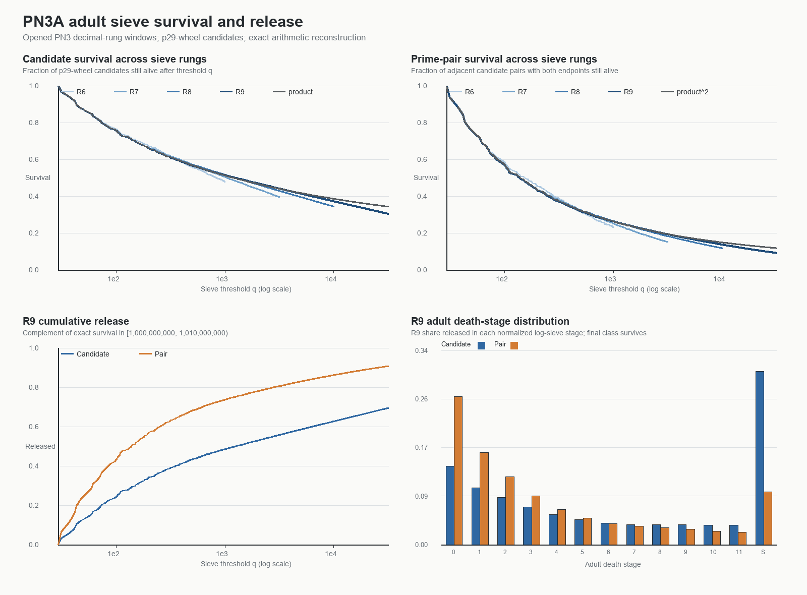
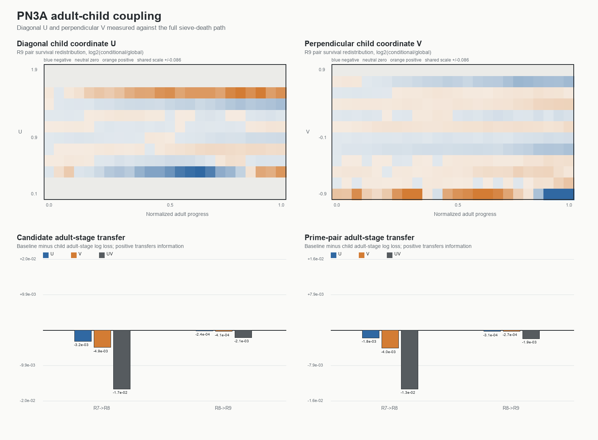

# PN3A adult sieve-path diagnostic

**Test ID:** `PN3A/ADULT-SIEVE-PATH/DEVELOPMENT-v1`  
**Date:** 18 July 2026  
**Status:** `OPENED-DATA DIAGNOSTIC COMPLETE / ADULT PATH RECOVERED / LOCAL DIAGONAL NOT SUPPORTED / MISSING ASPECT REMAINS`  
**Evidence class:** structural development on already opened decimal rungs; not blind confirmation; not a rescue of PN3  
**Target guard:** the p31 PN1H wheel was not accessed.

## Result in one sentence

The previous prime-survival label was indeed only the terminal cross-section of a larger survival/release process, but the red local diagonal is not that adult process: the exact adult follows a slow scale-wide sieve envelope and separates from its independent-product control mainly near the terminal boundary, while every local `U`, `V` and `UV` death-stage transfer was negative.

## What Dylan noticed

Dylan's reading of the visual was that the existing prime work looked strongly connection-heavy and contained the child of a larger diagonal, but not the adult itself. The proposed missing object was not another pattern inside the local gap plane. It was the wave **against or across the primes**: the larger process of retaining and releasing candidate numbers while successive sieve rungs act on them.

That criticism of the measurement was correct. PN3 assigned each event only its final label:

- `1`: survived all required factors and is prime;
- `0`: did not survive.

It did not retain **where in the intervening hierarchy the event died**. PN3A reconstructs that information exactly.

## The adult coordinate

For every p29-wheel candidate (n), let (d(n)) be its smallest prime divisor above 29, with (d(n)=0) when (n) survives to primality. At a later sieve prime (q), define

\[
\underbrace{S(q)}_{\substack{\text{survival / retained}\text{connection at rung }q}}
=
\frac{\#\{n:d(n)=0\text{ or }d(n)>q\}}{\#\{n\}},
\qquad
\underbrace{R(q)}_{\substack{\text{cumulative release}\text{by rung }q}}
=1-S(q).
\]

Plainly: `S(q)` is how much of the original candidate population is still present after prime (q) has acted; `R(q)` is how much has been removed. They are an exactly conserved two-sided reading:

\[
\underbrace{S(q)}_{\text{retained}}
+
\underbrace{R(q)}_{\text{released}}
=1.
\]

This is the neutral adult ARA path. It can be placed on a 0–2 coordinate as either (2S(q)) or (2R(q)), but that choice fixes direction and phase orientation. The analysis therefore leaves Phase A/Phase B, Space/Time and up/down naming to Dylan rather than inferring them from arithmetic.

For an adjacent candidate pair, the death rung is the earlier endpoint death. A pair survives only while both endpoints survive.

## Ordinary control

The independent-factor control is

\[
\underbrace{M(q)}_{\substack{\text{survival if later prime}\text{deletions were independent}}}
=
\prod_{29<p\le q}\left(1-\frac1p\right),
\]

with (M(q)^2) as the corresponding independent two-endpoint control.

This control is essential. A decreasing survival curve is automatically produced by ordinary sieve multiplication. ARA would need to recover additional transferable structure, not merely rename that known decay.

## Exact adult-path results

| Rung | Candidate survival | Pair survival | Candidate / product | Pair / product² |
|---|---:|---:|---:|---:|
| R6 | 0.477186312 | 0.228281547 | 0.930896159 | 0.868755026 |
| R7 | 0.394975002 | 0.150686665 | 0.897170948 | 0.777474238 |
| R8 | 0.343199387 | 0.117170732 | 0.890684122 | 0.789175433 |
| R9 | 0.305450510 | 0.092529374 | 0.891125119 | 0.787544834 |

At R9, the independent product predicts candidate survival `0.342769498`; exact survival is `0.305450510`. The product is therefore `12.218%` high relative to the exact result. For pairs, product-squared predicts `0.117490929`; exact pair survival is `0.092529374`, so the independent control is `26.977%` high.

This gives a meaningful version of Dylan's “connection-heavy” reading. Most of the adult trajectory is a slow, monotone accumulation of deletions across many sieve rungs. It is not visually or statistically an oscillating local-gap wave in this representation. “Connection-heavy” remains an ARA interpretation, while the exact measured statement is that survival is governed primarily by the cumulative factor hierarchy.

## The late handover and the established crosswalk

For R9 candidates, exact survival first differs from the independent product by:

| Relative difference | Sieve prime (q) | Normalized log-path position |
|---|---:|---:|
| 1% | 5,851 | 0.755934 |
| 5% | 13,441 | 0.875908 |
| 10% | 25,409 | 0.967767 |

Thus the largest candidate discrepancy is late. The pair process begins separating earlier because two endpoints and their local relation must survive.

After seeing the result, the stable correction was compared with the established Mertens/prime-number-theorem asymptotic:

\[
\underbrace{\frac{S_{\mathrm{exact}}}{M}}_{\substack{\text{measured terminal}\text{correction}}}
\longrightarrow
\underbrace{\frac{e^\gamma}{2}}_{\substack{\text{known Mertens/PNT}\text{normalisation}}}
=0.890536209\ldots
\]

The measured R9 ratio is `0.891125119`, only `0.0661%` above (e^gamma/2). R8 is `0.0166%` above it. In plain terms: the late difference is not an unexplained new prime wave. It is almost exactly the familiar difference between multiplying independent small-prime survival factors to (sqrt{x}) and the actual asymptotic density of primes near (x).

The pair correction is close to, but not identical with, ((e^gamma/2)^2): R9 differs by `-0.6948%`. That remainder is consistent with additional two-endpoint dependence and is the correct place for pair-specific controls such as conditional Hardy–Littlewood, not evidence by itself for a new ARA component.

## Was the red diagonal the missing adult?

The local child plane was rotated into:

\[
\underbrace{U}_{\substack{\text{red common}\text{diagonal}}}
=\frac{x+y}{2},
\qquad
\underbrace{V}_{\substack{\text{perpendicular}\text{difference}}}
=\frac{y-x}{2}.
\]

Twelve-bin `U`, `V` and joint `UV` models were trained to predict the 12 adult death stages plus terminal survival. Positive held-out gain would mean the child coordinate transfers information about the adult path beyond the training rung's overall death-stage distribution.

| Transfer | Entity | U gain | V gain | UV gain |
|---|---|---:|---:|---:|
| R7 → R8 | candidate | -0.003180174 | -0.004851710 | -0.016511427 |
| R7 → R8 | pair | -0.001752863 | -0.004014797 | -0.013099572 |
| R8 → R9 | candidate | -0.000236363 | -0.000409766 | -0.002122270 |
| R8 → R9 | pair | -0.000313603 | -0.000274448 | -0.001934576 |

All values are bits per event; positive would favour the child model. Every value is negative. The U/V results are also consistent with, or worse than, 100 within-location-block permutations. Therefore:

> **The red diagonal is a legitimate local child coordinate, but it is not supported as the transferable adult sieve coordinate.**

The heatmaps do show local conditional redistribution. That is weaker than a stable adult rule: the colours do not transfer into improved death-stage forecasts on the next rung.

## What is still missing?

The test narrows the missing aspect rather than eliminating it.

The old measurement was indeed only half the story in a methodological sense: terminal identity had flattened the entire survival/release history. But the newly recovered adult does not behave like an extra ordinary local-gap axis. It is better described as a **scale-spanning counting or number-line envelope**, with a late terminal correction and additional pair dependence.

The next candidate object should therefore be sought among:

1. a location/scale coordinate tied to the changing density of primes along the number line;
2. the residual after the exact Mertens/PNT envelope is removed;
3. the relation between single-candidate survival and two-endpoint survival;
4. the late terminal region, where exact survival separates most sharply from the independent product.

It should not be sought by retuning U/V bins on these opened windows. Any claim that this residual is an ARA phase, handover or perpendicular adult needs a directional formula frozen before a fresh interval is opened.

## Framework implication

This result supports one methodological part of the framework and rejects one attempted identification:

- **Supported as measurement logic:** a terminal identity can flatten a deeper hierarchical path; decompression recovers additional exact structure.
- **Recovered crosswalk:** survival and release form a reversible conserved pair at every sieve threshold.
- **Not uniquely ARA:** the main envelope is ordinary sieve multiplication and its late single-candidate correction is established Mertens/PNT mathematics.
- **Not supported:** the red local diagonal, its perpendicular, or their joint 2D child state as a transferable adult-death predictor.
- **Still open:** whether a separately derived large/slow ARA coordinate adds anything beyond the established scale envelope on fresh data.

This is useful progress because it prevents a visual local pattern from being promoted into the wrong rung. It also preserves Dylan's original concern: there remains a larger process than the local child plane, but its ordinary mathematical identity must be subtracted before any ARA surplus is claimed.

## Reproducibility and validation

- Protocol: `PN3A_ADULT_SIEVE_PATH_DIAGNOSTIC_PROTOCOL.md`
- Primary analysis: `pn3a_adult_sieve_path.py`
- Executed notebook: `PN3A_ADULT_SIEVE_PATH_REPRODUCIBILITY.ipynb`
- Notebook execution: all `4/4` code cells executed; full analysis and independent validation rerun.
- Independent validator: `pn3a_independent_validation.py`
- Independent validation: `118/118` checks passed.
- Exact saved arrays: `PN3A_ADULT_SIEVE_DIAGNOSTIC_DATA.npz`
- Result object: `PN3A_ADULT_SIEVE_PATH_RESULTS.json`
- The p31 target was not accessed.

## Frozen next-step boundary

PN3 remains a clean negative result. PN3A is opened-data diagnosis, not a repair. Before any fresh predictive run:

1. define the large/slow coordinate mathematically;
2. subtract or compete directly with the Mertens/PNT envelope;
3. state whether the prediction concerns candidate survival, pair survival, death stage or residual sign;
4. freeze a fresh number interval;
5. preserve p31 for PN1H.
