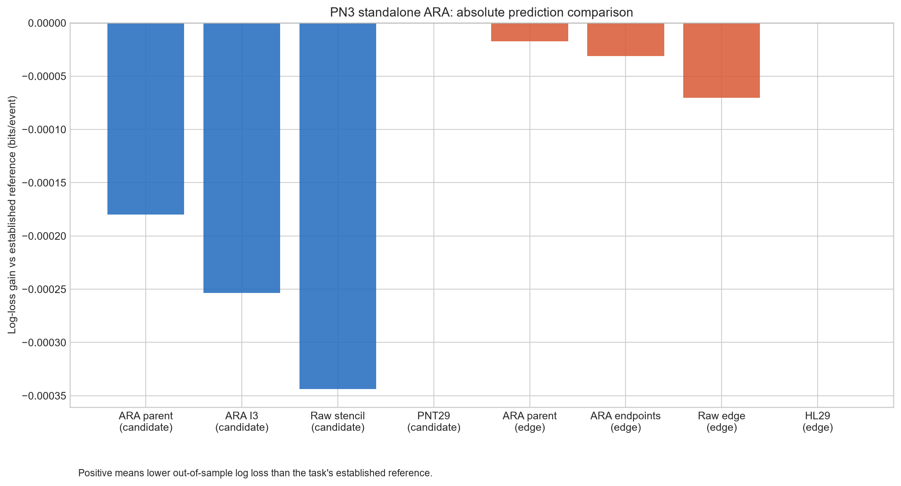
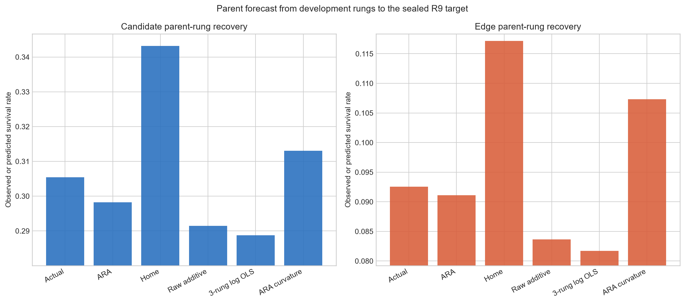
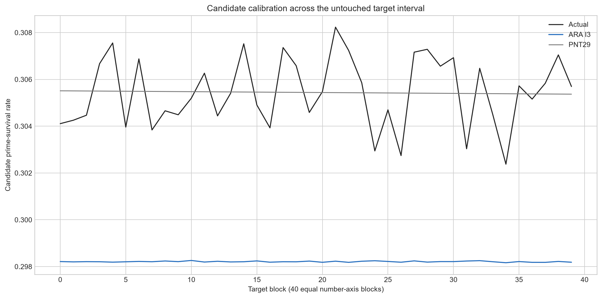

# PN3: standalone ARA parent/child prime-survival test

**Test ID:** `PN3/STANDALONE-ARA-PARENT-CHILD/v1`  
**Date:** 17 July 2026  
**Status:** `COMPLETE / CLEAN NEGATIVE / 118 OF 118 INDEPENDENT CHECKS`  
**Fresh target:** `[1,000,000,000,1,010,000,000)`  
**Protected target:** the separate p31 PN1H wheel remains unopened  
**Frozen protocol SHA-256:** `DB6BE581908BA336A02F2481CEAB21FAACEF137F8773E9FC74CCF605E5E5A2EB`

> **19 July centering correction:** the frozen protocol and all numerical results remain unchanged. Its
> `Information³` candidate is now termed a **three-point ARA stencil**, because three consecutive readings do not
> by themselves encode two identities plus their retained relation. Its `TE-ARA conservation` is now termed
> **parent-budget conservation**, because it constrains forecast probability mass rather than physical
> identity-mode energy participation. See `PN_CENTERING_TERMINOLOGY_CORRECTION_2026-07-19.md`.

## Answer first

PN3 removed the concern that PN2's ARA models were merely corrections layered on top of prime-number-theorem or
Hardy–Littlewood probabilities. The PN3 prediction path was genuinely standalone: it contained no analytic
prime-density formula, learned only from opened data, transferred an empirical parent rate from earlier decimal
rungs, and let local ARA states redistribute that fixed total under an exact parent-budget conservation rule.

The registered result is negative.

- The standalone ARA parent forecast was substantially better than simply carrying the previous rung forward and
  slightly better than the raw additive extrapolation on log loss, but it missed the target rate by `2.370%` for
  candidate survival and `1.535%` for adjacent-prime-pair survival. Both fail the predeclared `1%` criterion.
- The ARA child representations beat their parameter-matched raw-gap child controls, with bootstrap intervals wholly
  positive. This is a real relative compression result.
- However, adding either ARA child model made the standalone parent prediction worse, not better. Both child endpoints
  fail.
- The complete standalone ARA models lost cleanly to the post-seal PNT and conditional Hardy–Littlewood references.

Thus PN3 does **not** support a new standalone ARA prime-calculation method in its present form. It does identify the
missing part more sharply: the primary error is the large, slow parent density envelope, not the absence of another
local child wave.

## What was tested

### 1. The standalone parent rule

The empirical survival rates at two already-open decimal rungs were treated as the parent-scale ARA pair. The frozen
transfer was

\[
\underbrace{\widehat p_9^{\mathrm{ARA}}}_{\substack{\text{next-rung}\text{parent rate}}}
=
\frac{
\underbrace{p_8^2}_{\substack{\text{current rung}\text{continued}}}
}{
\underbrace{p_7}_{\substack{\text{previous rung}\text{reference}}}
}.
\]

Plainly: continue the most recent multiplicative change one rung forward. In ordinary mathematics this is exactly the
same as linear extrapolation in the logarithm of the empirical rates,

\[
\log \widehat p_9=2\log p_8-\log p_7.
\]

That equivalence was registered before the target was opened. It is an ARA/log-linear crosswalk, not evidence that
the recurrence is unique to ARA.

### 2. The child geometry

For adjacent p29-wheel gaps `(g_L,g_R)`, the local ARA coordinate was

\[
\underbrace{x}_{\substack{\text{ARA child}\text{position}}}
=
\frac{2\underbrace{g_R}_{\text{Phase B side}}}
{\underbrace{g_L+g_R}_{\text{local two-side total}}}
\in(0,2).
\]

The primary candidate child was the ordered three-point ARA stencil
`(x_previous,x_current,x_next)`. The primary edge child used the two endpoint ARA readings. Raw local gaps and a raw
four-gap stencil were retained as controls.

### 3. Parent-budget conservation

Every child model was normalized without target labels so that

\[
\underbrace{\frac{1}{N}\sum_i\widehat p_i}_{\substack{\text{total child}\text{prediction}}}
=
\underbrace{\widehat p_9^{\mathrm{ARA}}}_{\substack{\text{frozen parent}\text{budget}}}.
\]

Plainly: a child state could say where survival was more or less likely, but it could not create or remove any of the
parent's total predicted probability. This cleanly separated the frozen parent quantity from child redistribution.
It did not measure TE-ARA, because no physical energy-mode participation was present.

### 4. Separation from established baselines

The standalone script contained no PNT, twin-prime constant, singular-series or Hardy–Littlewood computation. It
sealed an immutable target packet first. A separately hashed comparison script then read that packet, added the
established reference predictions and scored everything. The packet hash was
`129832B150360C005DFF676A8F0140145BEB1E9DFCBF074BB4FC44ABDDDE1C6A` before and after comparison.

## Results

### Parent-rung recovery

| Endpoint | Actual target rate | Standalone ARA | Relative error | Home | Raw additive | Frozen result |
|---|---:|---:|---:|---:|---:|---|
| Candidate prime survival | `0.305450510` | `0.298210821` | `2.370%` low | `0.343199387` | `0.291423773` | **P1 fail** |
| Adjacent prime-pair survival | `0.092529374` | `0.091109459` | `1.535%` low | `0.117170732` | `0.083654799` | **P1 fail** |

Although the 1% recovery threshold failed, the ARA parent had lower log loss than both Home and raw additive at both
endpoints. It therefore captured much of the slow decline, just not accurately enough for the registered claim.

### Child redistribution

Log-loss gain is written as `comparator loss - ARA loss`, so positive values favour ARA.

| Primary comparison | Observed gain (bits/event) | 95% block-bootstrap interval | Result |
|---|---:|---:|---|
| Candidate three-point ARA stencil vs parent only | `-0.000073689` | `[-0.000095842,-0.000050295]` | child hurts |
| Candidate three-point ARA stencil vs raw stencil | `+0.000090078` | `[+0.000062844,+0.000116327]` | ARA child beats raw |
| Candidate three-point ARA stencil vs PNT29 | `-0.000253481` | `[-0.000289979,-0.000217519]` | established reference wins |
| ARA edge endpoints vs parent only | `-0.000013902` | `[-0.000022171,-0.000005301]` | child hurts |
| ARA edge endpoints vs raw edge | `+0.000039072` | `[+0.000021894,+0.000056062]` | ARA child beats raw |
| ARA edge endpoints vs conditional HL29 | `-0.000031267` | `[-0.000045892,-0.000016122]` | established reference wins |

All intervals use 40 equal number-axis blocks, 10,000 resamples and seed `20260717`.

The most informative combination is the pair of findings in each task: the ARA child encoding is better than the raw
child encoding, but both encodings are worse than assigning every event the parent rate. The local geometry therefore
compresses the raw gap state relatively well without supplying useful out-of-rung survival variation.

### Registered decision rules

| Criterion | Candidate | Edge |
|---|---|---|
| P1 — parent rate within 1% and no worse than Home/raw additive | **Fail** | **Fail** |
| P2 — ARA child beats parent-only and raw child | **Fail** | **Fail** |
| P3 — full standalone ARA beats established reference | **Fail** | **Fail** |

No primary criterion passed.

## What the result means for the geometry

### Supported narrow observations

1. A bottom-up empirical rung recurrence can recover much of the prime-density decline without receiving an analytic
   prime law. It was closer and better-scored than Home, although it was not accurate enough.
2. Bounded ARA child states retained more transferable structure than the matched raw child states on both tasks.
3. Parent-budget conservation worked exactly and is a useful way to separate parent quantity from child
   redistribution. It is a probability constraint, not TE-ARA.

### Not supported

1. The frozen two-rung parent rule is not accurate to the registered standard.
2. The local three-point ARA stencil does not improve absolute prime survival on the fresh target.
3. PN3 does not beat or recover the established prime-density laws to parity.
4. The data do not require a third local wave. The stronger evidence points to a missing or misspecified slow parent
   coordinate.

### Important established-baseline diagnostic

For every p29-wheel gap class present in the target, the conditional Hardy–Littlewood multiplier was the same:
`39.784544672686`. Its remaining variation was therefore almost entirely the slow
`1/[log(n)log(n+g)]` location envelope. This makes the failure especially interpretable: PN3 was not mainly defeated
by an intricate gap-class correction. It was defeated by a more accurate large-scale decay law.

## Honest next step

Do not tune PN3 on this target. Preserve it as a failed frozen operationalization.

If the branch resumes, the next development question should be narrower than “find another local wave”: **what ARA
parent coordinate can reproduce the slow cross-scale density envelope without being handed the analytic answer?**
That must be developed only on opened rungs, compared with ordinary logarithmic and convergence models, and frozen
before a new interval is opened. The p31 PN1H wheel remains reserved for its separate capstone test and must not be
repurposed.

## Reproducibility and audit packet

- Frozen protocol: `PN3_STANDALONE_ARA_PARENT_CHILD_PROTOCOL_v1_FROZEN.md`
- Frozen target configuration: `PN3_TARGET_RUN_CONFIG_v1_FROZEN.json`
- Frozen post-seal comparator configuration: `PN3_COMPARATOR_RUN_CONFIG_v1_FROZEN.json`
- Standalone implementation: `pn3_standalone_ara.py`
- Separate established comparison: `pn3_established_comparison.py`
- Development model and summary: `PN3_STANDALONE_ARA_DEVELOPMENT_MODEL.npz`,
  `PN3_STANDALONE_ARA_DEVELOPMENT_SUMMARY.json`
- Sealed target packet and summary: `PN3_STANDALONE_ARA_TARGET_PACKET.npz`,
  `PN3_STANDALONE_ARA_TARGET_SUMMARY.json`
- Machine results: `PN3_STANDALONE_ARA_RESULTS.json`
- Scores and uncertainty: `PN3_STANDALONE_ARA_MODEL_SCORES.csv`, `PN3_STANDALONE_ARA_BOOTSTRAP.csv`
- Location and gap-class tables: `PN3_STANDALONE_ARA_BLOCK_CALIBRATION.csv`,
  `PN3_STANDALONE_ARA_GAP_CLASSES.csv`
- Independent validator: `pn3_independent_validation.py`, `PN3_INDEPENDENT_VALIDATION.json`
- Reproducibility notebook: `PN3_STANDALONE_ARA_REPRODUCIBILITY.ipynb`

The independent validator imported neither PN3 analysis script. It independently rebuilt the p29 candidate
population and target prime labels, recomputed all model losses and all six block-bootstrap intervals, checked the
analytic-reference quarantine, verified parent-budget conservation, and confirmed the packet hash. All `118/118` checks
passed.
