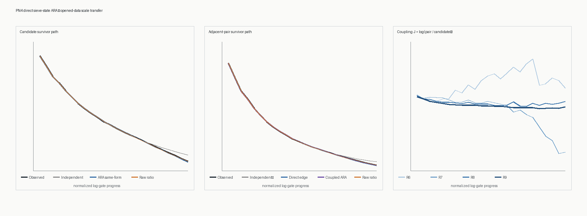

# PN4 direct sieve-state ARA report

**Test ID:** `PN4/DIRECT-SIEVE-STATE/OPENED-DEVELOPMENT-v1`  
**Run:** 19 July 2026  
**Status:** `OPENED-DATA RETROSPECTIVE TRANSFER / LARGE ADULT PATH RECOVERED / PREDECLARED ARA MODELS LOSE TO RAW MULTIPLICATIVE TRANSFER / LOCAL ARA STENCIL NOT SUPPORTED / P31 WHEEL CAPSTONE UNOPENED`

## Direct answer

The direct sieve-state test found a real and very strong scale-transfer pattern, but not an ARA-specific predictive
win under the frozen PN4 definitions.

The R8 survivor/release deformation transfers cleanly to R9. The candidate ARA same-form model reduces terminal
error from the independent sieve's `12.2177%` to `1.5723%`. The coupled candidate/pair model reduces the independent
pair error from `26.9769%` to `2.8232%`. Both also improve path log loss, and the direction of improvement repeats
from R7->R8 and R8->R9.

However, the predeclared raw multiplicative-ratio controls are better: `0.0495%` candidate terminal error and
`0.2070%` pair terminal error. Their path log losses are also slightly lower than the corresponding ARA models. The
strictly causal local three-point ARA stencil loses to the best control for both candidates and pairs.

Plainly: **the larger sieve wave really does retain its shape across decimal rungs. ARA sees most of it, especially
when the pair relation is retained, but the test says the cross-rung law is multiplicative rather than the frozen
additive 0-2 residual rule. We cannot rename the winning raw control after seeing the result.**

## What was measured

At every one of 24 fixed normalized log-gate cells,

\[
\underbrace{S_j}_{\substack{\text{share still surviving}\\\text{after cell }j}}
=
\frac{N_j}{N_0},
\qquad
\underbrace{x_j}_{\substack{\text{direct ARA}\\\text{release coordinate}}}
=2(1-S_j).
\]

For candidates and adjacent pairs, PN4 also retained

\[
\underbrace{J_j}_{\substack{\text{candidate/pair}\\\text{coupling relation}}}
=
\log\!\left(
\frac{\underbrace{S_{e,j}}_{\text{pair survival}}}
{\underbrace{S_{c,j}^2}_{\text{independent-pair reference}}}
\right).
\]

Plainly: `x` records how far the declared population has moved from all-surviving toward all-released. `J` records
whether adjacent pairs survive more or less often than two independent candidates would. In this occupancy test,
`x=1` means half released; it does not automatically mean physical cancellation or resonance.

The R6-R8 paths are the prior rungs. R9 is excluded from model construction by the PN4 code path, but R9 was already
opened in PN3. This is therefore retrospective transfer evidence, not a new blind confirmation.

## R8-to-R9 result

### Candidate survival

| Model | Path log loss (bits/at-risk event) | Path RMSE | Terminal error |
|---|---:|---:|---:|
| Independent sieve | 0.2884110329 | 0.01201498 | 12.2177% |
| ARA same-form residual | 0.2873058508 | 0.00218088 | 1.5723% |
| ARA two-rung residual | 0.2873110612 | 0.00098626 | 0.5416% |
| Raw multiplicative ratio | **0.2872985959** | 0.00103936 | **0.0495%** |
| Raw two-rung ratio | 0.2873058862 | 0.00113543 | 0.7722% |

The two-rung ARA residual has the smallest path RMSE, while the one-rung raw ratio has the best probabilistic score
and terminal accuracy. The frozen primary ARA same-form model therefore improves greatly on independence but fails
criterion C1 because it does not beat the raw ratio.

The same-form ARA transfer is also exactly affine-equivalent to additive raw-survival residual transfer:

\[
x=2(1-S)
\quad\Longrightarrow\quad
x_9-x_{9,\mathrm{ind}}=x_8-x_{8,\mathrm{ind}}
\iff
S_9-S_{9,\mathrm{ind}}=S_8-S_{8,\mathrm{ind}}.
\]

This is a valid ARA crosswalk, but it cannot establish unique ARA information.

### Adjacent-pair survival

| Model | Path log loss (bits/at-risk event) | Path RMSE | Terminal error |
|---|---:|---:|---:|
| Independent pair | 0.4821059949 | 0.00885889 | 26.9769% |
| Direct ARA edge residual | 0.4809428891 | 0.00263283 | 6.8519% |
| Coupled ARA relation | 0.4808891020 | 0.00146332 | 2.8232% |
| Coupled ARA relation-gradient | 0.4809374544 | 0.00121351 | 2.1883% |
| Raw multiplicative edge ratio | **0.4808818477** | **0.00083859** | **0.2070%** |
| Raw two-rung edge ratio | 0.4809234997 | 0.00097319 | 1.7152% |

Retaining `J` materially improves on direct pair residual transfer. That supports the methodological point that a
whole pair identity should not be flattened to the single-candidate path. But the raw edge ratio remains better on
all three primary metrics, so criterion C2 fails.

## Repetition across rungs

The improvement over independence is not an R9-only accident:

- R7->R8 candidate terminal error falls from `12.2732%` under independence to `0.9173%` under ARA same-form.
- R8->R9 candidate terminal error falls from `12.2177%` to `1.5723%`.
- R7->R8 pair path log loss falls from `0.4416642855` to `0.4403804625` under coupled ARA.
- R8->R9 pair path log loss falls from `0.4821059949` to `0.4808891020`.

Both repeat-direction criteria pass. The raw ratios are nevertheless better at both transfers.

## Local causal probe

The secondary test predicted each next cell only from completed cells in the same R9 path.

| Entity | Independent next cell | Home last hazard | ARA three-point secant | Winner |
|---|---:|---:|---:|---|
| Candidate | 0.2746381952 | **0.2745568467** | 0.2748160865 | Home |
| Pair | **0.4537780284** | 0.4553802054 | 0.4573058801 | Independence |

Lower log loss is better. The local three-point ARA stencil is worst in both rows. The negative result is useful:
the stable object is the large cross-rung survivor path, not a simple undamped local secant through three cells.

## Established number-theory crosswalk

At the terminal sieve limit, the established Mertens/PNT factors are extremely accurate:

| Terminal comparator | Candidate error | Pair error |
|---|---:|---:|
| Independent product | 12.2177% | 26.9769% |
| Mertens/PNT factor | 0.0661% | 0.6996% |
| Prior-rung raw multiplicative ratio | **0.0495%** | **0.2070%** |

The winning candidate ratio is

\[
\frac{S_{c,8}}{S_{c,\mathrm{ind},8}}=0.8906841,
\qquad
\frac{S_{c,9}}{S_{c,\mathrm{ind},9}}=0.8911251,
\qquad
\frac{e^\gamma}{2}=0.8905362.
\]

Plainly: the multiplicative rung relation is extraordinarily stable, but it is also sitting almost exactly on an
established asymptotic number-theory factor. PN4 therefore strengthens the ARA mapping of a repeating survivor/
release relation while supplying no evidence that the prime law itself is new.

## Decision ledger

| Criterion | Result |
|---|---|
| C1: candidate ARA beats independence and raw ratio on R9 | Fail |
| C2: coupled ARA beats independence, direct edge and raw ratio on R9 | Fail |
| C3: candidate improvement over independence repeats | **Pass** |
| C3: pair improvement over independence repeats | **Pass** |
| C4: candidate ARA terminal error below 1% | Fail (`1.5723%`) |
| C4: coupled pair terminal error below 1% | Fail (`2.8232%`) |
| C5: local candidate stencil beats Home and independence | Fail |
| C5: local pair stencil beats Home and independence | Fail |

Two of eight separately scored criteria pass.

## Methodology judgment

PN4 corrects the main weakness of PN3B for this question: it applies the ARA survivor/release coordinate directly to
the exact sieve-death record before any spectral decomposition. Its fixed log-gate cells are a declared
coarse-graining ruler, not an imported wave-extraction method. It also separates three claims that had previously
blurred together:

1. **Direct mapping:** the sieve process has a valid ARA survivor/release coordinate. This is exact by definition.
2. **Scale recurrence:** the large deformation relative to independent sieving transfers strongly across rungs.
   This is supported retrospectively.
3. **New predictive law:** the frozen ARA transfer beats raw and established controls. This is not supported.

The result points to a clean next hypothesis: a multiplicative/log-ratio rung-coupling coordinate may be the right
form for vertical scale transfer. Because the raw ratio won here, that hypothesis must be written and frozen before
another untouched transfer. It should then be compared directly with Mertens/Buchstab/PNT-based controls. PN4
cannot be reused as its confirmation set.

## Validation and reproducibility

An independent validator does not import the primary analysis module. It independently rebuilds the 24 cells,
survival paths, R9 transfer formulas, scoring metrics, terminal factors and artifact hashes. It passed `88/88`
checks.

The notebook executed all `4/4` code cells with zero error outputs. The bundled environment lacked `nbformat` and
`nbclient`, so execution used the recorded standard-library fallback executor rather than silently leaving the
notebook unexecuted.

Artifacts:

- `PN4_DIRECT_SIEVE_STATE_ARA_PROTOCOL.md`
- `pn4_direct_sieve_state_ara.py`
- `pn4_direct_sieve_state_validate.py`
- `PN4_DIRECT_SIEVE_STATE_RESULTS.json`
- `PN4_DIRECT_SIEVE_STATE_PATHS.csv`
- `PN4_DIRECT_SIEVE_STATE_TRANSFER.png`
- `PN4_DIRECT_SIEVE_STATE_VALIDATION.json`
- `PN4_DIRECT_SIEVE_STATE_ARA.ipynb`
- `PN4_NOTEBOOK_EXECUTION_VALIDATION.json`
- `PN4_DIRECT_SIEVE_STATE_ARTIFACT.json`

The PN1H p31 wheel-capstone protocol and target remain untouched. The occurrence of gate 31 inside PN3A's already
opened smallest-factor arrays is a different object and does not open the sealed p31 wheel transfer.
