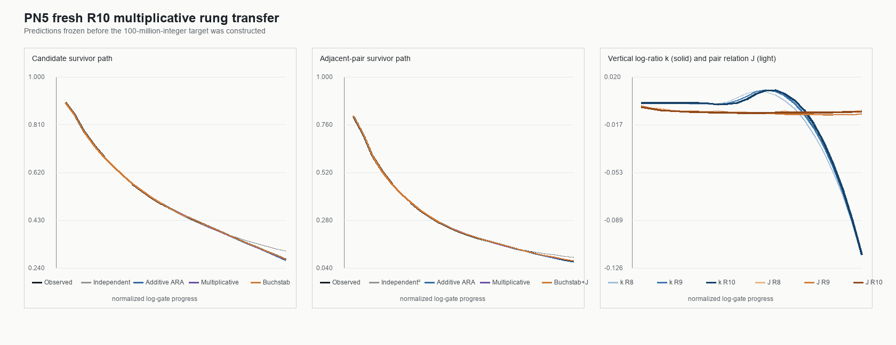

# PN5 fresh R10 multiplicative rung-transfer report

**Test ID:** `PN5/MULTIPLICATIVE-RUNG/FRESH-R10-v1`  
**Run:** 19 July 2026  
**Status:** `FRESH PRE-HASHED R10 TRANSFER / MULTIPLICATIVE RULE HIGHLY ACCURATE / STRONG PARTIAL SUPPORT / BUCHSTAB PATH CONTROL STILL WINS / PAIR J NEAREST-RUNG CRITERION FAILS / P31 WHEEL CAPSTONE UNOPENED`

## Answer first

The multiplicative rung rule discovered in PN4 transferred to a genuinely fresh, much larger target with striking
accuracy.

Before the target was constructed, PN5 froze and hashed the prediction

\[
\widehat S_{c,10}=S_{c,\mathrm{ind},10}
\frac{S_{c,9}}{S_{c,\mathrm{ind},9}},
\qquad
\widehat S_{e,10}=\widehat S_{c,10}^{,2}e^{J_9}.
\]

It then exactly sieved all 100 million integers in `[10,000,000,000,10,100,000,000)`.

The frozen primary prediction achieved:

- candidate terminal error: **`0.019187%`**;
- adjacent-pair terminal error: **`0.130979%`**.

It decisively beat independence and the previous additive ARA rule. It also required no clipping or monotonic repair.
This is strong prospective evidence that the multiplicative survivor ratio is stable across these decimal sieve
rungs.

The full registered result is nevertheless partial rather than a clean sweep:

- the declared Buchstab asymptotic control has slightly lower full-path log loss;
- candidate `k` obeys nearest-rung recurrence, but pair relation `J` does not—R8 is slightly closer to R10 than R9;
- the primary ARA equations are algebraically identical to raw multiplicative-ratio transfer.

Plainly: **the rung relation predicted the new curve extremely well, but established sieve mathematics still
describes the parent curve slightly better. The most accurate full-path construction is the established Buchstab
parent envelope plus the retained pair relation.**

## Freeze integrity

The order of operations was:

1. Write the protocol and target bounds.
2. Generate the complete R10 prediction paths using only PN4's R8/R9 records and known prime gates.
3. Hash the prediction packet:  
   `5954DE0B9EC6994702B1BD06A65FBC064CF24BEF7B29F02C2C47E25B766429A9`.
4. Verify that hash inside the target builder.
5. Only then construct the R10 target.

The target contains:

| Population | Starting events | Terminal survivors | Terminal survival |
|---|---:|---:|---:|
| p29-conditioned candidates | 15,794,726 | 4,341,930 | 0.2748974563 |
| Adjacent candidate pairs | 15,794,725 | 1,185,734 | 0.0750715191 |

This is a complete deterministic enumeration, not a sample.

## Your circular-arc observation

Yes: the fresh observed path retains the same bowed, circumference-slice appearance. It is especially clear in the
candidate panel, where the curve begins steeply, bends through the middle and flattens relative to its early descent.
That is compatible with your reading of the measured 0-2 line as a sectional slice through a larger sphere/circle.

The qualification is important: the Buchstab asymptotic curve lies almost directly on the same visible arc and has
the best registered path score. The arc appearance therefore identifies a real stable geometry in this projection,
but does not by itself distinguish ARA from established rough-number theory. A circle-specific claim needs its own
frozen fit—circle parameters learned before a new target and compared with Buchstab using equal complexity.

## Candidate result

| Frozen model | Path log loss | Path RMSE | Terminal error |
|---|---:|---:|---:|
| Independent sieve | 0.30969660889 | 0.010643093 | 12.239218% |
| Previous additive ARA | 0.30863264321 | 0.001469945 | 1.336385% |
| **Multiplicative ARA/raw-equivalent primary** | 0.30862618433 | 0.000555767 | **0.019187%** |
| Log-gradient ARA secondary | 0.30862460558 | 0.000463309 | 0.068708% |
| **Buchstab asymptotic control** | **0.30862147139** | **0.000068609** | 0.025871% |

The primary multiplicative model passes P1. It improves on the independent product by about `218,048` total scored
bits and beats the previous additive ARA rule. The frozen secondary log-gradient version is slightly better across
the path, showing that a small rung-to-rung change in `k` remains useful.

The Buchstab control is still better by about `960` total scored bits and has a much smaller path RMSE. It therefore
wins P4, and P4 is recorded as a failure for the ARA primary. The ARA primary is marginally more accurate at the
single terminal endpoint, but the registered path score has priority.

## Adjacent-pair result

| Frozen model | Path log loss | Path RMSE | Terminal error |
|---|---:|---:|---:|
| Independent pair | 0.51776137184 | 0.007047590 | 26.810584% |
| Previous additive edge ARA | 0.51670319461 | 0.001919655 | 6.439782% |
| **Multiplicative ARA/raw-equivalent primary** | 0.51665448471 | 0.000554492 | **0.130979%** |
| Log-gradient ARA secondary | 0.51665262434 | 0.000370306 | 0.337329% |
| Buchstab squared | 0.51665142573 | 0.001989704 | 0.610081% |
| **Buchstab plus frozen R9 relation J** | **0.51664655510** | **0.000178442** | 0.220939% |

The primary passes P2 and improves on pair independence by about `136,286` scored bits. Retaining the explicit pair
relation clearly matters.

The hybrid Buchstab-plus-`J` model nevertheless has the best full-path score, beating the ARA primary by about `976`
bits. This makes P5 fail. The scientific reading is constructive: the established parent envelope and the retained
cross-rung coupling relation work better together than either flattened component.

## What transferred

The candidate vertical coordinate is

\[
k_c(t)=\log\!\left(\frac{S_c(t)}{S_{c,\mathrm{ind}}(t)}\right).
\]

Its full-path RMSE comparisons are:

| Frozen source coordinate | RMSE against R10 |
|---|---:|
| R9 `k` | **0.001462718** |
| R8 `k` | 0.003968733 |

So the latest adjacent rung is clearly the better candidate source.

For the pair relation,

| Frozen source relation | RMSE against R10 |
|---|---:|
| R9 `J` | 0.001186009 |
| R8 `J` | **0.000938862** |

This reverses the expected nearest-rung order. Consequently the combined P3 criterion fails. `J` appears to
oscillate, converge non-monotonically, or contain a finer-scale correction that a simple nearest-rung rule flattens.
The pair prediction remains highly accurate because `J` is small relative to the dominant candidate-squared parent.

At the terminal cell,

\[
\frac{S_{c,10}}{S_{c,\mathrm{ind},10}}=0.890954175,
\qquad
J_{10}=-0.006599757.
\]

For comparison, the prior candidate ratios were R8 `0.890684122` and R9 `0.891125119`.

## Established sieve comparison

Buchstab's function is defined by

\[
\omega(u)=\frac1u\quad(1\le u\le2),
\qquad
(u\omega(u))'=\omega(u-1)\quad(u>2).
\]

PN5 used the standard fixed-`u` rough-number asymptotic in conditional form,

\[
S_{\rm Buchstab}(Q)
\approx
S_{\rm ind}(Q)e^\gamma\omega\!\left(\frac{\log X_{\rm mid}}{\log Q}\right).
\]

The relationship between Buchstab's function and counts of rough numbers, including
`Phi(x,y) ~ omega(u)x/log(y)`, is established number theory; its delay equation and limiting behaviour are described
in [Fan's explicit rough-number analysis](https://arxiv.org/abs/2306.03347). The numerical recurrence used here was
also checked at `omega(2)=1/2` and `omega(3)=(1+log 2)/3`; the same differential-delay definition is documented in
[Quarel's numerical treatment](https://arxiv.org/abs/1801.01813).

This control is asymptotic and evaluated at the target midpoint; it is not an exact finite-short-interval prediction.
Its excellent performance is nevertheless a serious comparator, not a decorative curve.

## Decision ledger

| Criterion | Result |
|---|---|
| P1: candidate primary beats independence/additive and has <1% terminal error | **Pass** |
| P2: pair primary beats independence/additive and has <1% terminal error | **Pass** |
| P3: both `k` and `J` obey nearest-rung recurrence | Fail (`k` passes; `J` fails) |
| P4: candidate primary beats Buchstab path | Fail |
| P5: pair primary beats Buchstab plus source `J` | Fail |
| P6: primary paths require no repair | **Pass** |

Three of six registered criteria pass. The protocol required P1+P2+P3+P6 for full prospective multiplicative-rung
support, so the exact composite claim does not pass. The appropriate conclusion is **strong partial support**, with
candidate recurrence supported and pair-relation recurrence still misspecified.

## What PN5 adds to ARA

Supported:

1. The survivor/release path is a repeatable large-scale object rather than a one-window visual artifact.
2. Multiplicative/log-ratio vertical transfer is much better than additive displacement on this identity.
3. Explicit candidate/pair decomposition recovers pair survival to high accuracy.
4. The proposed direction of working from an adult envelope plus a retained child/coupling relation is productive.

Not established:

1. The result does not beat the declared established parent envelope.
2. The pair relation does not simply copy from the nearest rung.
3. The primary transformation contains no information absent from raw prior-rung survival ratios.
4. The arc appearance is not yet evidence of a literal Euclidean circle rather than a visually similar sieve curve.
5. PN5 is not a new prime generator, RH evidence or proof of universal ARA geometry.

## Validation

The independent validator:

- does not import the PN5 primary modules;
- reconstructs the entire 100-million-integer target with chunk size `3,000,001` rather than `2,000,000`;
- independently rebuilds candidate and pair death paths;
- recomputes the primary equations, all model scores and `k/J` comparisons;
- checks the frozen packet hash;
- independently checks the Buchstab numerical recurrence.

All `56/56` checks passed. The notebook executed `4/4` code cells with zero error outputs using the recorded
standard-library fallback because `nbformat`/`nbclient` are unavailable in the bundled runtime.

Key artifacts:

- `PN5_MULTIPLICATIVE_RUNG_TRANSFER_PROTOCOL.md`
- `pn5_freeze_multiplicative_predictions.py`
- `PN5_FROZEN_PREDICTIONS.json`
- `PN5_FROZEN_PREDICTION_MANIFEST.json`
- `pn5_build_r10_target.py`
- `PN5_R10_TARGET_AGGREGATES.json`
- `pn5_score_multiplicative_transfer.py`
- `PN5_MULTIPLICATIVE_RUNG_RESULTS.json`
- `PN5_MULTIPLICATIVE_RUNG_PATHS.csv`
- `PN5_MULTIPLICATIVE_RUNG_TRANSFER.png`
- `pn5_validate_fresh_r10.py`
- `PN5_FRESH_R10_VALIDATION.json`
- `PN5_MULTIPLICATIVE_RUNG_TRANSFER.ipynb`
- `PN5_NOTEBOOK_EXECUTION_VALIDATION.json`

The sealed PN1H p31 wheel-capstone target remains untouched.
