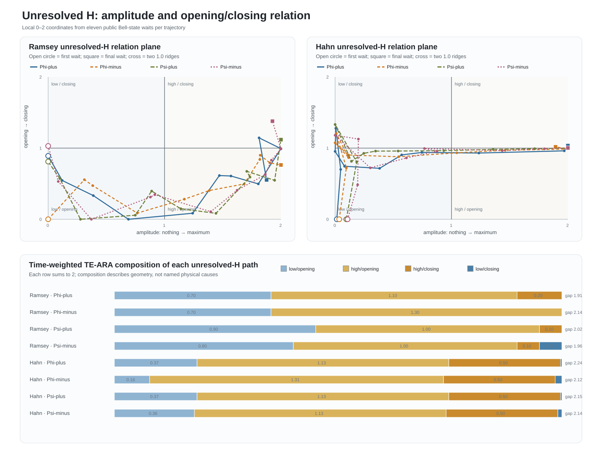

# Q10 unresolved-\(H\) amplitude/opening relation plane

**Test ID:** `Q10-UNRESOLVED-TWO-AXIS-v1`  
**Ledger ID:** `T269`  
**Date:** 24 July 2026  
**Verdict:** `CALIBRATED — 9/9 frozen gates passed`  
**Test class:** post-outcome geometry-first instrument calibration

> **Sphere-first re-evaluation, corrected 24 July 2026:** the two-axis phase portrait makes \(H\) a legitimate
> open ARA coordinate child inside the measured Bell-parent account. Because no trajectory closed a loop and no
> independent physical channel boundary was observed, it is not yet a completed autonomous physical child sphere.
> “ARA child” and “independently measured laboratory subsystem” are different classifications. See
> `Q10_Q14_SPHERE_FIRST_REEVALUATION_2026-07-24.md`.
>
> **Methodology correction, 24 July 2026:** Q10's four-quadrant TE-ARA total measures path occupancy. It does not
> perform the intended `unresolved self-identity + Other = 2` participation test. Q10 therefore calibrates the
> candidate's ARA coordinates but does not by itself establish that most of unresolved \(H\) belongs to one
> coherent Phase-B identity. See `Q13_Q14_RAMSEY_HAHN_QUADRANT_REAUDIT_2026-07-24.md`, section 2.4.
>
> **Q15 completion:** the missing self/Other test was subsequently run. Ramsey was self-dominant
> (`1.830519` self + `0.169481` Other), while Hahn was coherent but mixed
> (`1.352827` self + `0.647173` Other). The apparent Ramsey/Hahn handover failed wait-rematching control
> (`p=0.9973`). Unresolved \(H\) therefore remains a coherent candidate mode, not a promoted pure Phase B. See
> `Q15_UNRESOLVED_SELF_IDENTITY_TE_ARA_REPORT_2026-07-24.md`.

## Answer first

Dylan's correction was supported on the opened Q7–Q9 Bell trajectories: the unresolved allocation \(H\) can be
decompressed into two non-redundant ARA coordinates:

1. **amplitude** — how much unresolved allocation is present;
2. **opening/closing rate** — which way that allocation is moving;
3. **their ordered relation** — the two-dimensional path that retains both pieces at once.

The normalized amplitude path repeated extremely closely across the four Bell identities:

| Condition | Median cross-state amplitude correlation |
|---|---:|
| Ramsey | `0.987945` |
| Hahn | `0.983026` |

The rate/direction path also repeated, but less uniformly:

| Condition | Median cross-state rate correlation |
|---|---:|
| Ramsey | `0.459003` |
| Hahn | `0.929915` |

Repeating the entire construction with the independently defined purity-loss waveform
\(H_P=I_{\rm unresolved}/2\) changed points in the two-axis plane by a median distance of only `0.171070`.
Independent recomputation reproduced every gate and headline number exactly.

This is a successful calibration of a **two-axis description of the unresolved waveform**. It does not yet name
the physical mechanisms inside \(H\), predict later quantum data or prove that a complete hidden cycle was
observed. No trajectory met the frozen full-loop criterion.

## The two ARA cuts

For each condition/state trajectory, start with:

\[
\underbrace{H(t)}_{\substack{\text{observed unresolved}\\\text{allocation}}}
=
\underbrace{2}_{\text{local TE-ARA account}}
-
\underbrace{K(t)}_{\text{persistent relation}}
-
\underbrace{R(t)}_{\text{transverse relation}}.
\]

### Cut 1 — amplitude

\[
\boxed{
\underbrace{x_H(t)}_{\substack{\text{ARA amplitude}\\0\rightarrow2}}
=
2\frac{
\underbrace{H(t)-H_{\min}}_{\text{distance above local minimum}}
}{
\underbrace{H_{\max}-H_{\min}}_{\text{observed local range}}
}.
}
\]

Plainly: `0` is the least unresolved allocation observed in that trace; `2` is the most. This is a local
coordinate, not a claim that either endpoint is a universal quantum singularity.

### Cut 2 — opening or closing

\[
\boxed{
\underbrace{y_H(t)}_{\substack{\text{ARA direction}\\
0=\text{fastest opening}\\
1=\text{locally still}\\
2=\text{fastest closing}}}
=
1-
\operatorname{clip}\left(
\frac{
\underbrace{\dot H(t)}_{\text{change of unresolved allocation}}
}{
\underbrace{\max_t|\dot H(t)|}_{\text{largest observed rate}}
},
-1,1
\right).
}
\]

Plainly: the amplitude cut cannot distinguish a point moving toward greater \(H\) from one returning through the
same height. The second cut restores that lost direction.

### Information³ lock — their ordered relation

\[
\boxed{
\underbrace{C_H(t)}_{\substack{\text{joint relation}\\\text{in the two-cut plane}}}
=
\underbrace{(x_H(t)-1)}_{\text{centred amplitude}}
+
i\underbrace{(y_H(t)-1)}_{\text{centred direction}}.
}
\]

\[
\underbrace{R_H(t)}_{\text{distance from the double ridge}}
=|C_H(t)|,
\qquad
\underbrace{\theta_H(t)}_{\text{ordered orientation}}
=\operatorname{atan2}(y_H-1,x_H-1).
\]

Plainly: amplitude and direction are the two children. Their ordered location relative to one another is the
informative third. Two samples can have the same amplitude but occupy opposite opening/closing sides, so
\(C_H\) retains information that either scalar alone discards.

## Four joint states and the TE-ARA account

The two cuts produce four descriptive quadrants:

| Amplitude | Direction | ARA reading |
|---|---|---|
| low | opening | unresolved identity is small but growing |
| high | opening | unresolved identity is already large and still growing |
| high | closing | unresolved identity is large and returning |
| low | closing | unresolved identity is small and still returning |

Each sample was weighted by the time interval it represents. The four shares were normalized to:

\[
\boxed{
T_{\rm low/open}
+T_{\rm high/open}
+T_{\rm high/close}
+T_{\rm low/close}
=2.
}
\]

This is an accounting identity for the path's occupancy, not a conservation law for physical energy.

Average TE-ARA composition across the four states was:

| Condition | low/open | high/open | high/close | low/close |
|---|---:|---:|---:|---:|
| Ramsey | `0.775` | `1.100` | `0.100` | `0.025` |
| Hahn | `0.314` | `1.172` | `0.499` | `0.015` |

Plainly: the measured Ramsey window was overwhelmingly an opening passage. Hahn contained a substantially
larger high-amplitude closing segment. That is visible in the two-axis path but is flattened by an
amplitude-only graph.

## Frozen gates

The protocol was frozen at SHA-256:

`0d2d19091b198efeffe7d5ef8fed205d5b02100fb5b14c82602f30fb0cb16d98`

| Gate | Frozen requirement | Result |
|---|---|---:|
| U1 | 88 valid records; 8 nonzero-range trajectories | pass |
| U2 | both coordinates finite and inside `0–2` | pass |
| U3 | inverse amplitude reconstruction error `<=1e-12` | `2.220e-16` |
| U4 | radius/angle relation reconstruction error `<=1e-12` | `2.220e-16` |
| U5 | every quadrant account sums to `2` | pass |
| U6 | nonzero variation on both axes in every trace | pass |
| U7 | amplitude cross-state median correlation `>=0.80` | `0.987945`, `0.983026` |
| U8 | rate cross-state median correlation `>=0.40` | `0.459003`, `0.929915` |
| U9 | purity-defined two-axis median distance `<=0.25` | `0.171070` |

All `9/9` gates passed.

The first six gates establish that the instrument is mathematically coherent and reversible where promised.
They are not evidence that nature prefers ARA coordinates. The empirical content is concentrated in U7–U9:
the shared shapes across states and agreement between two independently defined unresolved waveforms.

## What the geometry actually shows

- The **amplitude arc is common** across Bell identities after each trace is put on its own local `0–2` scale.
- The **Hahn direction path is also highly common** across identities.
- Ramsey has the same broad amplitude evolution but more state-specific directional details; this is why its
  rate correlation is only moderate.
- Every path has a start-to-end gap around `1.91–2.24`, far above the frozen `0.35` loop threshold.
- Seven trajectories contain at least one derivative reversal, but the observation window still does not return
  to its starting relation-plane location.

Therefore the honest geometric reading is:

\[
\boxed{
\text{measured two-axis arc}
\neq
\text{demonstrated complete cycle}.
}
\]

The data may contain only an opening passage plus a partial turn; eleven samples may also be too sparse to
resolve a tighter loop. A longer, denser trajectory is required to distinguish those possibilities.

## What this contributes to ARA

Q9 found that parent magnitude plus one visible cut recovered a hidden child's size but not its mirror
direction. Q10 implements the missing instruction directly:

\[
\boxed{
\underbrace{\text{amplitude}}_{\text{where}}
+
\underbrace{\text{opening/closing}}_{\text{which way}}
+
\underbrace{\text{their ordered relation}}_{\text{Information³ lock}}
\longrightarrow
\underbrace{\text{less-flattened unresolved identity}}_{\text{two-axis }H}.
}
\]

This does not repair Q9's failed signed-value prediction after the fact. It explains the information class that
Q9 omitted and supplies a calibrated instrument for a future masked-direction or forward-holdout test.

The next stringent rung is to freeze a rule that uses earlier two-axis \(H\) geometry to predict a later
amplitude, direction quadrant or turning time, then compare it with amplitude-only, derivative-only and standard
time-series controls.

## Files and reproducibility

- Frozen fidelity: `Q10_UNRESOLVED_TWO_AXIS_FIDELITY_v1.md`
- Frozen protocol: `Q10_UNRESOLVED_TWO_AXIS_PROTOCOL_v1_FROZEN.md`
- Protocol hash: `Q10_UNRESOLVED_TWO_AXIS_PROTOCOL_v1_FROZEN.sha256`
- Main implementation: `q10_unresolved_two_axis_test.py`
- Independent implementation: `q10_unresolved_two_axis_validate.py`
- Point records: `Q10_UNRESOLVED_TWO_AXIS_RECORDS.csv`
- Trajectory diagnostics: `Q10_UNRESOLVED_TWO_AXIS_TRAJECTORIES.csv`
- Frozen gates: `Q10_UNRESOLVED_TWO_AXIS_GATES.csv`
- Machine-readable result: `Q10_UNRESOLVED_TWO_AXIS_RESULTS.json`
- Independent validation: `Q10_UNRESOLVED_TWO_AXIS_VALIDATION.json`
- Figure: `Q10_UNRESOLVED_TWO_AXIS_GEOMETRY.svg`
