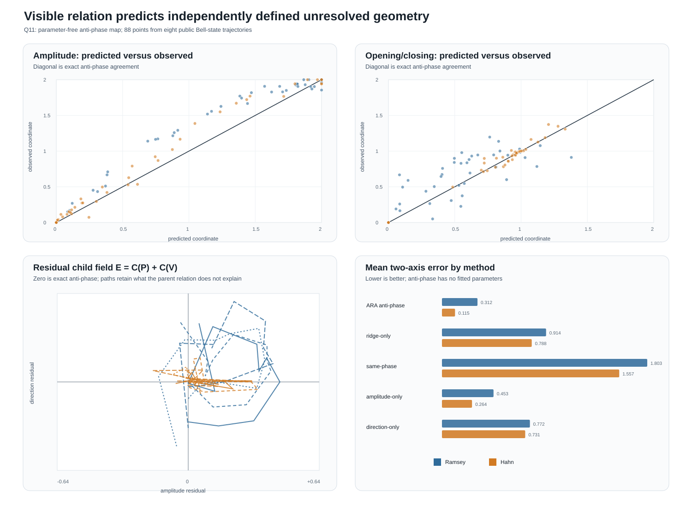

# Q11 visible/unresolved Information³ relation

**Test ID:** `Q11-VISIBLE-UNRESOLVED-INFORMATION3-v1`  
**Ledger ID:** `T270`  
**Date:** 24 July 2026  
**Verdict:** `CALIBRATED — 10/10 frozen gates passed`  
**Test class:** post-outcome parameter-free relation calibration

> **Sphere-first re-evaluation, corrected 24 July 2026:** \(V\) and \(P\) are complementary summaries of the
> same measured parent and valid ARA coordinate children at that declared comparison boundary. They are not
> independently measured physical subsystems. The standard compact Bell-core
> purity proxy \((1+K^2+2R^2)/4\) predicts the measured purity-loss path with correlations `0.999149` Ramsey and
> `0.995538` Hahn. The anti-phase calibration remains valid, while its evidential ceiling is a same-sphere
> projection relation. See `Q10_Q14_SPHERE_FIRST_REEVALUATION_2026-07-24.md`.
>
> **Methodology correction, 24 July 2026:** Q10's TE-ARA was a four-quadrant path-occupancy account, not the
> intended `unresolved self-identity + Other = 2` participation test. Q11 therefore supports an anti-phase
> **candidate Phase-B coordinate**, but it does not by itself authorize promotion to a physically calibrated
> Phase B. See `Q13_Q14_RAMSEY_HAHN_QUADRANT_REAUDIT_2026-07-24.md`, section 2.4.
>
> **Q15 completion:** a held-out self/Other test found a dominant unresolved identity in Ramsey but only a
> coherent mixed identity in Hahn. Correct-time Ramsey/Hahn correspondence was not distinctive under wait
> rematching (`p=0.9973`). The anti-phase crosswalk remains valid, while the physical Phase-B name remains
> provisional. See `Q15_UNRESOLVED_SELF_IDENTITY_TE_ARA_REPORT_2026-07-24.md`.

## Answer first

The intermediate step Dylan requested is supported on these public Bell-state trajectories.

The independently defined purity-loss identity moves approximately anti-phase to the visible compact quantum
relation in both:

1. **amplitude** — how far each identity has progressed across its local range;
2. **opening/closing direction** — which way each identity is moving through that range.

The anti-phase relation had no fitted parameters:

\[
\widehat x_P=2-x_V,
\qquad
\widehat y_P=2-y_V.
\]

It produced:

| Condition | amplitude correlation | direction correlation | branch agreement |
|---|---:|---:|---:|
| Ramsey | `0.974314` | `0.765762` | `84.09%` |
| Hahn | `0.989231` | `0.986616` | `95.45%` |

The overall median two-axis error was `0.171070` on a plane whose axes each span `0–2`. All `10/10` frozen
gates passed, and an independent source-to-result implementation matched every audited field and headline
metric with difference `0.0`.

This establishes that the two identities are structurally related in these records. It does not yet establish
what physical mechanisms occupy the remaining residual. That residual is now the legitimate field in which to
seek children.

## The two measured children

The visible compact Bell relation is:

\[
\underbrace{V(t)}_{\substack{\text{visible compact}\\\text{quantum identity}}}
=
\underbrace{K(t)}_{\text{persistent parity}}
+
\underbrace{R(t)}_{\text{transverse relation radius}}.
\]

The unresolved target is not the algebraic remainder \(2-K-R\). It is calculated from the purity of the full
reconstructed two-qubit state:

\[
\boxed{
\underbrace{P(t)}_{\substack{\text{independently defined}\\\text{unresolved-to-pure identity}}}
=
\underbrace{2\left(1-\operatorname{Tr}\rho(t)^2\right)}_{\text{half-scale unresolved information}}.
}
\]

Both are calculated from the same measured density matrices, so these are independent **definitions**, not
independent experiments.

Each identity receives the same two ARA cuts:

\[
x_Z(t)=2\frac{Z(t)-Z_{\min}}{Z_{\max}-Z_{\min}},
\]

\[
y_Z(t)
=1-\operatorname{clip}\left(
\frac{\dot Z(t)}{\max_t|\dot Z(t)|},-1,1
\right),
\qquad Z\in\{V,P\}.
\]

Their centred two-axis locations are:

\[
C_Z(t)=(x_Z(t)-1)+i(y_Z(t)-1).
\]

## The Information³ relation

The frozen ARA proposal was that the unresolved identity would be the anti-phase path of the visible one:

\[
\boxed{
\underbrace{\widehat C_P(t)}_{\text{predicted unresolved path}}
=
-
\underbrace{C_V(t)}_{\text{visible path}}.
}
\]

Plainly: if the visible identity is high and opening, the unresolved identity is predicted to be low and
closing; moving through the central ridge flips both coordinates.

The measured relation is not forced to be perfect. Define:

\[
\boxed{
\underbrace{E(t)}_{\substack{\text{residual relation}\\\text{candidate child field}}}
=
\underbrace{C_P(t)}_{\text{measured unresolved}}
+
\underbrace{C_V(t)}_{\text{visible}}.
}
\]

Then:

\[
\boxed{
C_P(t)=-C_V(t)+E(t).
}
\]

In ARA language:

\[
\boxed{
\underbrace{\text{visible identity}}_{\text{Information A}}
+
\underbrace{\text{unresolved identity}}_{\text{Information B}}
+
\underbrace{\text{their anti-phase orientation and residual}}_{\text{informative relation}}
\longrightarrow
\underbrace{\text{larger measured quantum account}}_{\text{Information³ parent}}.
}
\]

The final reconstruction is exact by definition once \(E\) is retained. The empirical result is that the
parameter-free anti-phase part already accounts for most of the two-axis location.

## Controls

Mean two-axis errors were:

| Model | Ramsey | Hahn |
|---|---:|---:|
| ARA anti-phase | `0.312` | `0.115` |
| ridge-only `(1,1)` | `0.914` | `0.788` |
| same-phase | `1.803` | `1.557` |
| amplitude anti-phase only | `0.453` | `0.264` |
| direction anti-phase only | `0.772` | `0.731` |

The full anti-phase relation improved on:

- ridge-only by `65.88%` in Ramsey and `85.43%` in Hahn;
- same-phase by `82.69%` and `92.62%`.

Both coordinates matter. The amplitude-only model was the closest control, but retaining direction improved it
further—especially in Hahn.

The angular opposition score is `+1` for exact opposing orientation. Median scores were:

- Ramsey: `0.938439`;
- Hahn: `0.999390`.

Plainly: Hahn is almost a direct geometric flip in this representation. Ramsey retains the same broad
anti-phase relation but has a larger directional residual.

## Frozen gates

Protocol SHA-256:

`ce896f3796b46703bd7b4fd659c6172680781cf4087ece4f50271aa922fdcd75`

| Gate | Requirement | Result |
|---|---|---:|
| R1 | 88 valid records in eight trajectories | pass |
| R2 | all coordinates finite and inside `0–2` | pass |
| R3 | amplitude correlation `>=0.95` in both conditions | `0.974`, `0.989` |
| R4 | direction correlation `>=0.40` in both | `0.766`, `0.987` |
| R5 | overall median two-axis error `<=0.25` | `0.171070` |
| R6 | improvement over ridge-only `>=25%` | `65.88%`, `85.43%` |
| R7 | improvement over same-phase `>=50%` | `82.69%`, `92.62%` |
| R8 | branch agreement `>=75%` | `84.09%`, `95.45%` |
| R9 | angular opposition score `>=0.75` | `0.938`, `0.999` |
| R10 | exact target reconstruction with residual | error `0.0` |

All `10/10` passed.

## What the residual says about possible children

The residual \(E\) is the part that should now be recursively decompressed rather than labelled in advance.

Post-outcome exploratory diagnostics show:

| Residual feature | Ramsey | Hahn |
|---|---:|---:|
| mean residual radius | `0.312` | `0.115` |
| median cross-state correlation of amplitude residual | `0.921` | `0.621` |
| median cross-state correlation of direction residual | `0.207` | `-0.003` |
| median cross-state correlation of residual radius | `0.680` | `0.636` |

The amplitude residual was positive in `77/88` records. In the local normalized coordinates, the purity-loss
identity generally sat further toward unresolved amplitude than the compact visible relation alone predicted.

This suggests—but does not yet prove—one shared child-like correction in amplitude. The directional residual
does not form one common path across all four Bell identities. It may contain Bell-family-specific children,
multiple couplings, derivative noise or under-sampled turns.

Therefore the faithful next decomposition is:

\[
\boxed{
\underbrace{E_{\rm common\ amplitude}}_{\text{first candidate child}}
+
\underbrace{E_{\rm directional/state}}_{\text{remaining Other}}
+
\underbrace{J_E}_{\text{their ordered relation}}
\longrightarrow
\underbrace{E}_{\text{residual parent}}.
}
\]

That formula is a proposed Q12 test structure, not a Q11 result. The children should only be promoted if they
repeat under held-out states, conditions or denser trajectories.

## Evidence boundary

- Q10 had already disclosed the equivalent aggregate distance `0.171070`; Q11 is not blind confirmation of
  that number.
- \(V\) and \(P\) are different projections of the same density matrices.
- Local normalization establishes matching shape and direction, not absolute-unit conservation.
- The result is correlation and geometric reconstruction, not causality.
- \(E\) does not yet identify an environment, energy channel, hidden quantum state or physical particle.
- Eleven waits per trajectory remain too sparse for confident grandchild or complete-cycle identification.

## Reproducibility

- Fidelity: `Q11_VISIBLE_UNRESOLVED_INFORMATION3_FIDELITY_v1.md`
- Frozen protocol: `Q11_VISIBLE_UNRESOLVED_INFORMATION3_PROTOCOL_v1_FROZEN.md`
- Protocol hash: `Q11_VISIBLE_UNRESOLVED_INFORMATION3_PROTOCOL_v1_FROZEN.sha256`
- Main test: `q11_visible_unresolved_information3_test.py`
- Independent validation: `q11_visible_unresolved_information3_validate.py`
- Point records: `Q11_VISIBLE_UNRESOLVED_INFORMATION3_RECORDS.csv`
- Metrics: `Q11_VISIBLE_UNRESOLVED_INFORMATION3_METRICS.csv`
- Gates: `Q11_VISIBLE_UNRESOLVED_INFORMATION3_GATES.csv`
- Machine result: `Q11_VISIBLE_UNRESOLVED_INFORMATION3_RESULTS.json`
- Validation result: `Q11_VISIBLE_UNRESOLVED_INFORMATION3_VALIDATION.json`
- Figure: `Q11_VISIBLE_UNRESOLVED_INFORMATION3_GEOMETRY.svg`
