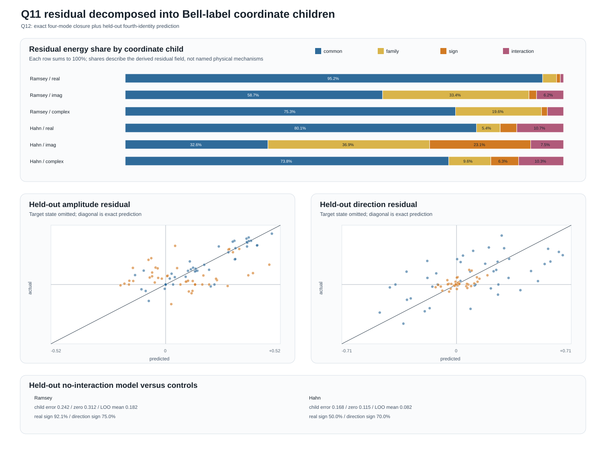

# Q12 residual coordinate children

**Test ID:** `Q12-RESIDUAL-CHILDREN-v1`  
**Ledger ID:** `T271`  
**Date:** 24 July 2026  
**Verdict:** `PARTIAL / NOT CALIBRATED — 6/10 frozen gates passed`  
**Test class:** post-outcome orthogonal child decomposition with held-out-identity test

> **Sphere-first re-evaluation, 24 July 2026:** the exact Hadamard outputs remain coordinate children, not
> independently established physical children. The common mode is most economically read as shared radial/decoherence
> deformation; family, sign and interaction modes are angular/label coordinates around that deformation. The
> held-out failure continues to show that the interaction coordinate is load-bearing. See
> `Q10_Q14_SPHERE_FIRST_REEVALUATION_2026-07-24.md`.

## Answer first

Q11's residual \(E=C_P+C_V\) is not featureless. Its four Bell identities decompose exactly into four
coordinate children:

1. a child common to all four identities;
2. a Phi-versus-Psi family child;
3. a plus-versus-minus orientation child;
4. a family-by-orientation interaction child.

The strongest result is unambiguous:

| Condition | common child share of amplitude-residual energy |
|---|---:|
| Ramsey | `95.22%` |
| Hahn | `80.13%` |

Thus most of the amplitude discrepancy left by Q11 is shared across Bell identities rather than belonging to
one state.

Direction is more distributed:

| Condition | common | family | sign | interaction |
|---|---:|---:|---:|---:|
| Ramsey direction | `58.72%` | `33.38%` | `1.74%` | `6.16%` |
| Hahn direction | `32.55%` | `36.89%` | `23.06%` | `7.50%` |

The exact decomposition is successful, but the frozen lower-order prediction was not universal. Omitting the
interaction child predicted a held-out Ramsey identity moderately well and failed on Hahn. Therefore the
children are mathematically located, but the proposed three-child rule is incomplete.

## The four children

At each condition and wait, write:

\[
\mathbf e=
\begin{bmatrix}
E_{\Phi+}&E_{\Phi-}&E_{\Psi+}&E_{\Psi-}
\end{bmatrix}^{\mathsf T}.
\]

The orthogonal child coordinates are:

\[
\boxed{
\begin{aligned}
\underbrace{m_0}_{\text{common child}}
&=(E_{\Phi+}+E_{\Phi-}+E_{\Psi+}+E_{\Psi-})/2,\\
\underbrace{m_F}_{\text{family child}}
&=(E_{\Phi+}+E_{\Phi-}-E_{\Psi+}-E_{\Psi-})/2,\\
\underbrace{m_S}_{\text{orientation child}}
&=(E_{\Phi+}-E_{\Phi-}+E_{\Psi+}-E_{\Psi-})/2,\\
\underbrace{m_{FS}}_{\text{family-orientation interaction}}
&=(E_{\Phi+}-E_{\Phi-}-E_{\Psi+}+E_{\Psi-})/2.
\end{aligned}
}
\]

For family label \(f=+1/-1\) and sign label \(s=+1/-1\):

\[
\boxed{
E_{f,s}
=\frac12\left(
m_0+f\,m_F+s\,m_S+fs\,m_{FS}
\right).
}
\]

The maximum reconstruction error was `1.110e-16`.

The energy account also closes:

\[
\boxed{
\sum_{\rm states}|E|^2
=|m_0|^2+|m_F|^2+|m_S|^2+|m_{FS}|^2.
}
\]

Maximum Parseval error was `2.220e-16`.

These exact results are properties of the established Walsh/Hadamard coordinate rotation. They prove that the
decomposition is lossless, not that the four modes are new quantum entities.

## Complete residual composition

| Condition/component | common | family | sign | interaction |
|---|---:|---:|---:|---:|
| Ramsey amplitude | `95.22%` | `3.18%` | `0.86%` | `0.74%` |
| Ramsey direction | `58.72%` | `33.38%` | `1.74%` | `6.16%` |
| Ramsey complete complex | `75.35%` | `19.62%` | `1.34%` | `3.69%` |
| Hahn amplitude | `80.13%` | `5.41%` | `3.78%` | `10.68%` |
| Hahn direction | `32.55%` | `36.89%` | `23.06%` | `7.50%` |
| Hahn complete complex | `73.80%` | `9.60%` | `6.35%` | `10.26%` |

Plainly:

- **Amplitude:** predominantly one shared child in both conditions.
- **Ramsey direction:** common motion plus a substantial Phi/Psi family distinction.
- **Hahn direction:** no single dominant child; family, common and sign modes all matter.
- **Interaction:** comparatively small in total energy, but not automatically removable.

## Held-out fourth-identity test

To avoid merely decomposing all four values after observing them, Q12 hid one Bell identity at a time.

Using only the other three, it predicted the fourth under the no-interaction rule:

\[
\boxed{
\widehat E_{f,s}
=E_{f,-s}+E_{-f,s}-E_{-f,-s}.
}
\]

Results:

| Metric | Ramsey | Hahn |
|---|---:|---:|
| no-interaction complex mean error | `0.2416` | `0.1683` |
| zero-residual error | `0.3120` | `0.1148` |
| leave-one-out mean error | `0.1820` | `0.0815` |
| same-family sibling error | `0.1353` | `0.1033` |
| improvement over zero | `+22.56%` | `-46.59%` |
| improvement over LOO mean | `-32.72%` | `-106.46%` |
| amplitude-sign accuracy | `92.11%` | `50.00%` |
| direction-sign accuracy | `75.00%` | `70.00%` |

The model recovered Ramsey amplitude orientation well, but it did not beat the simpler state controls. In Hahn,
where the original Q11 residual was already small, applying the incomplete lower-order model added more error
than predicting no residual.

This is the important correction:

\[
\boxed{
\text{small interaction energy}
\not\Rightarrow
\text{interaction can be discarded for identity prediction}.
}
\]

The held-out prediction error is proportional to the omitted interaction coordinate. Even a modest interaction
share can determine which fourth identity closes the cell.

## Frozen gates

Protocol SHA-256:

`18d3a3eb6afbe760e7af87f3b6725a9a4e56fab17f6680cd4c89048279d28ccb`

| Gate | Result |
|---|---|
| C1 complete 22-cell dataset | pass |
| C2 exact inverse | pass |
| C3 exact energy closure | pass |
| C4 common amplitude child `>=50%` | pass |
| C5 direction predominantly non-common in both conditions | **fail**; Ramsey remains `58.72%` common |
| C6 held-out model beats zero in both conditions | **fail** |
| C7 held-out model beats LOO mean | **fail** |
| C8 amplitude-sign accuracy `>=75%` in both | **fail**; Hahn `50%` |
| C9 direction-sign accuracy `>=60%` | pass |
| C10 interaction energy `<=25%` | pass |

Overall: `6/10`.

## What is known and what ARA contributes

The mathematical transform is known. It is the four-point Walsh/Hadamard decomposition associated with two
binary labels. Bell states, Pauli errors and their symmetry axes are established quantum mechanics.

ARA's contribution here is representational and methodological:

1. Q8 isolated a compact visible relation and retained `Other`.
2. Q9 showed why magnitude did not determine direction.
3. Q10 gave `Other` amplitude and direction.
4. Q11 established its anti-phase relation with visible quantum change.
5. Q12 recursively decompressed the remaining relation into label-coordinate children and tested whether a
   simpler parent could predict a hidden identity.

That sequence has exposed a specific next physics question: which established quantum noise channels produce
the common, family, sign and interaction signatures?

Likely standard candidates include common depolarization/mixedness, dephasing, bit-flip, phase-flip and
amplitude-damping channels. They must be tested from their known channel equations or controlled data rather
than assigned from the shapes by appearance.

## Next test

The strongest Q13 design is:

1. generate or obtain trajectories with known standard quantum channels;
2. calculate the same Q11 residual and Q12 children without refitting the transform;
3. freeze each channel's expected child signature;
4. blind the channel labels;
5. test whether the child vector identifies the held-out channel and strength.

That would move from **coordinate children** to evidence about **physical children**.

## Reproducibility

- Fidelity: `Q12_RESIDUAL_CHILDREN_FIDELITY_v1.md`
- Protocol: `Q12_RESIDUAL_CHILDREN_PROTOCOL_v1_FROZEN.md`
- Protocol hash: `Q12_RESIDUAL_CHILDREN_PROTOCOL_v1_FROZEN.sha256`
- Main test: `q12_residual_children_test.py`
- Independent validation: `q12_residual_children_validate.py`
- Child modes: `Q12_RESIDUAL_CHILDREN_MODES.csv`
- Held-out predictions: `Q12_RESIDUAL_CHILDREN_PREDICTIONS.csv`
- Metrics: `Q12_RESIDUAL_CHILDREN_METRICS.csv`
- Gates: `Q12_RESIDUAL_CHILDREN_GATES.csv`
- Machine result: `Q12_RESIDUAL_CHILDREN_RESULTS.json`
- Independent validation result: `Q12_RESIDUAL_CHILDREN_VALIDATION.json`
- Figure: `Q12_RESIDUAL_CHILDREN_GEOMETRY.svg`
