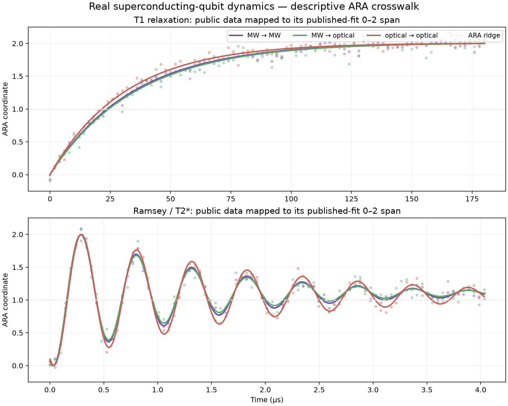

# Q2 Real-Hardware ARA Readout Test

**Ledger:** `T259`  
**Frozen protocol:** `Q2-PUBLIC-HARDWARE-IQ-v1`  
**Public source:** [Arnold and Werner et al., Zenodo DOI 10.5281/zenodo.14033026](https://doi.org/10.5281/zenodo.14033026)  
**Independent validation:** `19/19` checks passed  
**Frozen verdict:** `NOT SUPPORTED — 4/7 GATES`

## Technical summary

The strong real-data prediction did not hold. Across six whole-condition holdouts and `600,000` target
classifications, the coupled I/Q ARA account scored `0.882808` balanced accuracy. The I-only cut selected using
training conditions scored `0.882838`. The difference was `-0.000030`, with a paired 95% bootstrap interval of
`[-0.000147, +0.000050]`. The registered requirement was a gain of at least `+0.005` with a lower confidence
bound above zero.

The negative is informative rather than catastrophic. The source’s state-separation signal is already aligned
almost entirely with I:

- I-only: `0.882838`;
- Q-only: `0.578943`;
- coupled I/Q ARA: `0.882808`;
- raw I/Q LDA: `0.882808`;
- raw I/Q QDA: `0.882943`.

The coordinate crosswalk behaved exactly: the independently fitted ARA-coordinate and raw-I/Q linear
discriminants made zero different decisions, pole reversal changed zero decisions, and the complement residual
was `4.44 × 10⁻¹⁶`. This supports the reversible measurement map, but the registered added-information claim is
not supported on this readout geometry.

## One aligned I axis carried nearly all state separation

Every outer fold selected I using only the other five conditions. Adding Q changed almost nothing:

| Held-out condition | I-only | Q-only | Two-cut ARA | ARA − I |
|---:|---:|---:|---:|---:|
| 0 Hz | 0.941650 | 0.515990 | 0.941400 | -0.000250 |
| 10 Hz | 0.946920 | 0.600840 | 0.946880 | -0.000040 |
| 50 Hz | 0.935610 | 0.606360 | 0.935670 | +0.000060 |
| 250 Hz | 0.884990 | 0.594070 | 0.885020 | +0.000030 |
| 500 Hz | 0.829520 | 0.587600 | 0.829540 | +0.000020 |
| 1000 Hz | 0.758340 | 0.568800 | 0.758340 | 0.000000 |

Performance decreases as the optical-pulse repetition condition rises, but the two-cut account does not slow that
loss. Destroying shot-level I/Q pairing produced `0.882770`, another indication that Q contributes little joint
geometry to this particular classification.

This does not contradict the Q1 synthetic result. Q1 deliberately contained states that shared one cut while
differing on independent transverse cuts. This hardware output instead places almost all class separation on one
already useful native quadrature.

## The no-gain result repeated on every registered secondary readout

| Registered arm | Selected one cut | Two-cut ARA | Difference | QDA |
|---|---:|---:|---:|---:|
| primary first readout | 0.882838 | 0.882808 | -0.000030 | 0.882943 |
| second readout | 0.845145 | 0.844917 | -0.000228 | 0.845622 |
| prepared first readout | 0.860713 | 0.860245 | -0.000468 | 0.860498 |
| prepared second readout | 0.819525 | 0.819055 | -0.000470 | 0.822223 |

The small QDA improvement suggests slight non-linearity in the I/Q clouds, especially in the prepared second
readout, but it does not rescue the linear two-cut ARA prediction.

## Four of seven frozen gates passed

| Gate | Result | Verdict |
|---|---:|---|
| G1 two-cut balanced accuracy ≥ 0.80 | 0.882808 | pass |
| G2 gain over selected cut ≥ +0.005 | -0.000030 | fail |
| G3 gain interval lower bound > 0 | -0.000147 | fail |
| G4 worst condition ≥ 0.70 | 0.758340 | pass |
| G5 raw-I/Q and ARA equality | 0 disagreements | pass |
| G6 pole reversal and complement | 0 disagreements; `4.44 × 10⁻¹⁶` | pass |
| G7 one-shot label shuffle ≤ 0.55 | 0.733465 | fail |

G2 and G3 are the decisive clean failures: the second cut did not add held-out discrimination.

G7 also failed, but the post-run audit shows that its one-permutation design was weak. Random labels define a
tiny arbitrary discriminant direction; in two dimensions that direction can accidentally align or anti-align
with the real I separation. The exact complementary labelling would score approximately `1 − 0.733465 =
0.266535`; the paired mean is `0.5`. Future protocols should use paired label/complement permutations or a
multi-permutation null distribution. This does not change T259’s frozen `4/7` verdict, and G2/G3 still fail
without reference to G7.

## The real T1/Ramsey curves preserve the expected dynamical distinction

The source also provides three published T1 curves and three Ramsey/T2* curves across microwave-to-microwave,
microwave-to-optical and optical-to-optical readout. Mapping each source fit’s span reversibly onto `0–2` gives:

- every T1 fit crosses the `1.0` ridge once;
- the Ramsey/T2* fits cross it `11`, `11` and `15` times;
- ARA-coordinate fit MAE ranges from `0.039` to `0.087`.

This is a useful public-data crosswalk: monotonic relaxation and damped transverse oscillation remain visibly
different on the same coordinate convention. It is not an independent prediction because the authors’ published
fits define the `0–2` span.

## Scope, data and metric definitions

The source is the authors’ immutable `32 MB` Zenodo deposit for their peer-reviewed all-optical superconducting
qubit readout experiment. The archive checksum, schema and provenance were recorded before target values were
opened.

The primary benchmark uses six non-prepared I/Q files. Each condition supplies `50,000` ground-state and `50,000`
excited-state shot pairs. Every condition is held out once in full. The other five conditions determine:

- the I/Q midpoint and scale;
- each cut’s ground-to-excited orientation;
- the shared covariance;
- whether I or Q is the one-cut comparator.

Balanced accuracy is the mean of ground-state specificity and excited-state sensitivity. Because the target
classes are equal in size, it is also ordinary accuracy.

## Methodology

For each cut \(u\in\{I,Q\}\), training data define

\[
x_u
=
1+
\operatorname{sgn}(\mu_{e,u}-\mu_{g,u})
\frac{u-m_u}{s_u},
\qquad
m_u=\frac{\mu_{g,u}+\mu_{e,u}}2.
\]

This is an invertible affine coordinate map. Therefore a correctly implemented shared-covariance linear
discriminant in ARA coordinates should agree with the same model in raw I/Q coordinates. The exact tie is a
translation-fidelity check, not a performance advantage.

The non-trivial registered comparison is two cuts against the single native cut selected strictly inside the
training conditions. Uncertainty uses `2,000` paired bootstrap replicates over hardware conditions and contiguous
`1,000`-shot blocks.

## Limitations and robustness

- I/Q are receiver quadratures, not qubit Bloch X/Y/Z axes.
- This source appears to align most state separation with I. A deliberately unaligned receiver phase may give a
  different two-cut result.
- The same device and experiment generated all six conditions; this is condition transfer, not device transfer.
- The coordinate equivalence is expected mathematics for an invertible affine transform.
- The T1/Ramsey section uses source-supplied fits and is descriptive.
- The one-shot label-shuffle gate should be replaced in future work, but it is retained honestly for T259.

## Recommended next step

Do not tune this dataset until ARA wins. Preserve T259 as the boundary result.

The best next test is a public real-tomography dataset with independently measured X, Y and Z axes, or randomized
measurement directions, so Q1’s actual sphere-cut claim is tested rather than receiver I/Q alignment. If such a
source is unavailable, the next-best controlled hardware test is to predeclare several receiver phases and ask
whether the two-cut account becomes valuable as the state-separation direction rotates away from I.

## Further questions

- Does two-cut gain appear under deliberately unaligned or drifting receiver phase?
- Can ARA radius/direction diagnose calibration drift without improving static class accuracy?
- Does a public tomography dataset reproduce Q1’s coherent-versus-mixed ridge distinction?
- Can a paired-permutation null replace the under-specified one-shot label shuffle?

## Reproduction artifacts

- source/data-quality audit: `Q2_PUBLIC_HARDWARE_DATASET_AUDIT_2026-07-24.md`;
- frozen fidelity packet and protocol;
- runner: `q2_public_hardware_iq_test.py`;
- validator: `q2_public_hardware_iq_validate.py`;
- fold, block and summary CSVs;
- machine-readable result and validation JSON;
- descriptive dynamics script, CSV, JSON and inspected PNG;
- download instructions: `public_data/README.md`.
