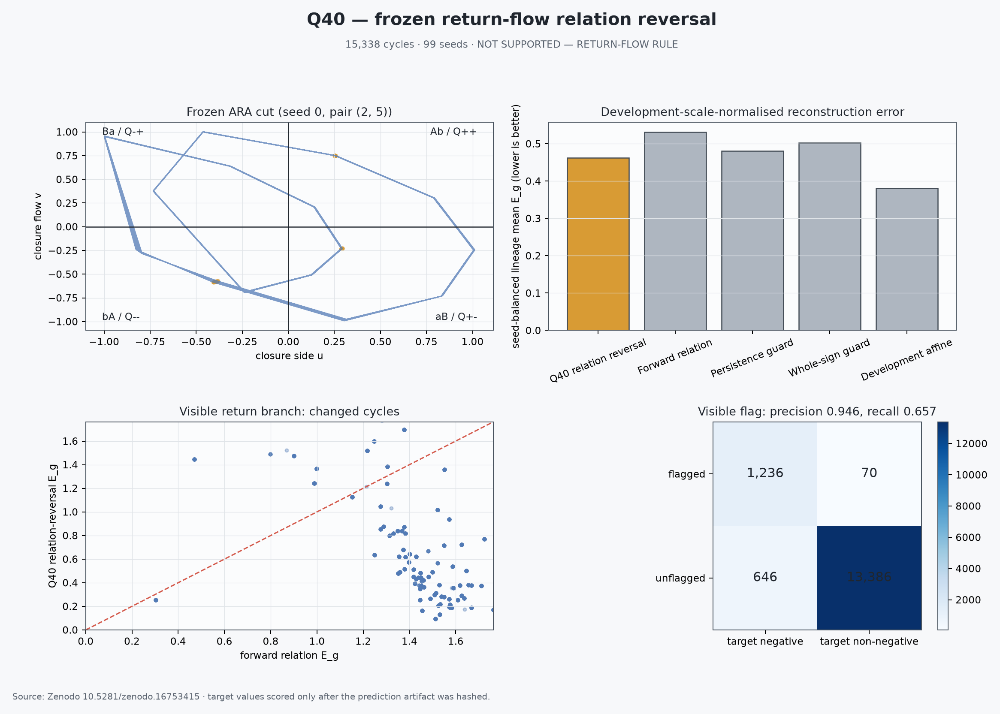

# Q40 Return-Flow Relation-Reversal Replication

**Date:** 27 July 2026  
**Ledger entry:** T295  
**Frozen verdict:** **NOT SUPPORTED — RETURN-FLOW RULE**

## Answer first

Q40 did **not** reproduce the complete frozen Q39A return-flow rule. It failed
two required gates:

1. flag recall was `65.67%`, below the frozen `75%` minimum; and
2. the frozen ARA rule's seed-balanced scaled error (`0.46262`) was higher
   than the development-only affine comparator (`0.38092`).

This is not a null result in the ordinary sense. Before seeing the Q40 target
matrices, the frozen visible-state flag found `1,236` of the `1,882` reversed
target orientations with `94.64%` precision and `99.48%` specificity. The
conditional reversal improved `88.13%` of the cycles it changed, and its
scaled error beat every fixed, non-fitted control with Holm-corrected
seed-cluster significance.

Plainly: the return-flow idea was not invented by looking at Q40. It travelled
to an untouched archive and worked very cleanly on one orientation. But the
exact Q39A flag was incomplete: it did not recognize most occurrences of the
reversed counterpart. The correct scientific record is therefore a strong
partial replication and a failed complete claim.

## What was frozen

The Q39A development result supplied the exact conditional operator:

\[
D=C_1-C_2,\qquad P=C_3+D,
\]

\[
F=\mathbf 1[\cos(P,C_3)<0],
\]

\[
\widehat C_4=
\begin{cases}
C_3-D,&F=1,\\
C_3+D,&F=0.
\end{cases}
\]

The internal ARA quadrant map was frozen as

\[
Q_{++}=Ab,\quad Q_{+-}=aB,\quad Q_{--}=bA,\quad Q_{-+}=Ba,
\]

with clockwise traversal

\[
Ab\rightarrow aB\rightarrow bA\rightarrow Ba\rightarrow Ab.
\]

The fidelity packet, protocol and method audit were hashed before target
enumeration. The target was then selected by the frozen lexical
metadata-only rule and locked before download:

- Zenodo DOI: [`10.5281/zenodo.16753415`](https://doi.org/10.5281/zenodo.16753415)
- archive: `unnati_submit_12_inhomo_v1_greedy.hdf5.zip`
- deposited MD5: `c04eb02b1766d9f83fb0240689d209a5`
- branch: `c2` (`2local connectivity`)

The prediction artifact contained visible-state predictions but no target
matrix. Its frozen SHA-256 was
`748095758c61577c278a273825c4fe8fec533faf61b9ee8e2ad938dad65e2184`.

## Population and eligibility

The locked archive yielded:

- `15,338` complete, non-overlapping four-visit cycles;
- `968` lineages;
- `99` seeds;
- `1,306` visible flags across `56` seeds; and
- `1,882` negative-orientation targets across `74` seeds.

Every frozen eligibility threshold passed. All target cycles in this archive
used traversal direction `-1`; that limits the tested directional coverage.

## Primary reconstruction result

Primary error is the reconstruction error divided by each lineage's
development-only median relation magnitude. This avoids inflating error when
the target norm is close to zero.

| Method | Seed-balanced scaled error | Relation to Q40 |
|---|---:|---|
| Development-only affine comparator | **0.38092** | Better |
| Q40 conditional relation reversal | **0.46262** | Frozen candidate |
| Persistence guard | 0.48029 | Q40 better |
| Whole-sign correction | 0.50250 | Q40 better |
| Forward relation | 0.53096 | Q40 better |
| Persistence | 0.70784 | Q40 better |
| Linear continuation | 0.89563 | Q40 better |
| Three-state mean | 0.95332 | Q40 better |
| Old identity | 1.16223 | Q40 better |
| Wrong order | 1.27249 | Q40 better |
| Inverted flag | 1.34083 | Q40 better |

Q40 beat each fixed control with a positive seed-cluster bootstrap advantage
and Holm-adjusted \(p<0.05\). For example, its advantage over the unchanged
forward rule was `0.06834`, 95% seed-cluster CI
`[0.04753, 0.09100]`. Its comparison with the affine model went the other
way: advantage `-0.08170`, CI `[-0.11655, -0.04821]`.

The affine comparator used only development cycles and the frozen linear
form

\[
\widehat C_4=\alpha C_1+\beta C_2+\gamma C_3.
\]

Its fitted coefficients were

\[
(\alpha,\beta,\gamma)
=
(0.75811,-1.32039,1.42591).
\]

This fitted control is more flexible than the ARA rule, but it was named in
advance and therefore must count against the full superiority claim.

## Visible flag result

The frozen flag produced:

| | Target reversed | Target not reversed |
|---|---:|---:|
| Flagged | `1,236` true positives | `70` false positives |
| Not flagged | `646` false negatives | `13,386` true negatives |

This gives:

- precision: `94.64%`;
- recall: `65.67%`;
- specificity: `99.48%`;
- balanced accuracy: `82.58%`.

The changed branch was useful: `88.13%` of flagged cycles improved, with
mean scaled improvement `0.73407` and seed-cluster 95% CI
`[0.55275, 0.88895]`. The rule also reduced the negative-cosine tail to
`4.32%`, below the frozen `5%` ceiling.

The failure was therefore not random false firing. It was failure to fire on
enough genuine reversed targets.

## Post-result quadrant localization

This section is descriptive and cannot alter the frozen verdict.

| Fourth quadrant | ARA name | Cycles | Reversed targets | True positives | False negatives | Recall |
|---|---|---:|---:|---:|---:|---:|
| `Q++` | `Ab` | 3,728 | 1,039 | 1,006 | 33 | 96.82% |
| `Q-+` | `Ba` | 2,730 | 628 | 15 | 613 | 2.39% |
| `Q--` | `bA` | 4,464 | 0 | 0 | 0 | not applicable |
| `Q+-` | `aB` | 4,416 | 215 | 215 | 0 | 100.00% |

`613` of the `646` misses (`94.89%`) occurred when the fourth visit was
`Ba/Q-+`. The same frozen flag recovered almost every reversed target in
`Ab` and every one in `aB`.

### ARA reading

The visible relation-reversal condition identifies one traversal orientation
very well but is not reversible across the complete four-quadrant cycle. A
plausible next ARA hypothesis is that `Ba` requires the oppositely oriented
visible relation or an equivalent quadrant-conditioned sign rule.

### Statistical reading

Q39A supplied a high-precision classifier that transported to Q40 but
under-covered one subgroup. Quadrant is now a strong candidate interaction
term. Because that interaction was discovered after Q40 outcomes were open,
it must be specified and frozen on another untouched archive before it can
count as evidence.

These are two languages for the same observed localization. Neither language
yet establishes that `Ba` is a physical Phase B, a literal singularity, or an
unobserved transport channel.

## Frozen gates

| Frozen gate | Result |
|---|---|
| Eligibility population | Pass |
| Lower error than every named comparator | **Fail** — affine was lower |
| Holm-corrected superiority to every comparator | **Fail** — affine |
| More than 70% of flagged cycles improved | Pass — 88.13% |
| Precision and recall at least 75%; specificity at least 90% | **Fail** — recall 65.67% |
| Negative target cosine below 5% | Pass — 4.32% |
| Better than whole-sign and inverted-flag controls | Pass |

The protocol's decision rule therefore requires:

> **NOT SUPPORTED — RETURN-FLOW RULE**

## Independent validation

An independent script re-read the raw HDF5 archive and recomputed:

- `4,000` raw density matrices;
- `401` prediction cycles;
- connected matrices, visible matrices and predicted matrices;
- every sampled flag;
- cycle non-overlap;
- population counts; and
- the complete confusion matrix.

All validation checks passed. There were `0` flag disagreements and `0`
cycle-overlap failures. Maximum differences were:

- connected matrix: `9.22e-10`;
- visible or predicted matrix: `7.45e-9`;
- reported metric: `9.86e-7`.

The metric tolerance was set to `5e-6` because the frozen prediction artifact
stores matrices as `float32`, while validation recomputes them in `float64`.
This precision accommodation did not change a flag, target label, count,
gate or verdict.

Raw-matrix quality control found maximum trace error `4.02e-5`, zero measured
Hermiticity error and minimum sampled density-matrix eigenvalue `0.00282`.
The trace deviation is consistent with the source archive's stored numeric
precision.

## What this changes

The strongest defensible update is:

> Q39A's conditional relation reversal was a genuine, target-blind partial
> regularity. On an untouched same-family archive it retained high precision,
> improved most changed cycles and beat every fixed control, but it did not
> supply a complete reversible rule and did not beat a development-fitted
> affine model.

This raises the evidence for a structured orientation effect inside the
tested connected-lattice dynamics. It does **not** establish a universal ARA
law, physical singularity crossing, Phase-B ontology, entanglement transport
or cross-tier fractality.

## Best next test

The clean next test is not to reinterpret Q40. It is to freeze one
quadrant-complete extension on another untouched archive:

1. retain the Q40 operator unchanged for `Ab`, `aB` and `bA`;
2. predeclare the exact reversed-orientation condition for `Ba`;
3. forbid target-derived fitting;
4. freeze predictions before revealing fourth visits;
5. require both global performance and minimum recall within every quadrant
   that contains enough reversed targets; and
6. retain the affine comparator.

Only after that directional rule survives should the project move to the
harder cross-tier fractality test. The entanglement interpretation remains a
later, separate hypothesis.

## Post-result geometric addendum — 27 July 2026

The initial follow-up proposed above—a simple reversed `Ba` orientation—was
tested and ruled out. It increased global seed-balanced scaled error from
`0.462621` to `0.513693` and increased `Ba` error from `0.496688` to
`0.815606`.

A separate audit restored sample order as a third axis in the visible Q40 ARA
cut. The highlighted path completes a rotation every `7.500965` samples but
returns to the same sampled coordinate only after two turns at lag `15`
(`r = 0.999999232`). Across all `968` eligible lineages, every one returned
at lag `15` with correlation above `0.9962`; `361` lineages used two
approximately `7.5`-sample turns and `597` used one approximately
`15`-sample turn.

The split localizes the Q40 failure: `576` of the `646` false negatives
(`89.16%`) occur in the two-turn family, and `543` are `Ba` misses within that
family. The next candidate is therefore a development-defined strand or
crossover selector inside two-turn `Ba`, not a whole-quadrant mirror.

These are post-result findings and do not change the frozen verdict. Full
methods, boundaries and reproduction paths are recorded in
[`Q40B_Q40C_POST_RESULT_MIRROR_AND_TWO_TURN_REPORT_2026-07-27.md`](Q40B_Q40C_POST_RESULT_MIRROR_AND_TWO_TURN_REPORT_2026-07-27.md).

## Reproduction files

- Frozen protocol:
  [`Q40_RETURN_FLOW_RELATION_REVERSAL_PROTOCOL_v1_PRETARGET_FROZEN.md`](Q40_RETURN_FLOW_RELATION_REVERSAL_PROTOCOL_v1_PRETARGET_FROZEN.md)
- Fidelity packet:
  [`Q40_RETURN_FLOW_RELATION_REVERSAL_FIDELITY_v1.md`](Q40_RETURN_FLOW_RELATION_REVERSAL_FIDELITY_v1.md)
- Pretarget method audit:
  [`Q40_PRETARGET_METHOD_AUDIT_2026-07-27.md`](Q40_PRETARGET_METHOD_AUDIT_2026-07-27.md)
- Target lock:
  [`Q40_TARGET_LOCK_v1_FROZEN.md`](Q40_TARGET_LOCK_v1_FROZEN.md)
- Main runner:
  [`q40_return_flow_relation_reversal_test.py`](q40_return_flow_relation_reversal_test.py)
- Frozen results:
  [`Q40_RETURN_FLOW_RELATION_REVERSAL_RESULTS.json`](Q40_RETURN_FLOW_RELATION_REVERSAL_RESULTS.json)
- Cycle-level results:
  [`Q40_RETURN_FLOW_RELATION_REVERSAL_CYCLES.csv.gz`](Q40_RETURN_FLOW_RELATION_REVERSAL_CYCLES.csv.gz)
- Independent validator:
  [`q40_validate_return_flow_relation_reversal.py`](q40_validate_return_flow_relation_reversal.py)
- Validation result:
  [`Q40_RETURN_FLOW_RELATION_REVERSAL_VALIDATION.json`](Q40_RETURN_FLOW_RELATION_REVERSAL_VALIDATION.json)
- Post-result localization:
  [`q40_post_result_quadrant_localization.py`](q40_post_result_quadrant_localization.py) and
  [`Q40_POST_RESULT_QUADRANT_LOCALIZATION.json`](Q40_POST_RESULT_QUADRANT_LOCALIZATION.json)
- Post-result mirror and two-turn audit:
  [`Q40B_Q40C_POST_RESULT_MIRROR_AND_TWO_TURN_REPORT_2026-07-27.md`](Q40B_Q40C_POST_RESULT_MIRROR_AND_TWO_TURN_REPORT_2026-07-27.md)

Core output hashes:

| File | SHA-256 |
|---|---|
| Results JSON | `02e8991a9a92fd41475b94cb26672d541bd485f8ab23617f4804e69d599fe8b2` |
| Validation JSON | `d0d1d5d2b8e250fb19ed9b76b4497a2b27396c3900c79062c3a28431c4eb3f13` |
| Cycle table | `f4635c765934bc33a7a589306982de669122cd40769681b96a358b9e93ac3ef4` |
| Diagnostics PNG | `4f1eb2dba5e6e358dd3aacb7899adca9ce324e8689b8cc5b57e8db23e496ae6c` |
| Quadrant localization JSON | `0fffdc8ef167226ec213f2467af49636d0292f36d085d1b01cf8da0fe7684367` |
