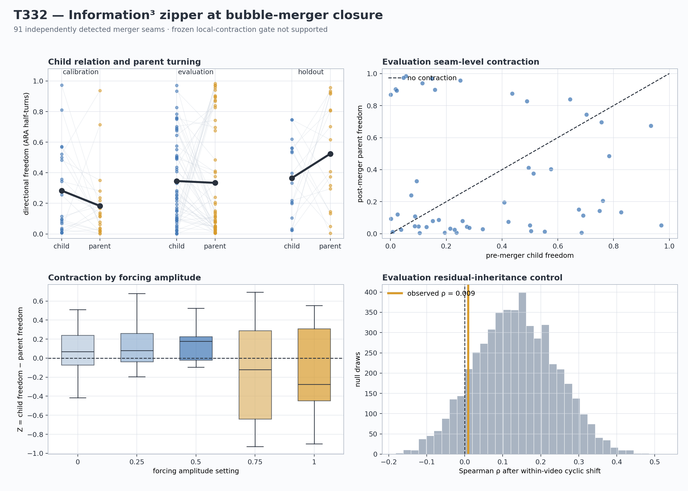

# T332 Information³ zipper at bubble-merger closure

**Run date:** 3 August 2026  
**Frozen protocol:** `T332_INFORMATION3_ZIPPER_BUBBLE_CLOSURE_PROTOCOL_v1_FROZEN.md`  
**Verdict:** **NOT SUPPORTED — LOCAL ZIPPER CONTRACTION**

## Technical summary

T332 asked whether an independently detected two-child-to-one-parent merger
compresses directional freedom, whether that change exceeds ordinary local
persistence, and whether the remaining post-merger freedom still carries the
rank ordering of the pre-merger child relation.

The local contraction gate was **not passed**. In
evaluation, mean `Z = F_child - F_parent` was `+0.011904` with a
95% whole-video interval of `[-0.119230, +0.125039]`. Holdout mean `Z` was
`-0.158769`.

The event-specificity gate was **not passed**. In
evaluation, the parent turn was smaller than the inherited lineage's prior
ordinary turn by mean `-0.054207` with interval
`[-0.214593, +0.098323]`. Holdout mean was `-0.035784`.

Immediate residual inheritance was **not supported**.
Evaluation Spearman `rho` was `+0.009076` with interval
`[-0.249606, +0.161691]` and one-sided cyclic-null
`p=0.875025`. Holdout `rho` was
`-0.341176`.

The full Information³ zipper remains unconfirmed under every outcome because
only three repeated merger lineages are available; later closure timing cannot
be inferred from this archive.

## The measurable zipper result

The primary comparison uses the same two-vector angular grain on each side of
the merger. `F_child` is the disagreement between the inherited and joining
child headings immediately before contact. `F_parent` is the turn between the
new parent's first two resolved outgoing headings. Positive `Z` means the
relation became directionally tighter after closure.

| split | events | mean child freedom | mean parent freedom | mean Z | 95% video interval | positive share |
|---|---:|---:|---:|---:|---:|---:|
| calibration | 23 | 0.283483 | 0.183123 | +0.100360 | [-0.074962, +0.226874] | 0.652 |
| evaluation | 52 | 0.345900 | 0.333996 | +0.011904 | [-0.119230, +0.125039] | 0.635 |
| holdout | 16 | 0.365596 | 0.524365 | -0.158769 | [-0.426067, +0.076182] | 0.375 |

## The failure changes with forcing condition

The negative result is not uniform across the archive. The low-amplitude files
lean toward contraction, whereas the two highest settings lean toward
expansion. This is a post-result descriptive cut, not a frozen gate. Amplitude
is also confounded with the calibration/evaluation/holdout split, so it cannot
identify a cause or rescue the failed universal prediction.

| forcing amplitude | events | mean Z | median Z | 95% video interval | positive share |
|---:|---:|---:|---:|---:|---:|
| 0 | 23 | +0.100360 | +0.067839 | [-0.074962, +0.226874] | 0.652 |
| 0.25 | 20 | +0.067220 | +0.079094 | [-0.350070, +0.206317] | 0.700 |
| 0.5 | 18 | +0.059047 | +0.176906 | [-0.056284, +0.237412] | 0.722 |
| 0.75 | 14 | -0.127731 | -0.119827 | [-0.541405, +0.201216] | 0.429 |
| 1 | 16 | -0.158769 | -0.274791 | [-0.426067, +0.076182] | 0.375 |

## Ordinary-turn control

The event-specificity control compares the post-merger parent turn with the
same inherited lineage's immediately preceding ordinary turn. It is available
for 20 calibration, 42 evaluation and 11 holdout events.

| split | events | mean ordinary-minus-parent | 95% video interval | positive share |
|---|---:|---:|---:|---:|
| calibration | 20 | -0.015933 | [-0.178958, +0.147419] | 0.400 |
| evaluation | 42 | -0.054207 | [-0.214593, +0.098323] | 0.476 |
| holdout | 11 | -0.035784 | [-0.301280, +0.044505] | 0.364 |

## Residual-inheritance control

The residual test asks a stricter question than contraction: after the parent
tightens, do events with more child disagreement retain more parent turning?
Singleton videos are excluded because their lineage pairing cannot be broken.
The observed Spearman correlation is compared with within-video cyclic shifts
of the parent values.

| split | events | videos | observed rho | 95% video interval | cyclic-null mean | one-sided p |
|---|---:|---:|---:|---:|---:|---:|
| calibration | 22 | 4 | +0.281762 | [-0.047445, +0.423550] | -0.095035 | 0.044991 |
| evaluation | 50 | 10 | +0.009076 | [-0.249606, +0.161691] | +0.133661 | 0.875025 |
| holdout | 16 | 3 | -0.341176 | [-1.000000, -0.142857] | -0.005405 | 0.933413 |

## Scope, definitions and limitations

- `F_child` and `F_parent` share units and two-vector grain, but they are not
  identical physical observables: one is between children and one is within
  the parent.
- The analysis uses released centroids without smoothing, Fourier processing,
  trajectory fitting or Phi-target selection.
- A positive merger-aligned contraction is descriptive. The ordinary-turn
  control is required before calling it event-specific.
- Circular-separation magnitude is symmetric under time/order reversal, so
  this test makes no directional zipper claim.
- The holdout has 16 events across three videos and is directional only.
- The archive cannot test the next-seam timing prediction. A longer archive
  with repeated mergers along the same inherited lineage is required.

## Recommended next step

Do not move this failed coordinate to a Phi or rational-spacing target. Freeze
a balanced-forcing replication that estimates the sign of `Z` at several
forcing settings within the same acquisition regime. Separately, seek a bubble
archive with at least 20 repeated merger lineages before testing ordered later
reclosure. A signed orientation coordinate may be tested as a different ARA
cut, but it must be registered independently of T332.

## Reproduction

- production: `work/run_t332_information3_zipper_bubble_closure.py`
- independent validation: `work/validate_t332_information3_zipper_bubble_closure.py`
- events: `results/T332_INFORMATION3_ZIPPER_BUBBLE_CLOSURE_EVENTS.csv`
- bootstrap summary: `results/T332_INFORMATION3_ZIPPER_BUBBLE_CLOSURE_BOOTSTRAP_SUMMARY.csv`
- residual null: `results/T332_INFORMATION3_ZIPPER_BUBBLE_CLOSURE_EVALUATION_RESIDUAL_NULL.csv`
- result JSON: `T332_INFORMATION3_ZIPPER_BUBBLE_CLOSURE_RESULTS.json`
- figure: `T332_INFORMATION3_ZIPPER_BUBBLE_CLOSURE_FIGURE.png`
